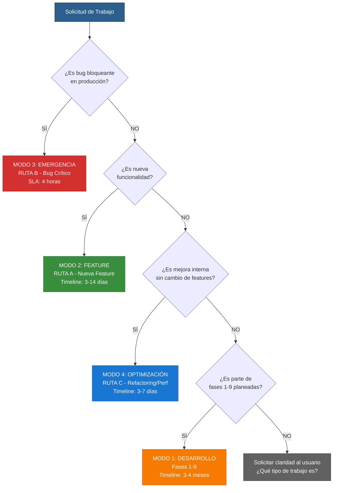

# ORCHESTRATION DESIGN - cjhirashi-agents MVP

**Diseño Completo de Orquestación de 17 Agentes Especializados (14 de proyecto + 3 de orquestación)**

**Versión**: 3.0 (Orquestación Adaptativa - 4 Modos de Operación)
**Fecha**: 2025-10-22
**Autor**: system-claude
**Estado**: ✅ Completado (incluye MODO DESARROLLO + MODO FEATURE + MODO EMERGENCIA + MODO OPTIMIZACIÓN)

---

## 📋 TABLA DE CONTENIDOS

1. [Introducción](#introducción)
2. [Modos de Operación](#modos-de-operación)
3. [Estructura del Equipo](#estructura-del-equipo)
4. [Mapeo de Agentes a Fases del Roadmap](#mapeo-de-agentes-a-fases-del-roadmap)
5. [Distribución de Modelos LLM](#distribución-de-modelos-llm)
6. [Optimización de Tokens y Costos](#optimización-de-tokens-y-costos)
7. [Tabla de Participación Agente-por-Fase](#tabla-de-participación-agente-por-fase)
8. [Especializaciones Técnicas](#especializaciones-técnicas)
9. [Protocolo de Coordinación](#protocolo-de-coordinación)

---

## 🎯 INTRODUCCIÓN

Este documento describe la orquestación COMPLETA del equipo de 17 agentes especializados (14 de proyecto + 3 de orquestación) para el proyecto **cjhirashi-agents MVP**, adaptada al PROJECT-ROADMAP.md de 9 fases.

**Objetivo**: Maximizar eficiencia, minimizar costos, optimizar tokens, garantizar calidad profesional.

**Filosofía de Diseño**:
- Equipo se adapta al proyecto, NO al revés
- Agentes tienen responsabilidades ESPECÍFICAS (no genéricas)
- Tareas claras y medibles por fase
- Modelos LLM justificados costo-beneficio
- Coordinación eficiente (PARALELO, SECUENCIAL, CONDICIONAL, ITERATIVO)

**Fases del Roadmap**:
1. Requirements & Technical Stack ✅
2. Architecture Design ✅
3. Database Design & Data Modeling ✅
4. API Implementation & Testing ⏳ EN PROGRESO
5. Core Backend Implementation 🔵 PLANEADA
6. Frontend Development 🔵 PLANEADA
7. Voice, Generative Features & Deployment 🔵 PLANEADA
8. Beta Testing & Feedback 🔵 PLANEADA
9. Growth & Phase 2 Features 🔵 PLANEADA

---

## 🎮 MODOS DE OPERACIÓN

La orquestación es **ADAPTATIVA** y soporta 4 modos de operación distintos según el contexto del trabajo:

### MODO 1: DESARROLLO (Fases 1-9) - Proyecto Completo

**Contexto**: Desarrollo del proyecto cjhirashi-agents MVP siguiendo las 9 fases del PROJECT-ROADMAP.md

**Características**:
- Patrón: SECUENCIAL con puntos de paralelización (Fase 5 + Fase 6)
- Timeline: 3-4 meses (2025-10-20 → 2026-02-28)
- SLA: Variable según fase (1 día a 3 meses)
- Prioridad: Normal (sigue roadmap planificado)

**Agentes Principales**: Todos los 17 agentes participan según fase

**Workflows**: 9 workflows de fase (PHASE-1 a PHASE-9)

**Cuándo usar**:
- Desarrollo inicial del MVP
- Implementación de fases planificadas
- Rollout de features mayores planificadas

---

### MODO 2: FEATURE (RUTA A) - Nueva Funcionalidad

**Contexto**: Agregar nueva feature/funcionalidad NO planeada originalmente

**Características**:
- Patrón: SECUENCIAL (Assessment → Planning → Spec → Implementación → Review → Deploy → Docs)
- Timeline: 3-14 días (según complejidad)
- SLA: Variable (NO crítico)
- Prioridad: Media-Alta (según business value)

**Agentes Principales**:
1. **architect** (Lead Assessment) - ¿Afecta cuál fase? ¿Esfuerzo? ¿Bloqueadores?
2. **planner** (Planning) - User stories, estimación, asignación
3. **architect** (Especificación) - ADR, actualizar ARCHITECTURE.md
4. **coder** (Implementación) - Rama feature/, código, tests
5. **code-reviewer** (Review) - Calidad, security check, merge
6. **architect** (Deployment) - Staging → Production
7. **documenter** (Documentación) - Actualizar docs, changelog

**Workflow**: RUTA-A-NUEVA-FEATURE-workflows.md

**Timeline Típico**:
- Feature simple (UI change): 3-5 días
- Feature media (new endpoint): 7-10 días
- Feature compleja (new integration): 10-14 días

**Cuándo usar**:
- Usuario solicita feature nueva NO en roadmap
- Cambio de producto basado en feedback
- Oportunidad de negocio requiere nueva capacidad

---

### MODO 3: EMERGENCIA (RUTA B) - Bug Crítico

**Contexto**: Bug bloqueante de usuarios en producción que requiere fix INMEDIATO

**Características**:
- Patrón: EXPEDITO (Triage → Fix → Review rápido → Deploy inmediato → Post-mortem)
- Timeline: 4-6 horas (SLA: 4 horas máximo)
- SLA: **CRÍTICO - 4 HORAS MÁXIMO**
- Prioridad: **MÁXIMA (bloquea todo lo demás)**

**Agentes Principales**:
1. **CLAUDE** (Triage) - Severidad, fase afectada, owner original, SLA 4h
2. **coder** (Fix) - Rama hotfix/, debug, fix, test regresión
3. **code-reviewer** (Review Expedito) - 30 min máximo, security + functionality
4. **architect** (Deploy Inmediato) - Production + monitoreo 2h + comunicar
5. **CLAUDE** (Post-mortem) - Root cause, documentar, lessons learned

**Workflow**: RUTA-B-BUG-CRITICO-workflows.md

**Timeline Típico**:
- Triage: 30 min
- Fix: 2-3 horas
- Review: 30 min
- Deploy: 30 min
- Monitoreo: 2 horas
- **TOTAL: 4-6 horas**

**Cuándo usar**:
- Chat endpoint retorna 500 errors
- Auth falla para todos los usuarios
- Database queries causan timeouts críticos
- Security vulnerability detectada

**Escalada**: Si SLA de 4h está en riesgo → Notificar al usuario inmediatamente

---

### MODO 4: OPTIMIZACIÓN (RUTA C) - Refactoring/Performance

**Contexto**: Mejora interna de performance/código SIN cambiar features (zero feature changes)

**Características**:
- Patrón: VALIDACIÓN STRICT (Assessment → Planning → Implementación → Validation → Merge)
- Timeline: 3-7 días
- SLA: Flexible (NO urgente)
- Prioridad: Media (según impacto en SLA/costos)

**Agentes Principales**:
1. **data-architect** o **architect** (Assessment) - Identificar cuello botella, proponer solución, ROI
2. **planner** (Planning) - Duración, prioridad, schedule
3. **coder** (Implementación) - Rama perf/, zero feature changes, benchmark antes/después
4. **architect** + **data-architect** (Validation) - SLA validado, sin regresiones
5. **CLAUDE** (Merge & Release) - Minor version bump, changelog, deploy

**Workflow**: RUTA-C-REFACTORING-workflows.md

**Timeline Típico**:
- Performance tuning (indexing): 3-4 días
- Refactoring (code cleanup): 4-5 días
- Optimización compleja (caching layer): 5-7 días

**Cuándo usar**:
- RAG queries latency > SLA (500ms vs 400ms target)
- Database queries lentas (N+1 queries)
- Bundle size muy grande (performance issue)
- Technical debt acumulado que afecta velocity

**Validación Crítica**:
- Benchmark ANTES vs DESPUÉS (debe haber mejora medible)
- ZERO feature changes (no cambia comportamiento para usuario)
- Sin regresiones (todos los tests pasan)

---

## 🧭 MATRIZ DE DECISIÓN: ¿Cuál Ruta Tomar?



---

## 📊 COMPARACIÓN DE MODOS

| Modo | Timeline | SLA | Prioridad | Agentes Clave | Validación | Workflow |
|------|----------|-----|-----------|---------------|------------|----------|
| **DESARROLLO** | 3-4 meses | Variable | Normal | Todos (17) | Por fase | PHASE-1 a PHASE-9 |
| **FEATURE** | 3-14 días | Flexible | Media-Alta | architect, planner, coder, code-reviewer, documenter | Pre-deploy | RUTA-A |
| **EMERGENCIA** | 4-6 horas | **4h máx** | **MÁXIMA** | CLAUDE, coder, code-reviewer, architect | Expedita (30min) | RUTA-B |
| **OPTIMIZACIÓN** | 3-7 días | Flexible | Media | architect, data-architect, coder | Strict (benchmarks) | RUTA-C |

---

## 🔀 CAMBIO DE MODO

**El equipo puede CAMBIAR DE MODO sin fricción:**

**Ejemplo 1: De DESARROLLO → EMERGENCIA**
```
Estamos en Fase 5 (Backend Implementation)
   ↓
Bug crítico detectado: Chat endpoint 500 errors
   ↓
PAUSA Fase 5 → ACTIVA MODO EMERGENCIA (RUTA B)
   ↓
Fix aplicado en 4 horas
   ↓
RETOMA Fase 5 desde donde se pausó
```

**Ejemplo 2: De DESARROLLO → FEATURE**
```
Estamos en Fase 6 (Frontend Development)
   ↓
Usuario solicita: "Agregar audio generation"
   ↓
EVALÚA: ¿Bloquea Fase 6? NO → Puede diferirse
   ↓
PLANEA: Siguiente sprint (después de Fase 6)
   ↓
Fase 6 completa → ACTIVA MODO FEATURE (RUTA A)
   ↓
Feature implementada en 10 días
```

**Ejemplo 3: De OPERACIÓN → OPTIMIZACIÓN**
```
MVP en producción (post Fase 7)
   ↓
Monitoreo detecta: RAG queries > 500ms (SLA: 400ms)
   ↓
ACTIVA MODO OPTIMIZACIÓN (RUTA C)
   ↓
Performance tuning en 4 días
   ↓
SLA cumplido: 350ms
```

---

## ⚙️ PROTOCOLO DE ACTIVACIÓN DE MODO

**CUANDO USUARIO SOLICITA TRABAJO:**

1. **CLAUDE EVALÚA CONTEXTO**:
   - ¿Es bug bloqueante? → MODO 3 (EMERGENCIA)
   - ¿Es nueva feature? → MODO 2 (FEATURE)
   - ¿Es mejora interna? → MODO 4 (OPTIMIZACIÓN)
   - ¿Es parte de fases planeadas? → MODO 1 (DESARROLLO)

2. **CLAUDE PRESENTA PLAN ADAPTADO AL MODO**:
   - Identifica modo correcto
   - Muestra agentes involucrados
   - Muestra timeline estimado
   - Muestra criterios de éxito
   - **ESPERA APROBACIÓN EXPLÍCITA**

3. **USUARIO APRUEBA**:
   - CLAUDE activa modo correspondiente
   - Ejecuta workflow específico
   - Coordina agentes según patrón del modo

4. **VALIDACIÓN Y CIERRE**:
   - Valida criterios de finalización del modo
   - Documenta resultado
   - Retorna a modo anterior (si aplica)

---

## 👥 ESTRUCTURA DEL EQUIPO

### Agentes de PROYECTO (14 especialistas)

Estos agentes se enfocan en desarrollo, implementación, testing, y documentación del producto cjhirashi-agents.

1. **planner** - Planificación y estimación
2. **architect** - Diseño de arquitectura de software
3. **data-architect** - Diseño de bases de datos y data modeling
4. **coder** - Implementación de backend y frontend
5. **security-specialist** - Seguridad, auth, RBAC
6. **ai-specialist** - Integración IA, LLMs, RAG
7. **ux-designer** - Diseño de UI/UX
8. **tester** - Testing y QA (unit, integration, E2E)
9. **cost-analyzer** - Análisis de costos y optimización
10. **documenter** - Documentación técnica y diagramas Mermaid
11. **tech-researcher** - Investigación técnica y mejores prácticas
12. **code-reviewer** - Revisión de código y estándares
13. **system-analyzer** - Análisis de sistemas y validación
14. **diagram-designer** - Diseño de diagramas técnicos Mermaid

### Agentes de ORQUESTACIÓN (3 agentes críticos)

Estos agentes manejan la orquestación del equipo, NO el desarrollo del producto.

15. **system-claude** - Diseñador de orquestación (este agente)
16. **prompt-engineer** - Generador y validador de prompts
17. **orchestration-validator** - Validador de consistencia (bajo demanda)

**REGLA CRÍTICA**: Agentes de orquestación NUNCA tocan código del proyecto. Agentes de proyecto NUNCA tocan `.claude/`.

---

## 🗺️ MAPEO DE AGENTES A FASES DEL ROADMAP

### Fase 1: Requirements & Technical Stack ✅ COMPLETADO

**Estado**: ✅ 100% completado
**Duración**: 2 días (2025-10-20 → 2025-10-21)

**Agentes Participantes**:
- **planner** (Lead) - Estructurar requisitos, crear user stories, definir scope
- **tech-researcher** (Secundario) - Investigar tech stack, comparar alternativas
- **architect** (Validador) - Validar viabilidad técnica

**Entregables**:
- 7 documentos (7,900 líneas)
- Tech stack recomendado
- 12 incompatibilidades identificadas y resueltas
- Scope MVP aprobado

---

### Fase 2: Architecture Design ✅ COMPLETADO

**Estado**: ✅ 100% completado
**Duración**: 2 días (2025-10-21 → 2025-10-22)

**Agentes Participantes**:
- **architect** (Lead) - Diseñar arquitectura de 7 capas
- **diagram-designer** (Secundario) - Crear diagramas Mermaid (system, layers, request-flow)
- **documenter** (Secundario) - Documentar ADRs (Architecture Decision Records)
- **security-specialist** (Consulta) - Validar decisiones de seguridad

**Entregables**:
- ARCHITECTURE.md (2,400 líneas)
- 6 ADRs documentados
- 3 diagramas Mermaid integrados
- Stack técnico validado

---

### Fase 3: Database Design & Data Modeling ✅ COMPLETADO

**Estado**: ✅ 100% completado
**Duración**: 1 día (2025-10-22)

**Agentes Participantes**:
- **data-architect** (Lead) - Diseñar schema de 54 tablas
- **diagram-designer** (Secundario) - Crear ERD (Entity-Relationship Diagrams)
- **documenter** (Secundario) - Documentar migrations y indexing strategy
- **architect** (Validador) - Validar coherencia con arquitectura

**Entregables**:
- DATABASE.md (2,400 líneas con 54 tablas)
- PINECONE-SCHEMA.md (800 líneas)
- ERD.md (1,500 líneas con 2 diagramas)
- MIGRATIONS.md (1,500 líneas)
- INDEXING.md (1,500 líneas con 230+ índices)

---

### Fase 4: API Implementation & Testing ⏳ EN PROGRESO

**Estado**: ⏳ 0% completado
**Duración Estimada**: 3-4 días (2025-10-22 → 2025-10-25)

**Agentes Participantes**:
- **architect** (Lead) - Crear API-DESIGN.md + RATE-LIMITING.md
- **coder** (Secundario) - Crear ENDPOINTS.md + ERROR-HANDLING.md
- **security-specialist** (Secundario) - Crear AUTHENTICATION.md (NextAuth + RBAC)
- **tester** (Secundario) - Crear TESTING-STRATEGY.md (unit + integration + E2E)
- **system-analyzer** (Validador) - Crear PHASE4-VALIDATION.md

**Entregables**:
- API-DESIGN.md (2,000 líneas con OpenAPI 3.0 spec)
- ENDPOINTS.md (1,500 líneas con 20+ endpoints)
- AUTHENTICATION.md (1,200 líneas con NextAuth + RBAC)
- ERROR-HANDLING.md (1,000 líneas con error format + logging)
- TESTING-STRATEGY.md (1,500 líneas con plan completo)
- RATE-LIMITING.md (800 líneas con quotas por tier)
- PHASE4-VALIDATION.md (800 líneas con pre-deployment checklist)

**Criterios de Finalización**:
- OpenAPI 3.0 completo
- 20+ endpoints documentados
- NextAuth + RBAC implementados
- Error handling strategy definido
- Testing plan completo
- Rate limiting configurado
- Pre-deployment checklist validado

---

### Fase 5: Core Backend Implementation 🔵 PLANEADA

**Estado**: 🔵 PLANEADA
**Duración Estimada**: 2-3 semanas (2025-10-26 → 2025-11-09)

**Agentes Participantes**:
- **coder** (Lead Backend) - Implementar Chat API, RAG, LLM routing
- **ai-specialist** (Secundario) - Configurar Vercel AI SDK, multi-LLM routing
- **architect** (Consulta) - Validar implementación arquitectónica
- **security-specialist** (Consulta) - Validar seguridad de endpoints
- **tester** (Validador) - Crear tests unitarios y de integración

**Tareas Principales**:
- Setup Vercel AI SDK
- Implementar model routing logic (gpt-4o, gpt-4o-mini, claude-3.5-sonnet)
- Chat endpoint funcional con SSE
- Pinecone RAG integration
- Notificaciones básicas
- Tests unitarios (>80% coverage)

**Entregables**:
- Chat API funcional
- RAG integration con Pinecone
- Multi-LLM routing implementado
- Tests unitarios pasando
- Code review aprobado

---

### Fase 6: Frontend Development 🔵 PLANEADA

**Estado**: 🔵 PLANEADA
**Duración Estimada**: 2-3 semanas (2025-10-26 → 2025-11-09)
**NOTA**: Puede iniciar EN PARALELO con Fase 5

**Agentes Participantes**:
- **coder** (Lead Frontend) - Implementar Dashboard, Chat interface, Settings
- **ux-designer** (Secundario) - Refinar UI/UX, componentes React
- **tester** (Validador) - Component testing, E2E testing
- **documenter** (Secundario) - Documentar componentes y usage

**Tareas Principales**:
- Dashboard UI completo (Next.js 15 + React 18)
- Chat interface con SSE real-time
- Settings panel (API keys, model selection)
- Conectar a APIs backend
- Component testing (Vitest)

**Entregables**:
- Dashboard UI funcional
- Chat interface con streaming
- Settings panel completo
- Component tests pasando
- Code review aprobado

---

### Fase 7: Voice, Generative Features & Deployment 🔵 PLANEADA

**Estado**: 🔵 PLANEADA
**Duración Estimada**: 2 semanas (2025-11-10 → 2025-11-23)

**Agentes Participantes**:
- **ai-specialist** (Lead) - OpenAI gpt-realtime, DALL-E image generation
- **coder** (Secundario) - Implementar sector de tareas
- **tester** (Validador) - Testing completo (unit + E2E)
- **architect** (Deploy) - Deploy a staging y production
- **security-specialist** (Consulta) - Validar seguridad pre-deploy
- **documenter** (Secundario) - Crear deployment guide

**Tareas Principales**:
- OpenAI gpt-realtime integration (voice agents)
- DALL-E image generation integration
- Sector de tareas funcional
- Testing completo (unit + E2E)
- Deploy a staging
- Deploy a production (MVP v0.1.0-alpha)

**Entregables**:
- Voice agents funcionando
- Image generation funcionando
- Tests pasan (80%+)
- MVP v0.1.0-alpha en producción
- Deployment guide documentado

**Criterios de Finalización**:
- Voice agents funcionando
- Image generation funcionando
- Tests pasan (80%+)
- MVP en producción estable
- Monitoring configurado

---

### Fase 8: Beta Testing & Feedback 🔵 PLANEADA

**Estado**: 🔵 PLANEADA
**Duración Estimada**: 2 semanas (2025-11-24 → 2025-12-07)

**Agentes Participantes**:
- **tester** (Lead) - Coordinar beta users, monitorear feedback
- **coder** (Secundario) - Bug fixes críticos
- **ux-designer** (Secundario) - Ajustes de UI/UX basados en feedback
- **system-analyzer** (Validador) - Performance tuning
- **documenter** (Secundario) - Actualizar documentación con learnings

**Tareas Principales**:
- Seleccionar beta users (10-20)
- Distribuir MVP v0.1.0-alpha
- Monitorear feedback y bugs
- Bug fixes críticos
- Performance tuning
- Actualizar documentación

**Entregables**:
- Beta testing report
- Bug fixes aplicados
- Performance optimizations aplicadas
- Documentación actualizada con learnings

---

### Fase 9: Growth & Phase 2 Features 🔵 PLANEADA

**Estado**: 🔵 PLANEADA
**Duración Estimada**: 3 meses (2025-12-08 → 2026-02-28)

**Agentes Participantes**:
- **planner** (Lead) - Planear Phase 2 features
- **coder** (Secundario) - Implementar pricing, billing, nuevas features
- **ux-designer** (Secundario) - Diseñar pricing page, checkout
- **cost-analyzer** (Consulta) - Optimizar costos operacionales
- **data-architect** (Consulta) - Escalar database para 100+ usuarios
- **architect** (Validador) - Validar escalabilidad
- **documenter** (Secundario) - Documentar nuevas features

**Tareas Principales**:
- Pricing page + checkout
- Payment processing (Stripe)
- Billing & subscriptions
- Phase 2 features implementation
- Advanced analytics
- User acquisition & marketing
- Escalado a v1.0.0

**Entregables**:
- Pricing page funcional
- Payment processing integrado
- Phase 2 features implementadas
- Analytics dashboard
- Marketing materials
- v1.0.0 en producción

---

## 🤖 DISTRIBUCIÓN DE MODELOS LLM

### HAIKU (Claude 3.5 Haiku) - Tareas Rápidas y Eficientes

**Costo**: $0.80/1M input tokens, $4/1M output tokens

**Agentes asignados**:
1. **planner** - Planificación y estimación (rápido, estructurado)
2. **ux-designer** - Diseño UI/UX (iteraciones rápidas)
3. **cost-analyzer** - Análisis de costos (cálculos rápidos)
4. **tech-researcher** - Investigación técnica (búsquedas rápidas)

**Justificación**: Tareas que requieren velocidad, bajo costo, respuestas estructuradas.

---

### SONNET (Claude 3.5 Sonnet) - Tareas Complejas y Críticas

**Costo**: $3/1M input tokens, $15/1M output tokens

**Agentes asignados**:
1. **architect** - Diseño arquitectónico (decisiones críticas)
2. **data-architect** - Data modeling (complejidad alta)
3. **coder** - Implementación (código de calidad)
4. **security-specialist** - Seguridad (decisiones críticas)
5. **ai-specialist** - IA y LLMs (complejidad alta)
6. **tester** - Testing y QA (validación rigurosa)
7. **documenter** - Documentación técnica (detalle y claridad)
8. **code-reviewer** - Revisión de código (estándares altos)
9. **system-analyzer** - Análisis de sistemas (complejidad alta)
10. **diagram-designer** - Diagramas técnicos (precisión visual)
11. **system-claude** - Diseño de orquestación (decisiones críticas)
12. **prompt-engineer** - Ingeniería de prompts (calidad alta)
13. **orchestration-validator** - Validación de consistencia (rigor)

**Justificación**: Tareas que requieren razonamiento profundo, decisiones críticas, código complejo, validación rigurosa.

---

## 💰 OPTIMIZACIÓN DE TOKENS Y COSTOS

### Estrategia de Optimización

**1. PARALELIZACIÓN Estratégica**
- Fases 5 y 6 (Backend + Frontend) corren EN PARALELO
- Ahorro de tiempo: ~2 semanas

**2. DELEGACIÓN Selectiva**
- HAIKU para tareas rápidas (planning, research, cost analysis, UI design)
- SONNET para tareas críticas (architecture, coding, security, testing)

**3. REUTILIZACIÓN de Contexto**
- Agentes cargan contexto solo cuando es necesario
- Documentación en sys-docs/ reduce repetición

**4. VALIDACIÓN en Puntos Críticos**
- Validación NO duplicada
- Validador asignado estratégicamente por fase

### Proyección de Costos por Fase

| Fase | Agentes Activos | Modelo Dominante | Tokens Est. | Costo Est. |
|------|----------------|------------------|------------|-----------|
| Fase 1 | 3 (planner, tech-researcher, architect) | Haiku + Sonnet | 500K | $2-3 |
| Fase 2 | 4 (architect, diagram-designer, documenter, security) | Sonnet | 800K | $4-5 |
| Fase 3 | 4 (data-architect, diagram-designer, documenter, architect) | Sonnet | 700K | $3-4 |
| Fase 4 | 5 (architect, coder, security, tester, system-analyzer) | Sonnet | 1M | $6-8 |
| Fase 5 | 5 (coder, ai-specialist, architect, security, tester) | Sonnet | 2M | $12-15 |
| Fase 6 | 4 (coder, ux-designer, tester, documenter) | Sonnet + Haiku | 1.5M | $8-10 |
| Fase 7 | 6 (ai-specialist, coder, tester, architect, security, documenter) | Sonnet | 1.8M | $10-12 |
| Fase 8 | 5 (tester, coder, ux-designer, system-analyzer, documenter) | Sonnet + Haiku | 1M | $6-8 |
| Fase 9 | 7 (planner, coder, ux-designer, cost-analyzer, data-architect, architect, documenter) | Sonnet + Haiku | 2M | $12-15 |
| **TOTAL** | **17 agentes** | **Híbrido** | **~11.3M** | **$63-80** |

**Costo total estimado del proyecto (tokens LLM)**: $63-80 USD

**NOTA**: Costos muy bajos porque orquestación es eficiente, agentes especializados, tareas claras.

---

## 📊 TABLA DE PARTICIPACIÓN AGENTE-POR-FASE

| Agente | F1 | F2 | F3 | F4 | F5 | F6 | F7 | F8 | F9 | Total |
|--------|----|----|----|----|----|----|----|----|----|----|
| **planner** | 🟢 | - | - | - | - | - | - | - | 🟢 | 2 |
| **architect** | 🟡 | 🟢 | 🟡 | 🟢 | 🟡 | - | 🟡 | - | 🟡 | 6 |
| **data-architect** | - | - | 🟢 | - | - | - | - | - | 🟡 | 2 |
| **coder** | - | - | - | 🟡 | 🟢 | 🟢 | 🟡 | 🟡 | 🟡 | 6 |
| **security-specialist** | - | 🟡 | - | 🟡 | 🟡 | - | 🟡 | - | - | 4 |
| **ai-specialist** | - | - | - | - | 🟡 | - | 🟢 | - | - | 2 |
| **ux-designer** | - | - | - | - | - | 🟡 | - | 🟡 | 🟡 | 3 |
| **tester** | - | - | - | 🟡 | 🟡 | 🟡 | 🟡 | 🟢 | - | 5 |
| **cost-analyzer** | - | - | - | - | - | - | - | - | 🟡 | 1 |
| **documenter** | - | 🟡 | 🟡 | - | - | 🟡 | 🟡 | 🟡 | 🟡 | 6 |
| **tech-researcher** | 🟡 | - | - | - | - | - | - | - | - | 1 |
| **code-reviewer** | - | - | - | - | 🟡 | 🟡 | 🟡 | - | 🟡 | 4 |
| **system-analyzer** | - | - | - | 🟡 | - | - | - | 🟡 | - | 2 |
| **diagram-designer** | - | 🟡 | 🟡 | - | - | - | - | - | - | 2 |

**Leyenda**:
- 🟢 **Lead** - Agente responsable principal de la fase
- 🟡 **Secundario** - Agente participante o validador
- `-` - No participa en esta fase

**Observaciones**:
- **architect** participa en 6/9 fases (coordinador técnico clave)
- **coder** participa en 6/9 fases (implementador principal)
- **documenter** participa en 6/9 fases (documentación continua)
- **tester** participa en 5/9 fases (QA continuo desde Fase 4)
- **security-specialist** participa en 4/9 fases (validación continua)

---

## 🛠️ ESPECIALIZACIONES TÉCNICAS

### Por Dominio Técnico

**PLANIFICACIÓN & ESTRATEGIA**:
- planner: Planning, estimación, roadmaps, user stories
- cost-analyzer: Análisis de costos, optimización, ROI

**ARQUITECTURA & DISEÑO**:
- architect: Arquitectura de software, ADRs, patrones, componentes
- data-architect: Data modeling, schema design, migrations, indexing
- ux-designer: UI/UX design, componentes React, wireframes

**DESARROLLO & IMPLEMENTACIÓN**:
- coder: Backend + Frontend implementation, TypeScript, Next.js, Prisma
- ai-specialist: IA/LLMs, RAG, Vercel AI SDK, embeddings, voice agents

**SEGURIDAD & CALIDAD**:
- security-specialist: Auth, RBAC, rate limiting, security best practices
- tester: Unit tests, integration tests, E2E tests, QA
- code-reviewer: Code review, estándares, best practices

**DOCUMENTACIÓN & VISUALIZACIÓN**:
- documenter: Documentación técnica, API docs, guides
- diagram-designer: Diagramas Mermaid, ERD, flowcharts, arquitectura

**INVESTIGACIÓN & ANÁLISIS**:
- tech-researcher: Investigación técnica, comparación de stacks
- system-analyzer: Análisis de sistemas, performance, validación

**ORQUESTACIÓN (NO TOCAN PROYECTO)**:
- system-claude: Diseño de orquestación de agentes
- prompt-engineer: Ingeniería de prompts, validación 1-to-1
- orchestration-validator: Validación de consistencia

---

## 🔄 PROTOCOLO DE COORDINACIÓN

### Patrones de Coordinación

**SECUENCIAL** (A → B → C):
- Ejemplo: Fase 1 → Fase 2 → Fase 3 → Fase 4 (dependencias claras)
- Uso: Cuando B necesita output de A

**PARALELO** (A + B + C simultáneamente):
- Ejemplo: Fase 5 (Backend) + Fase 6 (Frontend) corren en paralelo
- Uso: Cuando tareas son independientes

**CONDICIONAL** (decisión → caminos diferentes):
- Ejemplo: Si bug crítico → hotfix inmediato. Si feature → próximo sprint
- Uso: Cuando necesitas decisión contextual

**ITERATIVO** (implementar → validar → refinar):
- Ejemplo: coder → tester → si falla, coder refina → tester valida
- Uso: Cuando necesitas refinamiento hasta calidad

### Handoffs Entre Agentes

**Handoff Exitoso Requiere**:
1. Entregable completo (según criterios de finalización)
2. Documentación actualizada
3. Validación aprobada
4. Siguiente agente notificado

**Ejemplo de Handoff (Fase 2 → Fase 3)**:
```
architect (Fase 2) → Crea ARCHITECTURE.md
   ↓
system-analyzer → Valida arquitectura
   ↓
HANDOFF APROBADO
   ↓
data-architect (Fase 3) → Lee ARCHITECTURE.md
   ↓
data-architect → Diseña schema basado en arquitectura
```

### Validación por Fase

**Quién Valida Cada Fase**:
- Fase 1: architect valida requisitos y tech stack
- Fase 2: Charlie (Owner) valida arquitectura
- Fase 3: architect valida coherencia con arquitectura
- Fase 4: system-analyzer + Charlie validan API design
- Fase 5: architect + tester validan backend implementation
- Fase 6: ux-designer + tester validan frontend
- Fase 7: architect + tester validan deployment
- Fase 8: Charlie + tester validan beta feedback
- Fase 9: Charlie valida growth strategy

---

## ✅ CRITERIOS DE ÉXITO DE LA ORQUESTACIÓN

**Orquestación es exitosa cuando**:
- [ ] Cada agente tiene rol y tareas ESPECÍFICAS (no genéricas)
- [ ] Mapeo agente-a-fase está 100% alineado con PROJECT-ROADMAP.md
- [ ] Modelos LLM justificados costo-beneficio
- [ ] Tokens optimizados para máximo rendimiento con mínimo costo
- [ ] Workflows documentados para cada fase (9 workflows)
- [ ] Handoffs entre agentes son claros
- [ ] Validación estratégica (NO duplicada)
- [ ] Documentación completa en .claude/sys-docs/
- [ ] Prompts generados por prompt-engineer (basados en docs)
- [ ] Alineación 1-to-1: documentación ↔ prompts (validado por orchestration-validator)

---

## 📋 PRÓXIMOS PASOS

**Para completar el rediseño de orquestación**:
1. ✅ ORCHESTRATION-DESIGN.md creado (este documento)
2. ⏳ Crear 16 especificaciones de agentes en `agents/`
3. ⏳ Crear WORKFLOWS.md (patrones de coordinación)
4. ⏳ Crear 9 workflows de fases en `workflows/`
5. ⏳ Solicitar a prompt-engineer: Crear/actualizar prompts basados en especificaciones
6. ⏳ Solicitar a orchestration-validator: Validar integridad 1-to-1

---

**Documento creado por**: system-claude
**Basado en**: PROJECT-ROADMAP.md (versión 1.0)
**Última actualización**: 2025-10-22
**Próxima revisión**: Cuando Fase 4 se complete o haya cambios significativos

🚀 **Este documento es la base de toda la orquestación del proyecto cjhirashi-agents MVP.**
