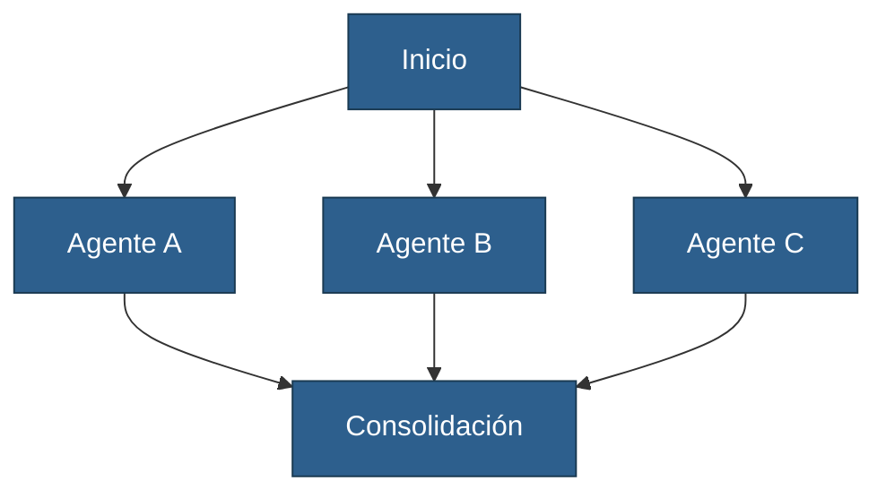
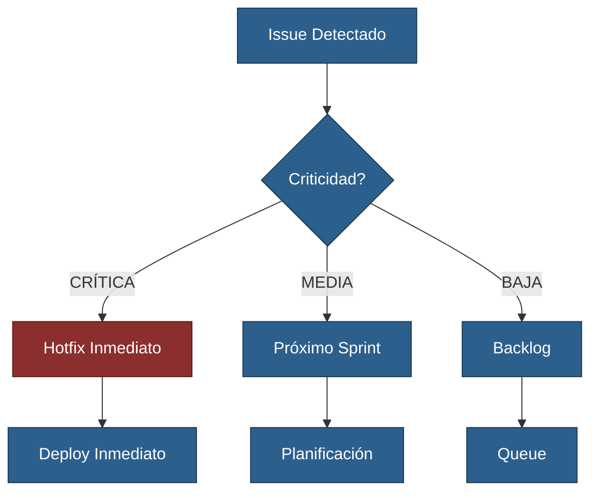
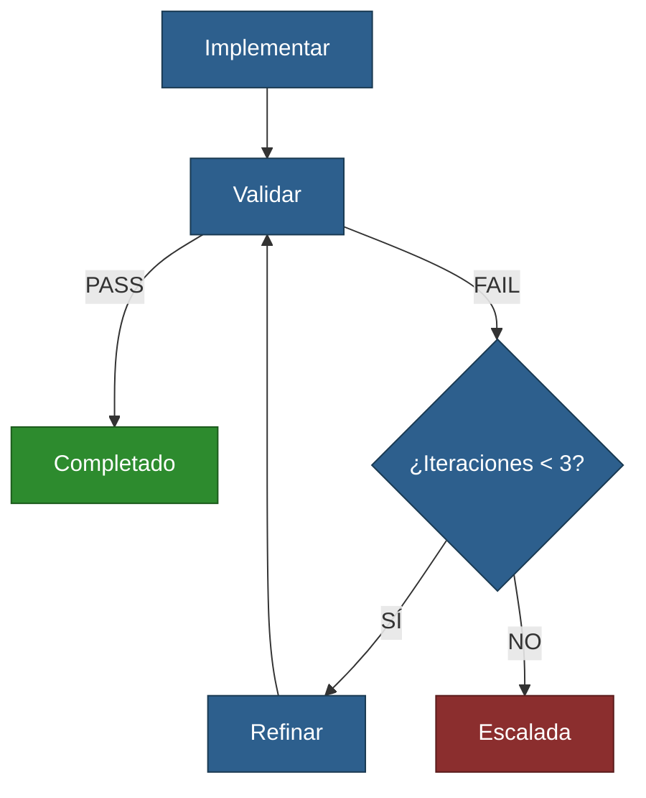
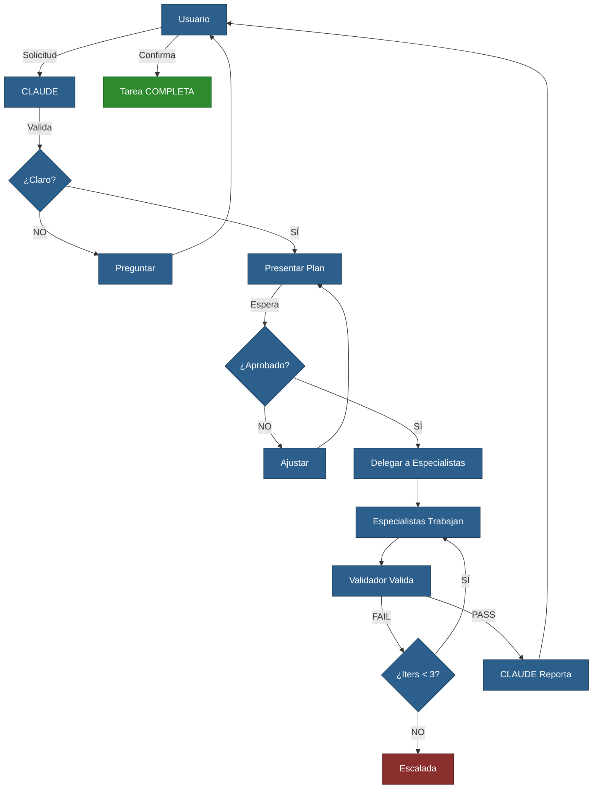

# WORKFLOWS - Patrones de Coordinación

**Patrones de Coordinación y Workflows del Equipo de 17 Agentes Especializados**

**Versión**: 2.0
**Fecha**: 2025-10-22
**Autor**: system-claude
**Estado**: ✅ Completado

---

## 📋 TABLA DE CONTENIDOS

1. [Introducción](#introducción)
2. [Patrones de Coordinación](#patrones-de-coordinación)
3. [Flujo de Orquestación Principal](#flujo-de-orquestación-principal)
4. [Handoffs Entre Agentes](#handoffs-entre-agentes)
5. [Validación y Criterios de Éxito](#validación-y-criterios-de-éxito)
6. [Manejo de Errores y Bloqueos](#manejo-de-errores-y-bloqueos)
7. [Estado Persistente Entre Sesiones](#estado-persistente-entre-sesiones)

---

## 🎯 INTRODUCCIÓN

Este documento define los patrones de coordinación y workflows utilizados por el equipo de 17 agentes especializados (14 de proyecto + 3 de orquestación) en el proyecto cjhirashi-agents MVP.

**Objetivo**: Maximizar eficiencia de coordinación, minimizar duplicación, garantizar calidad.

**Principios Fundamentales**:
1. **Especialización clara**: Cada agente tiene rol ÚNICO
2. **Handoffs explícitos**: Transiciones documentadas
3. **Validación estratégica**: NO duplicada, en puntos críticos
4. **Paralelización inteligente**: Cuando tareas son independientes
5. **Iteración controlada**: Máximo N iteraciones antes de escalada

---

## 🔄 PATRONES DE COORDINACIÓN

### 1. PATRÓN SECUENCIAL (A → B → C)

**Descripción**: Tareas ejecutadas en orden estricto, donde B necesita output de A.

**Cuándo usar**:
- Dependencias claras entre tareas
- Output de A es input de B
- No hay posibilidad de paralelización

**Ejemplo: Fases 1-4 del Roadmap**
```
Fase 1: Requirements
   ↓ (entrega: requisitos + tech stack)
Fase 2: Architecture
   ↓ (entrega: arquitectura + ADRs)
Fase 3: Database
   ↓ (entrega: schema + ERD)
Fase 4: API Design
   ↓ (entrega: OpenAPI spec + endpoints)
Fase 5 + 6: Backend + Frontend (PARALELO)
```

**Ventajas**:
- Claridad total de dependencias
- Fácil de seguir y depurar
- Validación clara en cada handoff

**Desventajas**:
- Mayor duración total (no paralelización)
- Bloqueador en A detiene todo

**Diagrama**:


---

### 2. PATRÓN PARALELO (A + B + C simultáneamente)

**Descripción**: Múltiples agentes trabajan simultáneamente en tareas independientes.

**Cuándo usar**:
- Tareas son independientes (NO hay dependencias entre ellas)
- Queremos reducir tiempo total
- Tenemos recursos disponibles

**Ejemplo: Fase 5 (Backend) + Fase 6 (Frontend)**
```
Fase 5: Backend Implementation
   ├─ coder (backend)
   ├─ ai-specialist
   └─ tester (backend tests)

PARALELO CON:

Fase 6: Frontend Implementation
   ├─ coder (frontend)
   ├─ ux-designer
   └─ tester (component tests)
```

**Ventajas**:
- Reducción significativa de tiempo (Fases 5+6: 2 semanas en lugar de 4)
- Uso eficiente de recursos
- Mayor throughput

**Desventajas**:
- Coordinación más compleja
- Posibles conflictos si no son 100% independientes

**Diagrama**:


---

### 3. PATRÓN CONDICIONAL (decisión → caminos diferentes)

**Descripción**: Decisión contextual determina qué agente o flujo ejecutar.

**Cuándo usar**:
- Necesitas decisión basada en contexto
- Diferentes escenarios requieren diferentes especialistas
- Criticidad o complejidad determina el path

**Ejemplo: Gestión de Issues**
```
Issue reportado
   ↓
system-analyzer: Evaluar criticidad
   ↓
   ├─ SI criticidad = CRÍTICA
   │     ↓
   │  Hotfix inmediato (coder + code-reviewer expedito)
   │     ↓
   │  Deploy inmediato
   │
   └─ SI criticidad = BAJA/MEDIA
         ↓
      Agregar a próximo sprint (planner)
         ↓
      Desarrollo normal
```

**Ventajas**:
- Respuesta adaptativa al contexto
- Eficiencia (recursos adecuados por caso)
- Flexibilidad

**Desventajas**:
- Lógica de decisión debe estar bien definida
- Posible ambigüedad si criterios no son claros

**Diagrama**:


---

### 4. PATRÓN ITERATIVO (implementar → validar → refinar)

**Descripción**: Ciclo de implementación, validación y refinamiento hasta alcanzar calidad.

**Cuándo usar**:
- Calidad requiere iteraciones
- Feedback continuo mejora resultado
- Complejidad alta con validación rigurosa

**Ejemplo: Implementación + Testing**
```
coder: Implementar feature
   ↓
tester: Ejecutar tests
   ↓
   ├─ SI tests PASAN → DONE
   │
   └─ SI tests FALLAN →
         ↓
      coder: Refinar implementación
         ↓
      tester: Re-ejecutar tests
         ↓
      (máximo 3 iteraciones)
         ↓
      SI sigue fallando → Escalada a architect
```

**Ventajas**:
- Calidad garantizada
- Refinamiento continuo
- Detección temprana de issues

**Desventajas**:
- Mayor duración (iteraciones múltiples)
- Riesgo de loop infinito (por eso límite de iteraciones)

**Diagrama**:


---

## 🎭 FLUJO DE ORQUESTACIÓN PRINCIPAL

### Flujo Master: CLAUDE → Especialistas → Validación → Usuario

**Roles**:
- **CLAUDE** (Orquestador Maestro): Coordina equipo, delega tareas, valida resultados
- **Especialistas** (17 agentes): Ejecutan tareas específicas
- **Validadores** (asignados por fase): Validan calidad
- **Usuario** (Charlie): Aprueba planes y resultados finales

**Flujo Completo**:
```
1. Usuario → Solicitud a CLAUDE
      ↓
2. CLAUDE → Valida comprensión (100% claro)
      ↓
3. CLAUDE → Presenta plan detallado (QUÉ, QUIÉN, CUÁNDO, CÓMO VALIDAR)
      ↓
4. Usuario → Aprueba plan (explícitamente)
      ↓
5. CLAUDE → Delega a especialistas apropiados
      ↓
6. Especialistas → Ejecutan tareas en paralelo/secuencial según patrón
      ↓
7. Validador asignado → Valida resultado (contra criterios de éxito)
      ↓
8. SI validación FALLA → Iteración (máximo 3 veces)
      ↓
9. SI validación PASA → CLAUDE reporta a usuario
      ↓
10. Usuario → Confirma resultado
      ↓
11. CLAUDE → Marca tarea COMPLETA + actualiza task-state.json
```

**Diagrama del Flujo Master**:


---

## 🤝 HANDOFFS ENTRE AGENTES

### Definición de Handoff

**Handoff**: Transición de responsabilidad de un agente a otro, con entregable completo.

**Handoff Exitoso Requiere**:
1. ✅ Entregable completo (según criterios de finalización)
2. ✅ Documentación actualizada (en `sys-docs/`)
3. ✅ Validación aprobada (por validador asignado)
4. ✅ Siguiente agente notificado explícitamente

### Ejemplos de Handoffs por Fase

**Handoff 1: Fase 1 → Fase 2**
```
planner (Fase 1):
   ├─ Entrega: requirements.md, user-stories.md, scope.md, tech stack
   └─ Valida: architect

architect (Fase 2):
   ├─ Lee: requirements.md, tech stack
   └─ Diseña: ARCHITECTURE.md basado en requisitos
```

**Handoff 2: Fase 2 → Fase 3**
```
architect (Fase 2):
   ├─ Entrega: ARCHITECTURE.md, ADRs
   └─ Valida: Charlie (Owner)

data-architect (Fase 3):
   ├─ Lee: ARCHITECTURE.md, ADRs
   └─ Diseña: DATABASE.md basado en arquitectura
```

**Handoff 3: Fase 4 → Fase 5 + 6**
```
architect (Fase 4):
   ├─ Entrega: API-DESIGN.md, ENDPOINTS.md, AUTHENTICATION.md
   └─ Valida: system-analyzer + Charlie

PARALELO:
   ├─ coder (Backend - Fase 5):
   │     ├─ Lee: API-DESIGN.md, ENDPOINTS.md
   │     └─ Implementa: Chat API, RAG, LLM routing
   │
   └─ coder (Frontend - Fase 6):
         ├─ Lee: API-DESIGN.md, ENDPOINTS.md
         └─ Implementa: Dashboard, Chat interface
```

### Protocolo de Handoff

**Paso 1: Entrega**
- Agente A completa entregable
- Actualiza documentación en `sys-docs/`
- Notifica: "Entregable listo para validación"

**Paso 2: Validación**
- Validador asignado revisa entregable
- Valida contra criterios de éxito
- Resultado: APROBADO o RECHAZADO

**Paso 3: Handoff**
- SI APROBADO:
  * CLAUDE notifica a Agente B: "Puedes iniciar Fase X"
  * Agente B carga contexto (lee docs necesarios)
  * Agente B inicia trabajo
- SI RECHAZADO:
  * CLAUDE notifica a Agente A: "Refinar X, Y, Z"
  * Agente A corrige
  * Re-validación

---

## ✅ VALIDACIÓN Y CRITERIOS DE ÉXITO

### Estrategia de Validación

**Principio**: Validación estratégica, NO duplicada.

**Validador asignado por fase**:
- Fase 1: architect
- Fase 2: Charlie (Owner)
- Fase 3: architect
- Fase 4: system-analyzer + Charlie
- Fase 5: architect + tester
- Fase 6: ux-designer + tester
- Fase 7: architect + tester
- Fase 8: Charlie + tester
- Fase 9: Charlie

### Criterios de Éxito por Tipo de Entregable

**DOCUMENTACIÓN = COMPLETA cuando**:
- [ ] Estructura clara y lógica
- [ ] Sin TODOs pendientes
- [ ] Diagramas integrados (si aplica)
- [ ] Links funcionales
- [ ] Formato consistente (Markdown)
- [ ] Gramática y ortografía correctas

**CÓDIGO = COMPLETO cuando**:
- [ ] Especificación técnica 100% implementada
- [ ] TypeScript types correctos
- [ ] Error handling implementado
- [ ] Logging apropiado
- [ ] Tests pasan (>80% coverage)
- [ ] Code review aprobado
- [ ] Linting pasa (ESLint)
- [ ] Es producción-ready

**ARQUITECTURA = COMPLETA cuando**:
- [ ] Diagrama de 7 capas claro
- [ ] Componentes documentados
- [ ] Stack validado y justificado
- [ ] Dependencias mapeadas
- [ ] Trade-offs documentados
- [ ] Compatible con seguridad
- [ ] Escalable para crecimiento
- [ ] Costos proyectados

**DATABASE DESIGN = COMPLETO cuando**:
- [ ] Schema documentado (tablas, columnas, tipos)
- [ ] Relaciones validadas (foreign keys)
- [ ] Índices estratégicos definidos
- [ ] Migrations planned (Prisma)
- [ ] Performance considerado
- [ ] Coherente con arquitectura

**TESTING = COMPLETO cuando**:
- [ ] Unit tests creados (>80% coverage)
- [ ] Integration tests creados
- [ ] E2E tests para flujos críticos
- [ ] Tests pasan en CI/CD
- [ ] Coverage report generado
- [ ] No regresiones detectadas

---

## 🚨 MANEJO DE ERRORES Y BLOQUEOS

### Protocolo de Escalada

**Cuando un especialista falla o hay bloqueador:**

**Paso 1: DOCUMENTAR error**
```
- ¿Qué especialista?
- ¿En qué substep?
- ¿Error exacto?
- ¿Es recoverable?
```

**Paso 2: EVALUAR opciones**
```
- ¿Recoverable? → Reintentar
- ¿Especialista alterno? → Cambiar
- ¿Información incompleta? → Solicitar a usuario
- ¿Escalación crítica? → Informar a Charlie
```

**Paso 3: COMUNICAR al usuario**
```
PROBLEMA DETECTADO:
- Especialista: [nombre]
- Substep: [qué falló]
- Error: [descripción clara]

OPCIONES:
1. Reintentar (si recoverable)
2. Especialista alterno: [nombre]
3. Información faltante: [detalles]

RECOMENDACIÓN: [Análisis de mejor opción]

¿Cómo procedes?
```

**Paso 4: USUARIO DECIDE → Ejecutar → Actualizar estado**

### Tipos de Errores

**ERROR TIPO A: Recuperable (retry)**
- Ejemplo: API timeout, rate limit
- Acción: Esperar y reintentar (máximo 3 veces)

**ERROR TIPO B: Especialista equivocado**
- Ejemplo: Tarea requiere architect pero se asignó a coder
- Acción: Re-asignar a especialista correcto

**ERROR TIPO C: Información incompleta**
- Ejemplo: Falta especificación técnica para implementar
- Acción: Solicitar información al usuario o agente anterior

**ERROR TIPO D: Bloqueador crítico**
- Ejemplo: Servicio externo caído, key API faltante
- Acción: Escalar a Charlie, pausar fase

---

## 💾 ESTADO PERSISTENTE ENTRE SESIONES

### Sistema de Persistencia

**Archivo**: `.claude/task-state.json`

**Propósito**: Mantener contexto entre sesiones, permitir continuidad.

**Contenido**:
```json
{
  "active_task": {
    "title": "Completar Fase 4 - API Design",
    "phase": 4,
    "progress": 60,
    "current_substep": "Crear TESTING-STRATEGY.md",
    "assigned_agent": "tester",
    "started_at": "2025-10-22T10:00:00Z",
    "updated_at": "2025-10-22T14:30:00Z",
    "blockers": [],
    "files_involved": [
      "sys-docs/api/API-DESIGN.md",
      "sys-docs/api/ENDPOINTS.md"
    ],
    "decisions": [
      "Usar OpenAPI 3.0 para spec",
      "Rate limiting por tier de usuario"
    ],
    "next_steps": [
      "tester → TESTING-STRATEGY.md",
      "system-analyzer → PHASE4-VALIDATION.md"
    ]
  },
  "completed_tasks": [
    {
      "title": "Fase 1 - Requirements",
      "completed_at": "2025-10-21T18:00:00Z",
      "duration_days": 2
    },
    {
      "title": "Fase 2 - Architecture",
      "completed_at": "2025-10-22T09:00:00Z",
      "duration_days": 2
    },
    {
      "title": "Fase 3 - Database",
      "completed_at": "2025-10-22T17:00:00Z",
      "duration_days": 1
    }
  ]
}
```

### Uso de task-state.json

**En nueva sesión**:
1. CLAUDE carga task-state.json
2. Si existe `active_task`:
   - Presenta: "Retomando: [título]. Status: X% completado. Próximo paso: [substep]"
   - Pregunta: "¿Continuamos o nueva tarea?"
3. Usuario responde:
   - "Continuamos" → Retomar desde substep actual
   - "Nueva tarea" → Guardar estado actual, iniciar nueva

**Durante ejecución**:
- Actualizar después de cada substep completado
- Preservar decisiones críticas
- Anotar blockers si existen
- Guardar archivos involucrados

**Al completar tarea**:
- Mover `active_task` a `completed_tasks`
- Limpiar `active_task`
- Marcar fase como completada en PROJECT-ROADMAP.md

---

## 📊 MÉTRICAS DE WORKFLOWS

### KPIs de Coordinación

| Métrica | Target | Actual | Status |
|---------|--------|--------|--------|
| **Tiempo promedio por fase** | 3-5 días | 1.7 días (Fases 1-3) | 🟢 Mejor |
| **Handoffs exitosos** | >95% | 100% (3/3 fases) | 🟢 Excelente |
| **Iteraciones promedio** | <2 | 1 (sin refactorización) | 🟢 Excelente |
| **Escaladas críticas** | 0 | 0 | 🟢 Perfecto |
| **Bloqueadores detectados** | <3 | 0 | 🟢 Perfecto |

### Eficiencia de Patrones

| Patrón | Uso en Proyecto | Eficiencia | Notas |
|--------|----------------|------------|-------|
| **SECUENCIAL** | Fases 1-4 | Alta | Dependencias claras |
| **PARALELO** | Fases 5+6 | Muy Alta | Ahorro 2 semanas |
| **CONDICIONAL** | Bug management | Alta | Respuesta adaptativa |
| **ITERATIVO** | Testing | Alta | Calidad garantizada |

---

## ✅ CRITERIOS DE ÉXITO DE WORKFLOWS

**Workflows son exitosos cuando**:
- [ ] Cada patrón tiene uso claro y justificado
- [ ] Handoffs entre agentes son explícitos
- [ ] Validación es estratégica (NO duplicada)
- [ ] Errores tienen protocolo de escalada
- [ ] Estado persiste entre sesiones (task-state.json)
- [ ] Métricas de coordinación son positivas
- [ ] Tiempo total optimizado (paralelización estratégica)
- [ ] Usuario entiende proceso sin ver detalles internos

---

**Documento creado por**: system-claude
**Basado en**: PROJECT-ROADMAP.md + ORCHESTRATION-DESIGN.md
**Última actualización**: 2025-10-22
**Próxima revisión**: Cuando patrones cambien o se agreguen nuevos

🚀 **Este documento define CÓMO coordinan los 17 agentes especializados para máxima eficiencia.**
