# ORCHESTRATION: Orchestration-Validator Workflow

**Workflow de Validación de Consistencia de Orquestación | AGENTE: orchestration-validator**

---

## 📋 INFORMACIÓN GENERAL

| Campo | Valor |
|-------|-------|
| **Agente** | orchestration-validator |
| **Especialidad** | Validación de integridad de orquestación de agentes |
| **Contexto** | Verificación de coherencia entre diseño, documentación y prompts |
| **Patrón** | VALIDACIÓN EXHAUSTIVA (6 pasos) |
| **Timeline Típico** | 30 minutos - 1 hora |
| **SLA** | Variable (según urgencia de validación) |
| **Prioridad** | Crítica (bloquea aprobación de orquestación) |

---

## 🎯 OBJETIVO DEL WORKFLOW

Validar coherencia total del sistema de orquestación garantizando integridad 1-to-1 entre diseño → documentación → prompts, detectando inconsistencias antes de que causen problemas en ejecución.

**EJEMPLO**: "Validar que todos los agentes tienen documentación y prompts alineados 100%"

---

## 🔄 CUÁNDO SE ACTIVA ESTE WORKFLOW

### Trigger Principal: Solicitud de validación de integridad

**Señales de activación**:
- system-claude solicita: "Valida que documentación, prompts y diseño estén alineados"
- Usuario solicita: "Valida la consistencia de la orquestación"
- CLAUDE solicita: "Genera reporte de validación completo"
- Después de cambios en orquestación (agentes, workflows, protocolos)

**Contexto de activación**:
- Orquestación inicial creada (validación completa)
- Cambios en agentes (validación específica)
- Cambios en workflows (validación de flujos)
- Antes de marcar orquestación como "completa"

---

## 👥 AGENTES PARTICIPANTES

1. **orchestration-validator** (TÚ - Lead Validator)
2. **system-claude** (Recibe reportes, corrige issues de diseño/docs)
3. **prompt-engineer** (Recibe reportes, corrige issues de prompts)
4. **CLAUDE** (Recibe reporte final)

---

## 📝 SECUENCIA DE TAREAS (6 PASOS)

### PASO 1: RECIBIR SOLICITUD DE VALIDACIÓN (Responsable: orchestration-validator)

**Objetivo**: Recibir solicitud y determinar scope de validación.

**Tareas**:
- Recibir solicitud de:
  * system-claude (después de cambios)
  * Usuario directo (validación general)
  * CLAUDE (reporte de estado)
- Determinar scope:
  * **VALIDACIÓN COMPLETA**: Todos los agentes + workflows + protocolos
  * **VALIDACIÓN ESPECÍFICA**: Solo agente(s) específico(s)
  * **VALIDACIÓN DE WORKFLOWS**: Solo workflows de fases/rutas
- Confirmar scope con solicitante
- Preparar checklist de validación

**Entregables**:
- Scope de validación definido
- Checklist de validación preparada

**Duración**: 5 minutos

---

### PASO 2: VALIDAR ESTRUCTURA DE AGENTES (Responsable: orchestration-validator)

**Objetivo**: Verificar que todos los agentes tienen estructura correcta.

**Tareas**:
- **Para cada agente del equipo (16 agentes)**:
  1. **Validar AGENTE MAESTRO (CLAUDE)**:
     - [ ] Existe `.claude/CLAUDE.md` (especificación)
     - [ ] NO existe `.claude/agents/claude.md` (ERROR si existe)
     - [ ] CLAUDE.md contiene: rol, objetivo, responsabilidades, 7 REGLAS INMUTABLES
     - [ ] Las 7 REGLAS están documentadas explícitamente

  2. **Validar AGENTES ESPECIALIZADOS (15 agentes)**:
     - Para cada agente en lista (system-claude, planner, architect, etc.):
       * [ ] Existe `.claude/sys-docs/agents/[agente]-doc.md` (documentación)
       * [ ] Existe `.claude/agents/[agente].md` (prompt)
       * [ ] Documentación contiene: rol, responsabilidades, tareas, criterios, modelo LLM
       * [ ] Prompt contiene: frontmatter (name, description, tools, model)
       * [ ] NO hay agentes con documentación pero sin prompt (gap detectado)
       * [ ] NO hay agentes con prompt pero sin documentación (gap detectado)

- Generar lista de ISSUES de estructura:
  * Agentes faltantes
  * Documentación faltante
  * Prompts faltantes
  * Archivos extras no documentados

**Entregables**:
- Lista de agentes validados (16 agentes)
- Lista de ISSUES de estructura (si hay)

**Duración**: 10-15 minutos

---

### PASO 3: VALIDAR INTEGRIDAD 1-TO-1 (DOCS ↔ PROMPTS) (Responsable: orchestration-validator)

**Objetivo**: Garantizar que prompts implementan 100% de documentación sin inventar ni omitir.

**Tareas**:
- **Para cada agente especializado**:
  1. Leer documentación: `.claude/sys-docs/agents/[agente]-doc.md`
  2. Leer prompt: `.claude/agents/[agente].md`
  3. Validar integridad:
     - [ ] **Responsabilidades**: ¿Prompt tiene TODAS las responsabilidades documentadas?
     - [ ] **Tareas**: ¿Prompt tiene TODAS las tareas documentadas?
     - [ ] **Sin inventar**: ¿Prompt NO inventa responsabilidades/tareas fuera de docs?
     - [ ] **Sin omitir**: ¿Prompt NO omite responsabilidades/tareas documentadas?
     - [ ] **Modelo LLM**: ¿Modelo en frontmatter coincide con documentación?
     - [ ] **Tools**: ¿Tools en frontmatter son apropiadas para especialidad?
     - [ ] **Idioma**: ¿Prompt está 100% EN ESPAÑOL?
     - [ ] **Criterios de éxito**: ¿Prompt implementa criterios medibles?
     - [ ] **Interacciones**: ¿Prompt documenta consulta a / consultado por?

- Generar lista de DISCREPANCIAS:
  * Responsabilidades faltantes en prompt
  * Tareas faltantes en prompt
  * Responsabilidades inventadas (no documentadas)
  * Tareas inventadas (no documentadas)
  * Modelo LLM incorrecto
  * Prompt en otro idioma (no español)

**Entregables**:
- Matriz de integridad (docs ↔ prompts) por agente
- Lista de DISCREPANCIAS (si hay)

**Duración**: 15-20 minutos

---

### PASO 4: VALIDAR WORKFLOWS DOCUMENTADOS (Responsable: orchestration-validator)

**Objetivo**: Verificar que workflows están documentados y son coherentes.

**Tareas**:
- **Validar workflows de fases (PHASE-1 a PHASE-9)**:
  - [ ] Existen 9 workflows (uno por fase)
  - [ ] Cada workflow tiene: objetivo, agentes, secuencia, diagrama Mermaid, criterios
  - [ ] Diagramas Mermaid usan colores oscuros + textos claros (contraste)
  - [ ] Agentes mencionados en workflows existen (documentados + prompts)

- **Validar workflows de rutas (RUTA-A, RUTA-B, RUTA-C)**:
  - [ ] Existen 3 rutas (FEATURE, EMERGENCIA, OPTIMIZACIÓN)
  - [ ] Cada ruta tiene: contexto, patrón, timeline, SLA, criterios
  - [ ] Agentes mencionados en rutas existen

- **Validar workflows de orquestación (ORCHESTRATION-X)**:
  - [ ] Existe workflow de system-claude
  - [ ] Existe workflow de prompt-engineer
  - [ ] Existe workflow de orchestration-validator
  - [ ] Workflows documentan: cuándo se activa, flujo, handoffs, criterios

- Generar lista de GAPS en workflows:
  * Workflows faltantes
  * Agentes mencionados pero no existentes
  * Diagramas Mermaid sin contraste
  * Criterios de finalización incompletos

**Entregables**:
- Lista de workflows validados
- Lista de GAPS en workflows (si hay)

**Duración**: 10-15 minutos

---

### PASO 5: GENERAR REPORTE DETALLADO (Responsable: orchestration-validator)

**Objetivo**: Crear reporte completo de validación con issues categorizados.

**Tareas**:
- Estructurar reporte de validación:
  ```markdown
  # REPORTE DE VALIDACIÓN DE ORQUESTACIÓN

  **Fecha**: [YYYY-MM-DD HH:MM]
  **Scope**: [Completo / Específico: agentes X, Y, Z]
  **Solicitado por**: [system-claude / Usuario / CLAUDE]

  ---

  ## RESUMEN EJECUTIVO

  - **Total agentes validados**: 16
  - **Agentes con estructura OK**: X/16
  - **Agentes con integridad 1-to-1 OK**: Y/15 (excluyendo CLAUDE)
  - **Workflows validados**: Z/15 (9 fases + 3 rutas + 3 orquestación)
  - **ISSUES CRÍTICOS**: N
  - **ISSUES MENORES**: M
  - **Estado general**: ✅ APROBADO / ⚠️ CON ISSUES / ❌ RECHAZADO

  ---

  ## VALIDACIÓN DE ESTRUCTURA

  ### ✅ Agentes con estructura OK (X agentes)
  - [agente-1]: Documentación + Prompt OK
  - [agente-2]: Documentación + Prompt OK
  ...

  ### ❌ ISSUES de estructura (N issues)
  - [agente-X]: Falta documentación en .claude/sys-docs/agents/
  - [agente-Y]: Falta prompt en .claude/agents/
  - ERROR: .claude/agents/claude.md existe (NO DEBE EXISTIR)
  ...

  ---

  ## VALIDACIÓN DE INTEGRIDAD 1-TO-1

  ### ✅ Agentes con integridad OK (Y agentes)
  - [agente-1]: Docs ↔ Prompt alineados 100%
  - [agente-2]: Docs ↔ Prompt alineados 100%
  ...

  ### ❌ DISCREPANCIAS (M discrepancias)
  - [agente-X]:
    * Responsabilidad "R1" documentada pero NO en prompt
    * Tarea "T2" en prompt pero NO documentada (inventada)
    * Modelo LLM: docs dice "haiku" pero prompt usa "sonnet"
  ...

  ---

  ## VALIDACIÓN DE WORKFLOWS

  ### ✅ Workflows documentados (Z workflows)
  - PHASE-1 a PHASE-9: OK
  - RUTA-A, RUTA-B, RUTA-C: OK
  - ORCHESTRATION workflows: OK
  ...

  ### ❌ GAPS en workflows (K gaps)
  - Falta workflow ORCHESTRATION-orchestration-validator
  - PHASE-5 menciona agente "qa" pero no existe
  ...

  ---

  ## RECOMENDACIONES

  **CRÍTICO (resolver antes de proceder)**:
  1. [Descripción de issue crítico]
  2. [Asignar a: system-claude / prompt-engineer]

  **MENOR (resolver cuando sea posible)**:
  1. [Descripción de issue menor]
  2. [Asignar a: system-claude / prompt-engineer]

  ---

  ## PRÓXIMOS PASOS

  - [ ] system-claude corrige issues de DISEÑO/DOCUMENTACIÓN
  - [ ] prompt-engineer corrige issues de PROMPTS
  - [ ] Re-ejecutar validación (confirmar correcciones)
  - [ ] Aprobar orquestación (si todo OK)
  ```

- Categorizar issues:
  * **CRÍTICO**: Bloquea ejecución (estructura faltante, discrepancias graves)
  * **MENOR**: No bloquea pero debe corregirse (formato, optimización)

**Entregables**:
- Reporte detallado de validación
- Issues categorizados (CRÍTICO vs MENOR)
- Recomendaciones de corrección

**Duración**: 10-15 minutos

---

### PASO 6: REPORTAR Y DELEGAR CORRECCIONES (Responsable: orchestration-validator)

**Objetivo**: Enviar reporte a solicitante y delegar correcciones a responsables.

**Tareas**:
- **Si NO hay ISSUES (validación aprobada)**:
  * Reportar a CLAUDE/system-claude/Usuario:
    - ✅ Validación APROBADA
    - Sistema 100% coherente
    - Sin discrepancias
    - Orquestación lista para ejecutar
  * Finalizar workflow

- **Si hay ISSUES (validación con problemas)**:
  * Reportar a solicitante el reporte completo
  * **DELEGAR correcciones** (NO corregir directamente):
    - Issues de DISEÑO/DOCUMENTACIÓN → Reportar a **system-claude** (para corregir)
    - Issues de PROMPTS → Reportar a **prompt-engineer** (para corregir)
  * Esperar correcciones
  * **Re-ejecutar validación** (volver a PASO 2) cuando correcciones estén listas
  * Repetir hasta validación aprobada

**Entregables**:
- Reporte enviado a solicitante
- Issues delegados a responsables (system-claude o prompt-engineer)
- Confirmación de próximos pasos

**Duración**: 5-10 minutos

---

## 🔄 DIAGRAMA DE FLUJO

```mermaid
graph LR
    Start[Solicitud de validación<br/>system-claude/Usuario/CLAUDE] --> OV1[PASO 1: orchestration-validator<br/>RECIBIR SOLICITUD]
    OV1 --> Decision1{¿Scope claro?}
    Decision1 -->|NO| Aclarar[Solicitar aclaración]
    Decision1 -->|SÍ| OV2[PASO 2: orchestration-validator<br/>VALIDAR ESTRUCTURA]

    OV2 --> OV3[PASO 3: orchestration-validator<br/>VALIDAR INTEGRIDAD 1-TO-1]
    OV3 --> OV4[PASO 4: orchestration-validator<br/>VALIDAR WORKFLOWS]

    OV4 --> OV5[PASO 5: orchestration-validator<br/>GENERAR REPORTE]
    OV5 --> OV6[PASO 6: orchestration-validator<br/>REPORTAR Y DELEGAR]

    OV6 --> Decision2{¿Hay ISSUES?}
    Decision2 -->|NO - Todo OK| Aprobado[✅ VALIDACIÓN APROBADA<br/>Orquestación lista]
    Decision2 -->|SÍ - Hay issues| Delegar[DELEGAR correcciones]

    Delegar --> Decision3{¿Tipo de issue?}
    Decision3 -->|DISEÑO/DOCS| SC1[system-claude corrige<br/>documentación]
    Decision3 -->|PROMPTS| PE1[prompt-engineer corrige<br/>prompts]

    SC1 --> Revalidar[Re-ejecutar validación<br/>Volver a PASO 2]
    PE1 --> Revalidar
    Revalidar --> OV2

    Aprobado --> End[Orquestación validada ✅<br/>Sistema coherente 100%]

    style Start fill:#2d5f8d,stroke:#1a3a52,color:#ffffff
    style OV1 fill:#7b1fa2,stroke:#4a148c,color:#ffffff
    style OV2 fill:#7b1fa2,stroke:#4a148c,color:#ffffff
    style OV3 fill:#7b1fa2,stroke:#4a148c,color:#ffffff
    style OV4 fill:#7b1fa2,stroke:#4a148c,color:#ffffff
    style OV5 fill:#7b1fa2,stroke:#4a148c,color:#ffffff
    style OV6 fill:#7b1fa2,stroke:#4a148c,color:#ffffff
    style SC1 fill:#388e3c,stroke:#2e7d32,color:#ffffff
    style PE1 fill:#1976d2,stroke:#0d47a1,color:#ffffff
    style Aprobado fill:#2d8b2e,stroke:#1c5a1c,color:#ffffff
    style End fill:#2d8b2e,stroke:#1c5a1c,color:#ffffff
    style Aclarar fill:#f57c00,stroke:#e65100,color:#ffffff
    style Delegar fill:#f57c00,stroke:#e65100,color:#ffffff
    style Decision1 fill:#fbc02d,stroke:#f57f17,color:#000000
    style Decision2 fill:#fbc02d,stroke:#f57f17,color:#000000
    style Decision3 fill:#fbc02d,stroke:#f57f17,color:#000000
```



---

## ✅ CRITERIOS DE FINALIZACIÓN

Validación está **COMPLETA** cuando:

- [ ] Solicitud recibida (scope claro)
- [ ] Estructura de agentes validada (16 agentes)
- [ ] Integridad 1-to-1 validada (docs ↔ prompts)
- [ ] Workflows validados (fases + rutas + orquestación)
- [ ] Reporte detallado generado
- [ ] Issues categorizados (CRÍTICO vs MENOR)
- [ ] **SI hay issues**: Delegados a responsables (system-claude o prompt-engineer)
- [ ] **SI NO hay issues**: Reporte de aprobación enviado
- [ ] Orquestación validada 100% coherente

---

## 📊 ENTREGABLES POR PASO

| Paso | Responsable | Entregables | Duración |
|------|-------------|-------------|----------|
| 1. RECIBIR SOLICITUD | orchestration-validator | Scope definido, checklist preparada | 5 min |
| 2. VALIDAR ESTRUCTURA | orchestration-validator | Lista de agentes validados, issues de estructura | 10-15 min |
| 3. VALIDAR INTEGRIDAD | orchestration-validator | Matriz de integridad, discrepancias | 15-20 min |
| 4. VALIDAR WORKFLOWS | orchestration-validator | Lista de workflows validados, gaps | 10-15 min |
| 5. GENERAR REPORTE | orchestration-validator | Reporte detallado con issues categorizados | 10-15 min |
| 6. REPORTAR Y DELEGAR | orchestration-validator | Reporte enviado, correcciones delegadas | 5-10 min |

**TOTAL ESTIMADO**:
- Validación completa (sin issues): **30-40 minutos**
- Validación completa (con issues): **40-60 minutos**
- Re-validación después de correcciones: **15-20 minutos**

---

## 🚨 PUNTOS DE VALIDACIÓN

### Validación 1: Post-RECIBIR SOLICITUD
**Pregunta**: ¿Scope de validación está claro?
- **SI claro** → Continuar a VALIDAR ESTRUCTURA
- **NO claro** → Solicitar aclaración

### Validación 2: Post-VALIDAR ESTRUCTURA
**Pregunta**: ¿Todos los agentes tienen estructura correcta?
- **SI todos OK** → Continuar a VALIDAR INTEGRIDAD
- **NO (hay gaps)** → Registrar issues, continuar

### Validación 3: Post-VALIDAR INTEGRIDAD
**Pregunta**: ¿Prompts implementan 100% de docs sin inventar ni omitir?
- **SI 100% alineados** → Continuar a VALIDAR WORKFLOWS
- **NO (hay discrepancias)** → Registrar issues, continuar

### Validación 4: Post-VALIDAR WORKFLOWS
**Pregunta**: ¿Workflows están documentados y son coherentes?
- **SI coherentes** → Continuar a GENERAR REPORTE
- **NO (hay gaps)** → Registrar issues, continuar

### Validación 5: Post-REPORTAR Y DELEGAR
**Pregunta**: ¿Hay issues que requieren corrección?
- **NO hay issues** → APROBAR orquestación, finalizar
- **SÍ hay issues** → DELEGAR correcciones, re-validar después

---

## 🔀 HANDOFFS ENTRE AGENTES

### Handoff 1: system-claude/Usuario/CLAUDE → orchestration-validator
**Trigger**: Solicitud de validación de integridad
**Contexto compartido**: Scope de validación (completo vs específico)

### Handoff 2: orchestration-validator → system-claude (si hay issues de diseño/docs)
**Trigger**: Issues de DISEÑO/DOCUMENTACIÓN detectados
**Contexto compartido**: Lista de issues, reporte completo

### Handoff 3: orchestration-validator → prompt-engineer (si hay issues de prompts)
**Trigger**: Issues de PROMPTS detectados
**Contexto compartido**: Lista de discrepancias, reporte completo

### Handoff 4: orchestration-validator → CLAUDE/system-claude (aprobación)
**Trigger**: Validación aprobada (sin issues)
**Contexto compartido**: Reporte de aprobación, sistema coherente 100%

---

## 📈 MÉTRICAS DE ÉXITO

**Validación exitosa cuando**:
1. **Estructura completa** (16 agentes con docs + prompts)
2. **Integridad 1-to-1** (sin discrepancias)
3. **Workflows documentados** (fases + rutas + orquestación)
4. **Issues detectados** (si hay) → delegados correctamente
5. **Reporte claro** (categorizados CRÍTICO vs MENOR)
6. **Timeline cumplido** (dentro de estimación)
7. **Orquestación aprobada** (si todo OK) o correcciones delegadas (si hay issues)

---

## 💡 EJEMPLOS DE ISSUES DETECTADOS

### Issue Crítico 1: Estructura faltante
```
AGENTE: qa
ISSUE: Documentación existe (.claude/sys-docs/agents/qa-doc.md) pero falta prompt (.claude/agents/qa.md)
CATEGORÍA: CRÍTICO
ASIGNAR A: prompt-engineer
ACCIÓN: Crear prompt basado en documentación existente
```

### Issue Crítico 2: Archivo incorrecto
```
AGENTE: claude (agente maestro)
ISSUE: Existe .claude/agents/claude.md (NO DEBE EXISTIR - CLAUDE.md ya es el prompt)
CATEGORÍA: CRÍTICO
ASIGNAR A: prompt-engineer
ACCIÓN: ELIMINAR .claude/agents/claude.md
```

### Issue Mayor 3: Discrepancia de integridad
```
AGENTE: planner
ISSUE: Documentación define responsabilidad "Interactuar con usuario" pero prompt NO la incluye
CATEGORÍA: CRÍTICO
ASIGNAR A: prompt-engineer
ACCIÓN: Actualizar prompt para incluir responsabilidad faltante
```

### Issue Mayor 4: Tarea inventada
```
AGENTE: architect
ISSUE: Prompt incluye tarea "Crear diagramas UML" pero documentación NO la menciona
CATEGORÍA: CRÍTICO
ASIGNAR A: prompt-engineer
ACCIÓN: Remover tarea inventada o solicitar a system-claude que la documente primero
```

### Issue Menor 5: Modelo LLM incorrecto
```
AGENTE: cost-analyzer
ISSUE: Documentación define modelo "haiku" pero prompt usa "sonnet"
CATEGORÍA: MENOR
ASIGNAR A: prompt-engineer
ACCIÓN: Corregir frontmatter a "haiku"
```

### Issue Menor 6: Workflow sin contraste
```
WORKFLOW: PHASE-4-workflows.md
ISSUE: Diagrama Mermaid usa colores claros (mal contraste)
CATEGORÍA: MENOR
ASIGNAR A: system-claude
ACCIÓN: Actualizar diagrama con colores oscuros + textos claros
```

---

## 🛠️ CHECKLIST DE VALIDACIÓN (COMPLETA)

### VALIDACIÓN DE ESTRUCTURA (16 agentes)

**AGENTE MAESTRO (CLAUDE)**:
- [ ] Existe `.claude/CLAUDE.md`
- [ ] NO existe `.claude/agents/claude.md` (ERROR si existe)
- [ ] CLAUDE.md contiene: rol, objetivo, responsabilidades, 7 REGLAS INMUTABLES

**AGENTES DE ORQUESTACIÓN (3 agentes)**:
- [ ] system-claude: docs + prompt existen
- [ ] prompt-engineer: docs + prompt existen
- [ ] orchestration-validator: docs + prompt existen

**AGENTES DE PROYECTO (13 agentes)**:
- [ ] planner: docs + prompt existen
- [ ] architect: docs + prompt existen
- [ ] data-architect: docs + prompt existen
- [ ] security-specialist: docs + prompt existen
- [ ] ux-designer: docs + prompt existen
- [ ] coder: docs + prompt existen
- [ ] ai-specialist: docs + prompt existen
- [ ] tester: docs + prompt existen
- [ ] cost-analyzer: docs + prompt existen
- [ ] documenter: docs + prompt existen
- [ ] tech-researcher: docs + prompt existen
- [ ] code-reviewer: docs + prompt existen
- [ ] system-analyzer: docs + prompt existen

---

### VALIDACIÓN DE INTEGRIDAD 1-TO-1 (15 agentes especializados)

**Para cada agente**:
- [ ] Responsabilidades en prompt = Responsabilidades en docs (sin inventar ni omitir)
- [ ] Tareas en prompt = Tareas en docs (sin inventar ni omitir)
- [ ] Modelo LLM en frontmatter = Modelo LLM en docs
- [ ] Tools en frontmatter son apropiadas para especialidad
- [ ] Prompt 100% EN ESPAÑOL
- [ ] Criterios de éxito implementados
- [ ] Interacciones documentadas (consulta a / consultado por)

---

### VALIDACIÓN DE WORKFLOWS (15 workflows)

**Workflows de fases (9 workflows)**:
- [ ] PHASE-1-workflows.md: existe, coherente
- [ ] PHASE-2-workflows.md: existe, coherente
- [ ] PHASE-3-workflows.md: existe, coherente
- [ ] PHASE-4-workflows.md: existe, coherente
- [ ] PHASE-5-workflows.md: existe, coherente
- [ ] PHASE-6-workflows.md: existe, coherente
- [ ] PHASE-7-workflows.md: existe, coherente
- [ ] PHASE-8-workflows.md: existe, coherente
- [ ] PHASE-9-workflows.md: existe, coherente

**Workflows de rutas (3 workflows)**:
- [ ] RUTA-A-NUEVA-FEATURE-workflows.md: existe, coherente
- [ ] RUTA-B-BUG-CRITICO-workflows.md: existe, coherente
- [ ] RUTA-C-REFACTORING-workflows.md: existe, coherente

**Workflows de orquestación (3 workflows)**:
- [ ] ORCHESTRATION-system-claude-workflow.md: existe, coherente
- [ ] ORCHESTRATION-prompt-engineer-workflow.md: existe, coherente
- [ ] ORCHESTRATION-orchestration-validator-workflow.md: existe, coherente

**Para cada workflow**:
- [ ] Contiene: objetivo, agentes, secuencia, diagrama Mermaid, criterios
- [ ] Diagrama Mermaid usa colores oscuros + textos claros (contraste)
- [ ] Agentes mencionados existen (documentados + prompts)

---

## 🔗 REFERENCIAS

- [system-claude workflow](./ORCHESTRATION-system-claude-workflow.md) - Workflow de diseño
- [prompt-engineer workflow](./ORCHESTRATION-prompt-engineer-workflow.md) - Workflow de prompts
- [ORCHESTRATION-DESIGN.md](../ORCHESTRATION-DESIGN.md) - Diseño de orquestación
- [ESTRUCTURA DE ARCHIVOS INMUTABLE](../../agents/README.md) - Estructura de archivos

---

## 🔐 REGLAS INMUTABLES (RECORDATORIO)

**NUNCA hacer esto**:
- ❌ Modificar archivos directamente (solo detectar y reportar)
- ❌ Corregir issues tú mismo (solo delegar a responsables)
- ❌ Aprobar orquestación con issues CRÍTICOS sin resolver
- ❌ Omitir issues detectados (reportar TODO)

**SIEMPRE hacer esto**:
- ✅ Validar estructura completa (16 agentes)
- ✅ Validar integridad 1-to-1 (docs ↔ prompts)
- ✅ Validar workflows documentados (fases + rutas + orquestación)
- ✅ Generar reporte detallado (categorizados CRÍTICO vs MENOR)
- ✅ Delegar correcciones a responsables (system-claude o prompt-engineer)
- ✅ Re-validar después de correcciones (confirmar que issues se resolvieron)

---

**Documento creado por**: system-claude
**Basado en**: Protocolo de Validación + ESTRUCTURA DE ARCHIVOS INMUTABLE
**Última actualización**: 2025-10-23
**Agente responsable**: orchestration-validator

🚀 **Este workflow guía la validación exhaustiva de consistencia de la orquestación de agentes, garantizando coherencia total del sistema.**
