# ORCHESTRATION: Prompt-Engineer Workflow

**Workflow de Generación y Validación de Prompts | AGENTE: prompt-engineer**

---

## 📋 INFORMACIÓN GENERAL

| Campo | Valor |
|-------|-------|
| **Agente** | prompt-engineer |
| **Especialidad** | Generación y validación de prompts de agentes |
| **Contexto** | Creación/actualización de prompts basados en documentación |
| **Patrón** | SECUENCIAL (5 pasos) |
| **Timeline Típico** | 30 minutos - 1 hora por agente |
| **SLA** | Variable (depende de urgencia de system-claude) |
| **Prioridad** | Alta (bloquea completitud de orquestación) |

---

## 🎯 OBJETIVO DEL WORKFLOW

Crear y actualizar prompts de agentes EN ESPAÑOL que implementen 100% de la especificación documentada por system-claude, garantizando integridad 1-to-1 entre documentación y prompts.

**EJEMPLO**: "Crear prompt para agente QA basándote en `.claude/sys-docs/agents/qa-doc.md`"

---

## 🔄 CUÁNDO SE ACTIVA ESTE WORKFLOW

### Trigger Principal: system-claude solicita creación/actualización de prompts

**Señales de activación**:
- system-claude delega: "Crea prompt EN ESPAÑOL para [agente] basándote en esta documentación"
- system-claude solicita: "Actualiza prompt de [agente] para implementar estos cambios"
- orchestration-validator reporta: "Discrepancia en prompt de [agente]"

**NUNCA se activa sin documentación previa** (protocol inmutable).

---

## 👥 AGENTES PARTICIPANTES

1. **prompt-engineer** (TÚ - Lead Prompt Generator)
2. **system-claude** (Solicitante, recibe reportes)
3. **orchestration-validator** (Validador final - opcional)

---

## 📝 SECUENCIA DE TAREAS (5 PASOS)

### PASO 1: RECIBIR SOLICITUD DE SYSTEM-CLAUDE (Responsable: prompt-engineer)

**Objetivo**: Recibir solicitud completa con ruta a documentación y contexto.

**Tareas**:
- Recibir solicitud de system-claude con:
  * Nombre del agente a crear/actualizar
  * Ruta exacta a documentación: `.claude/sys-docs/agents/[agente]-doc.md`
  * Modelo LLM a usar (Haiku, Sonnet u Opus)
  * Contexto: ¿Es agente NUEVO o ACTUALIZACIÓN?
- Validar que documentación existe (si NO existe → reportar error a system-claude)
- Confirmar recepción a system-claude

**Entregables**:
- Confirmación de recepción
- Validación de que documentación existe

**Duración**: 5 minutos

---

### PASO 2: LEER Y ANALIZAR DOCUMENTACIÓN (Responsable: prompt-engineer)

**Objetivo**: Entender 100% de la especificación del agente.

**Tareas**:
- Leer COMPLETO el archivo `.claude/sys-docs/agents/[agente]-doc.md`
- Extraer componentes clave:
  * **Rol y especialidad** (1 línea clara)
  * **Descripción** (1-2 líneas de qué hace)
  * **Responsabilidades principales** (5-10 items)
  * **Tareas específicas** (3-5 tareas concretas)
  * **Criterios de éxito** (medibles)
  * **Interacciones con otros agentes** (consulta a / consultado por)
  * **Modelo LLM** (Haiku, Sonnet u Opus)
  * **Limitaciones**
  * **Herramientas/Tools** (Read, Write, Edit, Grep, Glob, Bash, Task, etc.)
- Si documentación NO está clara → solicitar aclaración a system-claude ANTES de proceder
- Si documentación está completa → proceder a PASO 3

**Entregables**:
- Componentes clave extraídos
- Claridad 100% de especificación

**Duración**: 10-15 minutos

---

### PASO 3: CREAR/ACTUALIZAR PROMPT EN `.claude/agents/` (Responsable: prompt-engineer)

**Objetivo**: Implementar 100% de documentación en prompt con formato Claude Code.

**Tareas**:
- **Para AGENTE NUEVO**:
  * Crear archivo `.claude/agents/[agente].md`
  * Estructura del prompt:
    ```markdown
    ---
    name: [nombre-agente]
    description: [descripción corta EN ESPAÑOL]
    tools: [Read, Write, Edit, etc.]
    model: [haiku/sonnet/opus]
    ---

    # [NOMBRE-AGENTE] - [Especialidad]

    ## TU ROL
    [Rol y especialidad]

    ## OBJETIVO PRINCIPAL
    [Objetivo claro y medible]

    ## RESPONSABILIDADES PRINCIPALES
    [Lista de 5-10 responsabilidades extraídas de documentación]

    ## TAREAS ESPECÍFICAS
    [Lista de 3-5 tareas concretas extraídas de documentación]

    ## CRITERIOS DE ÉXITO
    [Checklist de criterios medibles]

    ## INTERACCIONES CON OTROS AGENTES
    [Consulta a / Consultado por]

    ## LIMITACIONES
    [Qué NO hace este agente]

    ## EJEMPLOS
    [Ejemplos concretos de uso - si aplica]
    ```

- **Para AGENTE EXISTENTE (actualización)**:
  * Leer `.claude/agents/[agente].md` actual
  * Identificar secciones a actualizar según documentación
  * Actualizar SOLO las secciones modificadas
  * MANTENER coherencia con estructura existente

- **REGLAS CRÍTICAS**:
  * **100% EN ESPAÑOL** (todo el prompt)
  * **NO INVENTAR** tareas que no estén en documentación
  * **NO OMITIR** tareas que SÍ estén en documentación
  * **IMPLEMENTAR TODO** lo documentado por system-claude
  * **MODELO LLM correcto** (frontmatter)
  * **Tools correctas** según especialidad

**Entregables**:
- Prompt creado/actualizado en `.claude/agents/[agente].md`
- Prompt 100% alineado con documentación
- Prompt 100% en ESPAÑOL

**Duración**: 15-30 minutos (según complejidad)

---

### PASO 4: VALIDAR INTEGRIDAD 1-TO-1 (Responsable: prompt-engineer)

**Objetivo**: Garantizar que prompt implementa 100% de documentación sin inventar ni omitir.

**Tareas**:
- Auto-validación interna (checklist):
  * [ ] ¿Prompt tiene TODAS las responsabilidades documentadas?
  * [ ] ¿Prompt tiene TODAS las tareas documentadas?
  * [ ] ¿Prompt NO inventa responsabilidades fuera de documentación?
  * [ ] ¿Prompt NO inventa tareas fuera de documentación?
  * [ ] ¿Modelo LLM en frontmatter coincide con documentación?
  * [ ] ¿Tools en frontmatter son correctas para especialidad?
  * [ ] ¿Prompt está 100% EN ESPAÑOL?
  * [ ] ¿Secciones están completas y claras?
- Si falta algo → volver a PASO 3 y completar
- Si todo OK → proceder a PASO 5

**Entregables**:
- Checklist de validación completada
- Prompt validado internamente

**Duración**: 5-10 minutos

---

### PASO 5: REPORTAR COMPLETITUD A SYSTEM-CLAUDE (Responsable: prompt-engineer)

**Objetivo**: Informar a system-claude que prompt está listo y validado.

**Tareas**:
- Generar reporte de completitud:
  * ✅ Prompt creado/actualizado: `.claude/agents/[agente].md`
  * ✅ Documentación implementada 100%
  * ✅ Integridad 1-to-1 validada internamente
  * ✅ Prompt EN ESPAÑOL 100%
  * ✅ Modelo LLM correcto: [haiku/sonnet/opus]
- Enviar reporte a system-claude
- Esperar confirmación de system-claude
- Si system-claude solicita ajustes → volver a PASO 3

**Entregables**:
- Reporte de completitud enviado
- Prompt listo para validación de orchestration-validator (si aplica)

**Duración**: 5 minutos

---

## 🔄 DIAGRAMA DE FLUJO

```mermaid
graph LR
    Start[system-claude solicita<br/>prompt de agente] --> PE1[PASO 1: prompt-engineer<br/>RECIBIR SOLICITUD]
    PE1 --> Decision1{¿Documentación<br/>existe?}
    Decision1 -->|NO| Error[Reportar error<br/>a system-claude]
    Decision1 -->|SÍ| PE2[PASO 2: prompt-engineer<br/>LEER Y ANALIZAR DOCS]

    PE2 --> Decision2{¿Documentación<br/>clara?}
    Decision2 -->|NO| Aclarar[Solicitar aclaración<br/>a system-claude]
    Decision2 -->|SÍ| PE3[PASO 3: prompt-engineer<br/>CREAR/ACTUALIZAR PROMPT]

    PE3 --> PE4[PASO 4: prompt-engineer<br/>VALIDAR INTEGRIDAD 1-TO-1]

    PE4 --> Decision3{¿Integridad OK?}
    Decision3 -->|NO - Falta algo| PE3
    Decision3 -->|SÍ - Todo OK| PE5[PASO 5: prompt-engineer<br/>REPORTAR COMPLETITUD]

    PE5 --> Decision4{¿system-claude<br/>aprueba?}
    Decision4 -->|NO - Ajustar| PE3
    Decision4 -->|SÍ - Aprobado| End[Prompt listo ✅<br/>Pasa a orchestration-validator]

    style Start fill:#2d5f8d,stroke:#1a3a52,color:#ffffff
    style PE1 fill:#1976d2,stroke:#0d47a1,color:#ffffff
    style PE2 fill:#1976d2,stroke:#0d47a1,color:#ffffff
    style PE3 fill:#1976d2,stroke:#0d47a1,color:#ffffff
    style PE4 fill:#1976d2,stroke:#0d47a1,color:#ffffff
    style PE5 fill:#1976d2,stroke:#0d47a1,color:#ffffff
    style End fill:#2d8b2e,stroke:#1c5a1c,color:#ffffff
    style Error fill:#d32f2f,stroke:#b71c1c,color:#ffffff
    style Aclarar fill:#f57c00,stroke:#e65100,color:#ffffff
    style Decision1 fill:#fbc02d,stroke:#f57f17,color:#000000
    style Decision2 fill:#fbc02d,stroke:#f57f17,color:#000000
    style Decision3 fill:#fbc02d,stroke:#f57f17,color:#000000
    style Decision4 fill:#fbc02d,stroke:#f57f17,color:#000000
```



---

## ✅ CRITERIOS DE FINALIZACIÓN

Prompt está **COMPLETO** cuando:

- [ ] Solicitud recibida de system-claude (con documentación válida)
- [ ] Documentación leída y analizada 100%
- [ ] Prompt creado/actualizado en `.claude/agents/[agente].md`
- [ ] Frontmatter correcto (name, description, tools, model)
- [ ] Rol y especialidad implementados
- [ ] TODAS las responsabilidades documentadas están en prompt
- [ ] TODAS las tareas documentadas están en prompt
- [ ] NO hay tareas inventadas fuera de documentación
- [ ] Criterios de éxito implementados
- [ ] Interacciones con otros agentes documentadas
- [ ] Limitaciones incluidas
- [ ] Prompt 100% EN ESPAÑOL
- [ ] Modelo LLM correcto (haiku/sonnet/opus)
- [ ] Validación interna 1-to-1 aprobada
- [ ] Reporte de completitud enviado a system-claude
- [ ] system-claude aprueba prompt

---

## 📊 ENTREGABLES POR PASO

| Paso | Responsable | Entregables | Duración |
|------|-------------|-------------|----------|
| 1. RECIBIR SOLICITUD | prompt-engineer | Confirmación de recepción, validación de docs | 5 min |
| 2. LEER Y ANALIZAR | prompt-engineer | Componentes clave extraídos, claridad 100% | 10-15 min |
| 3. CREAR/ACTUALIZAR | prompt-engineer | Prompt en `.claude/agents/[agente].md` | 15-30 min |
| 4. VALIDAR INTEGRIDAD | prompt-engineer | Checklist de validación completada | 5-10 min |
| 5. REPORTAR | prompt-engineer | Reporte de completitud a system-claude | 5 min |

**TOTAL ESTIMADO**:
- Agente simple (3-5 responsabilidades): **30-40 minutos**
- Agente medio (5-7 responsabilidades): **40-50 minutos**
- Agente complejo (7-10 responsabilidades): **50-60 minutos**

---

## 🚨 PUNTOS DE VALIDACIÓN

### Validación 1: Post-RECIBIR SOLICITUD
**Pregunta**: ¿Documentación existe y es accesible?
- **SI existe** → Continuar a LEER Y ANALIZAR
- **NO existe** → Reportar error a system-claude (NO proceder)

### Validación 2: Post-LEER Y ANALIZAR
**Pregunta**: ¿Documentación está clara y completa?
- **SI clara** → Continuar a CREAR/ACTUALIZAR
- **NO clara** → Solicitar aclaración a system-claude

### Validación 3: Post-VALIDAR INTEGRIDAD
**Pregunta**: ¿Prompt implementa 100% de docs sin inventar ni omitir?
- **SI 100% alineado** → Reportar completitud
- **NO alineado** → Corregir y re-validar

### Validación 4: Post-REPORTAR
**Pregunta**: ¿system-claude aprueba prompt?
- **SI aprueba** → Finalizar (pasa a orchestration-validator)
- **NO aprueba** → Ajustar según feedback y re-enviar

---

## 🔀 HANDOFFS ENTRE AGENTES

### Handoff 1: system-claude → prompt-engineer
**Trigger**: Documentación completa en `.claude/sys-docs/agents/`
**Contexto compartido**: Ruta a documentación, modelo LLM, tipo (nuevo/actualización)

### Handoff 2: prompt-engineer → system-claude
**Trigger**: Prompt creado/actualizado y validado internamente
**Contexto compartido**: Reporte de completitud, ruta a prompt creado

### Handoff 3: system-claude → orchestration-validator (indirecto)
**Trigger**: system-claude solicita validación final
**Contexto compartido**: Documentación + Prompt para validar integridad 1-to-1

---

## 📈 MÉTRICAS DE ÉXITO

**Prompt exitoso cuando**:
1. **Integridad 1-to-1** (docs ↔ prompt sin discrepancias)
2. **100% EN ESPAÑOL** (todo el contenido)
3. **Sin inventar** (solo lo documentado)
4. **Sin omitir** (todo lo documentado)
5. **Modelo LLM correcto** (haiku/sonnet/opus según docs)
6. **Timeline cumplido** (dentro de estimación)
7. **system-claude aprueba** (sin correcciones)

---

## 💡 EJEMPLOS DE PROMPTS

### Ejemplo 1: Agente Simple (planner)

**Documentación en `.claude/sys-docs/agents/planner-doc.md`**:
```markdown
Rol: Planificador de proyectos
Responsabilidades:
- Estructurar requisitos del usuario
- Generar PROJECT-ROADMAP.md
- Definir fases de desarrollo
Tareas:
- Crear roadmap de desarrollo
- Identificar actores por fase
- Interactuar con usuario para claridad
Modelo LLM: haiku
Tools: Read, Write, Edit, Grep, Glob
```

**Prompt generado en `.claude/agents/planner.md`**:
```markdown
---
name: planner
description: Planificador de proyectos - Estructura requisitos y genera roadmaps
tools: Read, Write, Edit, Grep, Glob
model: haiku
---

# PLANNER - Planificador de Proyectos

## TU ROL
Eres especialista en planificación de proyectos de software. Tu misión es estructurar requisitos del usuario y generar roadmaps claros y ejecutables.

## OBJETIVO PRINCIPAL
Convertir requisitos del usuario en PROJECT-ROADMAP.md estructurado con fases, actores y tareas específicas.

## RESPONSABILIDADES PRINCIPALES
- Estructurar requisitos del usuario en forma clara
- Generar PROJECT-ROADMAP.md efectivo y detallado
- Definir fases de desarrollo

## TAREAS ESPECÍFICAS
1. Crear roadmap de desarrollo con fases principales
2. Identificar actores (agentes) involucrados por fase
3. Interactuar con usuario para obtener claridad de requisitos

## CRITERIOS DE ÉXITO
- [ ] PROJECT-ROADMAP.md creado y completo
- [ ] Fases bien definidas con tareas específicas
- [ ] Actores identificados por fase
- [ ] Usuario aprueba roadmap

## INTERACCIONES CON OTROS AGENTES
- Consulta a: architect (validación de viabilidad técnica)
- Consultado por: CLAUDE (para planificación de proyecto)

## LIMITACIONES
- NO implementas código (solo planificación)
- NO diseñas arquitectura (solo identifica necesidades)
```

---

### Ejemplo 2: Agente Complejo (architect)

**Documentación en `.claude/sys-docs/agents/architect-doc.md`**:
```markdown
Rol: Arquitecto de software
Responsabilidades:
- Diseñar arquitectura de 7 capas
- Crear ADRs (Architecture Decision Records)
- Validar impacto de cambios
- Desplegar a staging/production
- Validar seguridad y escalabilidad
Tareas:
- Crear ARCHITECTURE.md con 7 capas
- Documentar decisiones técnicas en ADRs
- Validar que arquitectura soporta requisitos
- Coordinar despliegues
Modelo LLM: sonnet
Tools: Read, Write, Edit, Grep, Glob, Bash
```

**Prompt generado en `.claude/agents/architect.md`**:
```markdown
---
name: architect
description: Arquitecto de software - Diseña arquitecturas escalables y seguras
tools: Read, Write, Edit, Grep, Glob, Bash
model: sonnet
---

# ARCHITECT - Arquitecto de Software

## TU ROL
Eres arquitecto experto en diseño de sistemas escalables y seguros. Tu misión es crear arquitecturas de 7 capas que soporten todos los requisitos del proyecto.

## OBJETIVO PRINCIPAL
Diseñar y documentar arquitectura completa del sistema con decisiones técnicas justificadas y validadas.

## RESPONSABILIDADES PRINCIPALES
- Diseñar arquitectura de 7 capas (Presentation, API, Application, Domain, Infrastructure, Data Access, External Services)
- Crear ADRs (Architecture Decision Records) para decisiones técnicas
- Validar impacto arquitectónico de cambios
- Desplegar features a staging y production
- Validar que arquitectura es segura y escalable

## TAREAS ESPECÍFICAS
1. Crear ARCHITECTURE.md documentando las 7 capas del sistema
2. Documentar decisiones técnicas en ADRs (formato estándar)
3. Validar que arquitectura soporta todos los requisitos (funcionales y no funcionales)
4. Coordinar despliegues a staging y production con monitoreo

## CRITERIOS DE ÉXITO
- [ ] ARCHITECTURE.md completo con 7 capas documentadas
- [ ] ADRs creados para decisiones críticas
- [ ] Arquitectura valida requisitos 100%
- [ ] Despliegues exitosos sin regresiones

## INTERACCIONES CON OTROS AGENTES
- Consulta a: security-specialist (validación de seguridad), data-architect (schema de BD)
- Consultado por: CLAUDE, planner (viabilidad técnica), coder (guía de implementación)

## LIMITACIONES
- NO implementas código directamente (solo diseño)
- NO crea schemas de BD (delega a data-architect)
```

---

## 🛠️ HERRAMIENTAS Y RECURSOS

**Archivos de entrada**:
- `.claude/sys-docs/agents/[agente]-doc.md` - Especificación del agente

**Archivos de salida**:
- `.claude/agents/[agente].md` - Prompt generado

**Formato de prompt**:
- Frontmatter: YAML con name, description, tools, model
- Secciones: Rol, Objetivo, Responsabilidades, Tareas, Criterios, Interacciones, Limitaciones

**Modelos LLM disponibles**:
- `haiku` - Tareas simples, repetitivas, bajo costo
- `sonnet` - Tareas complejas, análisis, diseño (default)
- `opus` - Tareas críticas, máxima calidad (raramente usado)

**Tools comunes**:
- `Read, Write, Edit, Grep, Glob` - Casi todos los agentes
- `Bash` - Agentes que ejecutan comandos (architect, coder, tester)
- `Task` - Agentes que delegan sub-tareas
- `WebFetch, WebSearch` - Agentes de investigación (tech-researcher)

---

## 🔗 REFERENCIAS

- [system-claude prompt](../../agents/system-claude.md) - Ejemplo de prompt completo
- [CLAUDE.md](../../CLAUDE.md) - Especificación de agente maestro
- [ORCHESTRATION-DESIGN.md](../ORCHESTRATION-DESIGN.md) - Diseño de orquestación
- [.claude/agents/](../../agents/) - Directorio de prompts

---

## 🔐 REGLAS INMUTABLES (RECORDATORIO)

**NUNCA hacer esto**:
- ❌ Crear prompts sin documentación previa
- ❌ Inventar tareas fuera de documentación
- ❌ Omitir tareas documentadas
- ❌ Modificar `.claude/CLAUDE.md` (es agente maestro, NO lo tocas)
- ❌ Crear `.claude/agents/claude.md` (NO EXISTE - CLAUDE.md ya es el prompt)
- ❌ Crear prompts en otro idioma (100% ESPAÑOL)

**SIEMPRE hacer esto**:
- ✅ Leer documentación COMPLETA antes de crear prompt
- ✅ Implementar 100% de especificación (sin inventar ni omitir)
- ✅ Validar integridad 1-to-1 internamente
- ✅ Prompts 100% EN ESPAÑOL
- ✅ Modelo LLM correcto según documentación
- ✅ Reportar completitud a system-claude

---

**Documento creado por**: system-claude
**Basado en**: Protocolo de Orquestación + ESTRUCTURA DE ARCHIVOS INMUTABLE
**Última actualización**: 2025-10-23
**Agente responsable**: prompt-engineer

🚀 **Este workflow guía la generación y validación de prompts de agentes con integridad 1-to-1 entre documentación y prompts.**
