# ORCHESTRATION: System-Claude Workflow

**Workflow de Diseño de Orquestación | AGENTE: system-claude**

---

## 📋 INFORMACIÓN GENERAL

| Campo | Valor |
|-------|-------|
| **Agente** | system-claude |
| **Especialidad** | Diseño de orquestación de agentes |
| **Contexto** | Cambios en estructura de agentes, workflows, protocolos |
| **Patrón** | SECUENCIAL (7 pasos) |
| **Timeline Típico** | 2-6 horas (según complejidad) |
| **SLA** | Variable (según urgencia de cambio) |
| **Prioridad** | Alta (afecta a todos los agentes) |

---

## 🎯 OBJETIVO DEL WORKFLOW

Diseñar, documentar y validar cambios en la orquestación de agentes del proyecto cjhirashi-agents, garantizando coherencia, eficiencia y escalabilidad del equipo de 16 agentes especializados.

**EJEMPLO**: "Crear nuevo agente QA para validación de código" o "Actualizar flujo de coordinación entre architect y coder"

---

## 🔄 CUÁNDO SE ACTIVA ESTE WORKFLOW

### Trigger Principal: CLAUDE detecta necesidad de cambio en orquestación

**Señales de activación**:
- Usuario menciona: ".claude", "equipo de agentes", "nuevo agente", "modificar workflow"
- CLAUDE identifica: Necesidad de cambio en estructura de agentes
- orchestration-validator reporta: Inconsistencia en orquestación

**Palabras clave que activan**:
- "Crea un nuevo agente [X]"
- "Modifica el workflow de [Y]"
- "Actualiza protocolo de [Z]"
- "Diseña equipo para [Fase X]"
- "Optimiza orquestación de [Feature Y]"

**CLAUDE DELEGA COMPLETAMENTE** cuando detecta estas señales (REGLA 3 inmutable).

---

## 👥 AGENTES PARTICIPANTES

1. **system-claude** (TÚ - Lead Orchestration Designer)
2. **prompt-engineer** (Generador de prompts)
3. **orchestration-validator** (Validador de consistencia)
4. **CLAUDE** (Solicitante, recibe reportes)

---

## 📝 SECUENCIA DE TAREAS (7 PASOS)

### PASO 1: RECIBIR SOLICITUD (Responsable: system-claude)

**Objetivo**: Recibir solicitud de CLAUDE y validar si es orquestación o proyecto.

**Tareas**:
- Recibir solicitud completa de CLAUDE
- Analizar contexto: ¿Es orquestación (`.claude/`) o proyecto (`sys-docs/`)?
- Si menciona agentes, workflows, prompts → **ES ORQUESTACIÓN**
- Si menciona features, usuarios, producto → **NO ES ORQUESTACIÓN** (delegar de vuelta)
- Si NO está claro → Preguntar a CLAUDE para claridad 100%

**Entregables**:
- Confirmación: **SÍ es orquestación** (proceder) o **NO es orquestación** (rechazar)
- Contexto claro de qué cambio se solicita

**Duración**: 15-30 minutos

---

### PASO 2: ANALIZAR NECESIDAD (Responsable: system-claude)

**Objetivo**: Entender 100% qué se necesita, por qué, y cuál es el impacto.

**Tareas**:
- Analizar PROJECT-ROADMAP.md: ¿Cuál fase del proyecto está involucrada?
- Identificar agentes afectados: ¿Qué agentes necesitan cambios?
- Evaluar impacto:
  * ¿Afecta workflows existentes?
  * ¿Requiere nuevos agentes o solo actualizar existentes?
  * ¿Hay dependencias entre agentes?
- Identificar riesgos: ¿Puede generar inconsistencias?
- Evaluar tokens/costos: ¿Haiku, Sonnet u Opus?

**Entregables**:
- Análisis de impacto completo
- Lista de agentes afectados
- Evaluación de riesgos
- Justificación de modelo LLM (Haiku vs Sonnet)

**Duración**: 30-60 minutos

---

### PASO 3: DISEÑAR SOLUCIÓN (Responsable: system-claude)

**Objetivo**: Diseñar estructura de agentes, workflows y protocolos.

**Tareas**:
- Diseñar estructura de agentes:
  * Si es agente NUEVO: Definir rol, responsabilidades, tareas (3-5), criterios de éxito
  * Si es agente EXISTENTE: Definir qué actualizar (responsabilidades, tareas, modelo LLM)
- Diseñar workflows:
  * ¿Cómo se coordina con otros agentes? (secuencial, paralelo, condicional, iterativo)
  * ¿Cuándo se activa?
  * ¿Cuáles son los handoffs?
- Diseñar protocolos:
  * ¿Qué documentación crea/actualiza?
  * ¿Cómo reporta completitud?
  * ¿Cómo maneja errores?
- Optimizar tokens/costo-beneficio

**Entregables**:
- Especificación completa de agente(s) afectados
- Workflows diseñados (diagramas Mermaid incluidos)
- Protocolos de coordinación
- Análisis costo-beneficio (tokens, modelo LLM)

**Duración**: 1-2 horas (según complejidad)

---

### PASO 4: DOCUMENTAR EN `.claude/sys-docs/` (Responsable: system-claude)

**Objetivo**: Crear/actualizar documentación ANTES de crear prompts.

**Tareas**:
- **Para AGENTE NUEVO**:
  * Crear `.claude/sys-docs/agents/[agente]-doc.md` con:
    - Rol y especialidad
    - Responsabilidades principales (5-10 items)
    - Tareas específicas (3-5 tareas concretas)
    - Criterios de éxito medibles
    - Interacciones con otros agentes (consulta a / consultado por)
    - Modelo LLM justificado (Haiku/Sonnet)
    - Limitaciones
    - Ejemplos de uso
  * Crear `.claude/sys-docs/workflow-agents/NN-[agente]-workflow.md` con flujo detallado

- **Para AGENTE EXISTENTE**:
  * Actualizar `.claude/sys-docs/agents/[agente]-doc.md` con cambios específicos
  * Actualizar workflow si aplica

- **Para WORKFLOWS GENERALES**:
  * Crear/actualizar `.claude/sys-docs/workflows/[nombre]-workflow.md`

- **Para PROTOCOLO GENERAL**:
  * Actualizar `.claude/sys-docs/ORCHESTRATION-DESIGN.md` o `.claude/sys-docs/ORQUESTACION_SDLC.md`

**Entregables**:
- Documentación completa en `.claude/sys-docs/`
- Archivos creados/actualizados listados
- Documentación lista para revisión de usuario

**Duración**: 1-2 horas (según volumen)

---

### PASO 5: SOLICITAR CREACIÓN/ACTUALIZACIÓN DE PROMPTS (Responsable: system-claude → Delega a prompt-engineer)

**Objetivo**: Solicitar a prompt-engineer que cree/actualice prompts basándose SOLO en documentación.

**Tareas**:
- Delegar a prompt-engineer:
  * "Crea prompt EN ESPAÑOL para [agente] basándote en `.claude/sys-docs/agents/[agente]-doc.md`"
  * O: "Actualiza prompt de [agente] para implementar estos cambios: [lista de cambios]"
- Enviar rutas exactas de documentación
- Especificar modelo LLM a usar
- Esperar confirmación de prompt-engineer

**Entregables**:
- Solicitud clara enviada a prompt-engineer
- Prompt creado/actualizado en `.claude/agents/[agente].md` (por prompt-engineer)

**Duración**: 30 minutos - 1 hora (espera de prompt-engineer)

---

### PASO 6: SOLICITAR VALIDACIÓN DE INTEGRIDAD (Responsable: system-claude → Delega a orchestration-validator)

**Objetivo**: Validar que documentación, prompts y diseño estén perfectamente alineados 1-to-1.

**Tareas**:
- Delegar a orchestration-validator:
  * "Valida que documentación en `.claude/sys-docs/agents/` y prompts en `.claude/agents/` estén alineados"
  * "Valida que no hay discrepancias entre diseño → docs → prompts"
  * "Genera reporte de validación detallado"
- Esperar reporte de orchestration-validator
- **Si hay ISSUES**:
  * Issues de DISEÑO/DOCUMENTACIÓN → TÚ (system-claude) corriges
  * Issues de PROMPTS → Solicitar a prompt-engineer corrección
  * Repetir validación hasta éxito
- **Si validación OK**: Proceder a PASO 7

**Entregables**:
- Reporte de validación de orchestration-validator
- Sistema 100% coherente (sin discrepancias)

**Duración**: 30 minutos - 1 hora (validación + correcciones si aplican)

---

### PASO 7: REPORTAR A CLAUDE COMPLETITUD (Responsable: system-claude)

**Objetivo**: Informar a CLAUDE que orquestación está actualizada y lista para usar.

**Tareas**:
- Generar reporte final:
  * ✅ Documentación creada/actualizada en `.claude/sys-docs/`
  * ✅ Prompts creados/actualizados en `.claude/agents/`
  * ✅ Validación de integridad aprobada (sin discrepancias)
  * ✅ Sistema listo para ejecutar
- Listar archivos creados/modificados
- Presentar resumen de cambios
- Actualizar `.claude/CLAUDE.md` especificación si aplica (NO el prompt)
- Comunicar a CLAUDE las 7 REGLAS INMUTABLES (si cambió orquestación crítica)

**Entregables**:
- Reporte de completitud a CLAUDE
- `.claude/CLAUDE.md` actualizado (si aplica)
- Orquestación lista para ejecutar

**Duración**: 30 minutos

---

## 🔄 DIAGRAMA DE FLUJO

```mermaid
graph LR
    Start[CLAUDE detecta necesidad de<br/>cambio en orquestación] --> SC1[PASO 1: system-claude<br/>RECIBIR SOLICITUD]
    SC1 --> Decision1{¿Es ORQUESTACIÓN<br/>.claude/?}
    Decision1 -->|NO - Es proyecto| Rechazar[Rechazar solicitud<br/>Delegar de vuelta a CLAUDE]
    Decision1 -->|SÍ - Es orquestación| SC2[PASO 2: system-claude<br/>ANALIZAR NECESIDAD]

    SC2 --> SC3[PASO 3: system-claude<br/>DISEÑAR SOLUCIÓN]
    SC3 --> SC4[PASO 4: system-claude<br/>DOCUMENTAR en .claude/sys-docs/]

    SC4 --> PE1[PASO 5: prompt-engineer<br/>CREAR/ACTUALIZAR PROMPTS]
    PE1 --> OV1[PASO 6: orchestration-validator<br/>VALIDAR INTEGRIDAD]

    OV1 --> Decision2{¿Validación OK?}
    Decision2 -->|NO - Issues de DISEÑO| SC4
    Decision2 -->|NO - Issues de PROMPTS| PE1
    Decision2 -->|SÍ - Sin discrepancias| SC7[PASO 7: system-claude<br/>REPORTAR A CLAUDE]

    SC7 --> End[Orquestación actualizada ✅<br/>CLAUDE retoma proyecto]

    style Start fill:#2d5f8d,stroke:#1a3a52,color:#ffffff
    style SC1 fill:#388e3c,stroke:#2e7d32,color:#ffffff
    style SC2 fill:#388e3c,stroke:#2e7d32,color:#ffffff
    style SC3 fill:#388e3c,stroke:#2e7d32,color:#ffffff
    style SC4 fill:#388e3c,stroke:#2e7d32,color:#ffffff
    style PE1 fill:#1976d2,stroke:#0d47a1,color:#ffffff
    style OV1 fill:#7b1fa2,stroke:#4a148c,color:#ffffff
    style SC7 fill:#388e3c,stroke:#2e7d32,color:#ffffff
    style End fill:#2d8b2e,stroke:#1c5a1c,color:#ffffff
    style Rechazar fill:#f57c00,stroke:#e65100,color:#ffffff
    style Decision1 fill:#fbc02d,stroke:#f57f17,color:#000000
    style Decision2 fill:#fbc02d,stroke:#f57f17,color:#000000
```



---

## ✅ CRITERIOS DE FINALIZACIÓN

Orquestación está **COMPLETA** cuando:

- [ ] Solicitud recibida y validada (100% claro que es orquestación)
- [ ] Análisis de necesidad completado (impacto evaluado, agentes identificados)
- [ ] Solución diseñada (estructura, workflows, protocolos)
- [ ] Documentación creada/actualizada en `.claude/sys-docs/` (completa y clara)
- [ ] Prompts creados/actualizados por prompt-engineer (basados en docs)
- [ ] Validación de integridad aprobada (sin discrepancias 1-to-1)
- [ ] `.claude/CLAUDE.md` actualizado si aplica
- [ ] Reporte de completitud enviado a CLAUDE
- [ ] Sistema listo para ejecutar (sin pendientes)

---

## 📊 ENTREGABLES POR PASO

| Paso | Responsable | Entregables | Duración |
|------|-------------|-------------|----------|
| 1. RECIBIR SOLICITUD | system-claude | Confirmación de orquestación vs proyecto | 15-30 min |
| 2. ANALIZAR NECESIDAD | system-claude | Análisis de impacto, agentes afectados, riesgos | 30-60 min |
| 3. DISEÑAR SOLUCIÓN | system-claude | Especificación de agentes, workflows, protocolos | 1-2h |
| 4. DOCUMENTAR | system-claude | Documentación en `.claude/sys-docs/` | 1-2h |
| 5. SOLICITAR PROMPTS | prompt-engineer | Prompts en `.claude/agents/` | 30 min - 1h |
| 6. VALIDAR INTEGRIDAD | orchestration-validator | Reporte de validación 1-to-1 | 30 min - 1h |
| 7. REPORTAR | system-claude | Reporte de completitud a CLAUDE | 30 min |

**TOTAL ESTIMADO**:
- Cambio simple (actualizar agente existente): **2-3 horas**
- Cambio medio (crear agente nuevo): **4-5 horas**
- Cambio complejo (rediseñar flujo completo): **5-6 horas**

---

## 🚨 PUNTOS DE VALIDACIÓN

### Validación 1: Post-RECIBIR SOLICITUD
**Pregunta**: ¿Es realmente orquestación (`.claude/`) o es proyecto (`sys-docs/`)?
- **SI orquestación** → Continuar a ANALIZAR NECESIDAD
- **NO orquestación** → Rechazar, delegar de vuelta a CLAUDE

### Validación 2: Post-DOCUMENTAR
**Pregunta**: ¿Documentación está completa y clara?
- **SI completa** → Solicitar prompts a prompt-engineer
- **NO completa** → Completar documentación

### Validación 3: Post-VALIDAR INTEGRIDAD
**Pregunta**: ¿Documentación y prompts están alineados 1-to-1?
- **SI alineados** → Reportar completitud
- **NO alineados** → Corregir discrepancias (docs o prompts) y re-validar

---

## 🔀 HANDOFFS ENTRE AGENTES

### Handoff 1: CLAUDE → system-claude
**Trigger**: CLAUDE detecta necesidad de cambio en orquestación
**Contexto compartido**: Solicitud de cambio, contexto del proyecto, fase actual

### Handoff 2: system-claude → prompt-engineer
**Trigger**: Documentación completa en `.claude/sys-docs/`
**Contexto compartido**: Ruta a documentación, modelo LLM, lista de cambios

### Handoff 3: prompt-engineer → orchestration-validator
**Trigger**: Prompts creados/actualizados (delegado por system-claude)
**Contexto compartido**: Rutas a documentación y prompts

### Handoff 4: orchestration-validator → system-claude
**Trigger**: Validación completada
**Contexto compartido**: Reporte de validación (aprobado o issues detectados)

### Handoff 5: system-claude → CLAUDE
**Trigger**: Orquestación actualizada y validada
**Contexto compartido**: Reporte de completitud, archivos modificados

---

## 📈 MÉTRICAS DE ÉXITO

**Orquestación exitosa cuando**:
1. **Claridad 100%** (solicitud clara, sin ambigüedad)
2. **Documentación completa** (todos los items documentados)
3. **Prompts alineados 1-to-1** (implementan 100% de docs)
4. **Validación aprobada** (sin discrepancias)
5. **Timeline cumplido** (dentro de estimación)
6. **CLAUDE puede ejecutar** (sistema listo sin errores)

---

## 💡 EJEMPLOS DE CAMBIOS EN ORQUESTACIÓN

### Cambio Simple (2-3 horas)
**Ejemplo**: Actualizar responsabilidades de agente existente (planner)
- Analizar necesidad: 30 min
- Diseñar solución: 30 min
- Documentar: 1h (actualizar planner-doc.md)
- Solicitar prompts: 30 min (prompt-engineer actualiza)
- Validar integridad: 30 min
- Reportar: 15 min

### Cambio Medio (4-5 horas)
**Ejemplo**: Crear nuevo agente QA para validación de código
- Analizar necesidad: 1h (evaluar impacto, modelo LLM)
- Diseñar solución: 1h (rol, responsabilidades, workflows)
- Documentar: 2h (crear qa-doc.md + workflow)
- Solicitar prompts: 30 min (prompt-engineer crea)
- Validar integridad: 30 min
- Reportar: 30 min

### Cambio Complejo (5-6 horas)
**Ejemplo**: Rediseñar flujo completo de coordinación para Fase 5
- Analizar necesidad: 1h (identificar todos los agentes involucrados)
- Diseñar solución: 2h (workflows complejos, diagramas Mermaid)
- Documentar: 2h (actualizar múltiples docs + workflows)
- Solicitar prompts: 1h (múltiples agentes)
- Validar integridad: 1h (validación exhaustiva)
- Reportar: 30 min

---

## 🛠️ HERRAMIENTAS Y RECURSOS

**Documentación**:
- `.claude/sys-docs/agents/` - Especificaciones de agentes
- `.claude/sys-docs/workflow-agents/` - Workflows individuales
- `.claude/sys-docs/workflows/` - Workflows de fases
- `.claude/sys-docs/ORCHESTRATION-DESIGN.md` - Diseño general
- `.claude/sys-docs/ORQUESTACION_SDLC.md` - Ciclo de vida SDLC

**Prompts**:
- `.claude/agents/` - Prompts de agentes (modificados SOLO por prompt-engineer)
- `.claude/CLAUDE.md` - Especificación de agente maestro

**Referencia**:
- `sys-docs/PROJECT-ROADMAP.md` - Roadmap del proyecto
- `.claude/sys-docs/PROJECT-ROADMAP.md` - Roadmap de orquestación

---

## 🔗 REFERENCIAS

- [PROJECT-ROADMAP.md](../../sys-docs/PROJECT-ROADMAP.md) - Roadmap del proyecto
- [ORCHESTRATION-DESIGN.md](../ORCHESTRATION-DESIGN.md) - Diseño de orquestación
- [ORQUESTACION_SDLC.md](../ORQUESTACION_SDLC.md) - Ciclo de vida SDLC
- [.claude/CLAUDE.md](../../CLAUDE.md) - Especificación agente maestro

---

## 🔐 REGLAS INMUTABLES (RECORDATORIO)

**7 REGLAS que SIEMPRE comunicas a CLAUDE después de cambios críticos:**

```
REGLA 1: SOLO system-claude y prompt-engineer pueden modificar `.claude/`
REGLA 2: TÚ (CLAUDE) NO puedes cambiar orquestación directamente
REGLA 3: Si necesitas cambios en orquestación, DELEGA COMPLETAMENTE a system-claude
REGLA 4: system-claude documenta primero, luego solicita a prompt-engineer prompts
REGLA 5: Cualquier cambio requiere: documentación → aprobación → prompts → validación
REGLA 6: NUNCA asumir autoridad sobre cambios de orquestación
REGLA 7: NUNCA modificar .claude/ sin pasar por system-claude y prompt-engineer
```

---

**Documento creado por**: system-claude
**Basado en**: REGLAS INMUTABLES + Protocolo de Orquestación
**Última actualización**: 2025-10-23
**Agente responsable**: system-claude

🚀 **Este workflow guía el diseño, documentación y validación de cambios en la orquestación de agentes del proyecto cjhirashi-agents.**
