# RUTA A: Nueva Feature / Funcionalidad

**Workflow de Ejecución | MODO 2: FEATURE**

---

## 📋 INFORMACIÓN GENERAL

| Campo | Valor |
|-------|-------|
| **Modo** | MODO 2: FEATURE |
| **Contexto** | Nueva funcionalidad NO planeada originalmente |
| **Patrón** | SECUENCIAL (7 pasos) |
| **Timeline Típico** | 3-14 días (según complejidad) |
| **SLA** | Variable (NO crítico) |
| **Prioridad** | Media-Alta (según business value) |

---

## 🎯 OBJETIVO DE LA RUTA

Agregar nueva feature/funcionalidad al proyecto cjhirashi-agents de forma estructurada, garantizando calidad, documentación completa y despliegue exitoso.

**EJEMPLO**: "Agregar soporte para audio generation con OpenAI TTS"

---

## 👥 AGENTES PARTICIPANTES

1. **architect** (Lead Assessment + Especificación + Deployment)
2. **planner** (Planning)
3. **coder** (Implementación)
4. **code-reviewer** (Review)
5. **security-specialist** (Security check - si aplica)
6. **tester** (Testing - si aplica)
7. **documenter** (Documentación)

---

## 📝 SECUENCIA DE TAREAS (7 PASOS)

### PASO 1: ASSESSMENT (Responsable: architect)

**Objetivo**: Evaluar impacto de la nueva feature en arquitectura, fases y timeline del proyecto.

**Tareas del architect**:
- Analizar: ¿Afecta cuál fase del roadmap? (Fase 1-9)
- Estimar: ¿Cuál es el esfuerzo? (días, complejidad)
- Identificar: ¿Hay bloqueadores? (API keys, dependencias, licencias)
- Evaluar: ¿Impacta timeline actual del proyecto?
- Determinar: ¿Es viable implementar ahora o diferir?

**Entregables**:
- Análisis de impacto arquitectónico
- Estimación de esfuerzo (horas/días)
- Lista de bloqueadores identificados
- Recomendación: ¿Implementar ahora o diferir?

**Duración**: 1-2 horas

---

### PASO 2: PLANNING (Responsable: planner)

**Objetivo**: Estructurar la feature en user stories, estimar y asignar responsable.

**Tareas del planner**:
- Crear user stories de la feature
- Descomponer en tareas específicas
- Estimar esfuerzo por tarea
- Asignar desarrollador (coder)
- Crear issue en GitHub (si aplica)
- Definir criterios de aceptación

**Entregables**:
- User stories documentadas
- Tareas con estimación
- Asignación de responsable
- GitHub issue creado
- Criterios de aceptación claros

**Duración**: 2-3 horas

---

### PASO 3: ESPECIFICACIÓN (Responsable: architect)

**Objetivo**: Documentar decisiones arquitectónicas y actualizar documentación del proyecto.

**Tareas del architect**:
- Crear ADR (Architecture Decision Record) de la feature
  - Ejemplo: `ADR-007-audio-generation-strategy.md`
- Actualizar `ARCHITECTURE.md` (si aplica)
- Crear documento de implementación específico
  - Ejemplo: `AUDIO-IMPLEMENTATION.md`
- Documentar APIs, endpoints, schemas a crear/modificar
- Definir estrategia de testing

**Entregables**:
- ADR creado y documentado
- ARCHITECTURE.md actualizado (si aplica)
- Documento de implementación específico creado
- Testing strategy definida

**Duración**: 2-4 horas

---

### PASO 4: IMPLEMENTACIÓN (Responsable: coder)

**Objetivo**: Implementar la feature con código de calidad, tests y documentación inline.

**Tareas del coder**:
- Crear rama `feature/[nombre-feature]`
  - Ejemplo: `feature/audio-generation`
- Implementar código backend/frontend según especificación
- Escribir tests unitarios (>80% coverage)
- Escribir tests de integración (si aplica)
- Documentar código (JSDoc, comments)
- Actualizar `.env.example` (si hay nuevas variables)
- Verificar que tests pasan localmente

**Entregables**:
- Código implementado en rama feature/
- Tests unitarios e integración escritos
- Tests pasan localmente
- Código documentado
- `.env.example` actualizado (si aplica)

**Duración**:
- Feature simple (UI change): 1-2 días
- Feature media (new endpoint): 3-5 días
- Feature compleja (new integration): 5-7 días

---

### PASO 5: REVIEW (Responsable: code-reviewer)

**Objetivo**: Validar calidad del código, seguridad y adherencia a estándares antes de merge.

**Tareas del code-reviewer**:
- Revisar código (calidad, legibilidad, estándares)
- Validar tests (coverage >80%, casos edge cubiertos)
- Verificar documentación inline (JSDoc, comments)
- **Security check** (solicitar a security-specialist si hay endpoints/auth)
- Validar que NO hay regresiones
- Aprobar o solicitar cambios
- Merge a `main` cuando aprobado

**Tareas del security-specialist** (si aplica):
- Validar endpoints nuevos (auth, rate limiting)
- Validar inputs (sanitización, validación)
- Verificar que NO hay vulnerabilidades (SQL injection, XSS, CSRF)
- Aprobar seguridad o solicitar ajustes

**Entregables**:
- Code review completo
- Security review aprobado (si aplica)
- Merge a `main` completado
- Branch feature/ eliminado

**Duración**: 2-4 horas (code review) + 1 hora (security check si aplica)

---

### PASO 6: DEPLOYMENT (Responsable: architect)

**Objetivo**: Desplegar feature a staging, validar, y desplegar a production con monitoreo.

**Tareas del architect**:
- Deploy a **staging**:
  - Verificar que build es exitoso
  - Ejecutar smoke tests
  - Validar feature funciona en staging
- Deploy a **production**:
  - Ejecutar deployment
  - Monitorear logs (30 min post-deploy)
  - Verificar métricas (latency, errors, usage)
  - Comunicar a usuarios (si es feature visible)
- Rollback plan (si algo falla)

**Entregables**:
- Feature desplegada en staging (validada)
- Feature desplegada en production (estable)
- Monitoreo confirmado (sin errores)
- Comunicación a usuarios (si aplica)

**Duración**: 1-2 horas (staging) + 1-2 horas (production)

---

### PASO 7: DOCUMENTACIÓN (Responsable: documenter)

**Objetivo**: Actualizar documentación del proyecto, changelog y crear guías de uso.

**Tareas del documenter**:
- Actualizar `PROJECT-ROADMAP.md` (marcar feature completada)
- Actualizar `CHANGELOG.md`:
  - Versión incrementada (minor o patch)
  - Descripción de feature agregada
  - Ejemplo: `v0.2.0 - Added audio generation with OpenAI TTS`
- Crear guía de uso (si aplica):
  - Ejemplo: `AUDIO-GENERATION-GUIDE.md`
  - Cómo usar la feature
  - Ejemplos de uso
  - Troubleshooting
- Actualizar `README.md` (si feature es visible para usuarios)

**Entregables**:
- PROJECT-ROADMAP.md actualizado
- CHANGELOG.md actualizado (con nueva versión)
- Guía de uso creada (si aplica)
- README.md actualizado (si aplica)

**Duración**: 1-2 horas

---

## 🔄 DIAGRAMA DE FLUJO

```mermaid
graph LR
    Start[Solicitud de Nueva Feature] --> A1[PASO 1: architect - ASSESSMENT]
    A1 --> Decision1{¿Viable<br/>implementar ahora?}
    Decision1 -->|NO| Diferir[Diferir para sprint futuro<br/>Documentar en backlog]
    Decision1 -->|SÍ| P1[PASO 2: planner - PLANNING]

    P1 --> A2[PASO 3: architect - ESPECIFICACIÓN]
    A2 --> C1[PASO 4: coder - IMPLEMENTACIÓN]
    C1 --> CR1[PASO 5: code-reviewer - REVIEW]

    CR1 --> Decision2{¿Requiere<br/>security check?}
    Decision2 -->|SÍ| SS1[security-specialist - Security Check]
    Decision2 -->|NO| Merge1[Merge a main]
    SS1 --> Merge1

    Merge1 --> A3[PASO 6: architect - DEPLOYMENT]
    A3 --> Staging[Deploy a Staging]
    Staging --> Decision3{¿Staging OK?}
    Decision3 -->|NO| Fix[coder - Fix issues]
    Fix --> Staging
    Decision3 -->|SÍ| Production[Deploy a Production]

    Production --> Monitor[Monitoreo 30min]
    Monitor --> Decision4{¿Production OK?}
    Decision4 -->|NO| Rollback[Rollback + Debug]
    Decision4 -->|SÍ| D1[PASO 7: documenter - DOCUMENTACIÓN]

    D1 --> End[Feature Completada ✅]

    style Start fill:#2d5f8d,stroke:#1a3a52,color:#ffffff
    style A1 fill:#388e3c,stroke:#2e7d32,color:#ffffff
    style P1 fill:#388e3c,stroke:#2e7d32,color:#ffffff
    style A2 fill:#388e3c,stroke:#2e7d32,color:#ffffff
    style C1 fill:#388e3c,stroke:#2e7d32,color:#ffffff
    style CR1 fill:#388e3c,stroke:#2e7d32,color:#ffffff
    style SS1 fill:#388e3c,stroke:#2e7d32,color:#ffffff
    style A3 fill:#388e3c,stroke:#2e7d32,color:#ffffff
    style D1 fill:#388e3c,stroke:#2e7d32,color:#ffffff
    style End fill:#2d8b2e,stroke:#1c5a1c,color:#ffffff
    style Diferir fill:#f57c00,stroke:#e65100,color:#ffffff
    style Rollback fill:#d32f2f,stroke:#b71c1c,color:#ffffff
```

---

## ✅ CRITERIOS DE FINALIZACIÓN

Feature está **COMPLETA** cuando:

- [ ] Assessment completado (impacto evaluado, viabilidad confirmada)
- [ ] Planning completado (user stories, tareas, asignación)
- [ ] Especificación creada (ADR, docs actualizados)
- [ ] Código implementado (rama feature/, tests, documentación inline)
- [ ] Tests pasan (>80% coverage, casos edge cubiertos)
- [ ] Code review aprobado (calidad, estándares)
- [ ] Security review aprobado (si aplica)
- [ ] Merge a `main` completado
- [ ] Desplegado a staging (validado, funciona)
- [ ] Desplegado a production (estable, monitoreado)
- [ ] Sin errores en production (monitoreo 30min post-deploy)
- [ ] Documentación actualizada (ROADMAP, CHANGELOG, guías)
- [ ] Usuario aprueba feature (funciona según expectativas)

---

## 📊 ENTREGABLES POR PASO

| Paso | Responsable | Entregables | Duración |
|------|-------------|-------------|----------|
| 1. ASSESSMENT | architect | Análisis de impacto, estimación, bloqueadores | 1-2h |
| 2. PLANNING | planner | User stories, tareas, asignación, GitHub issue | 2-3h |
| 3. ESPECIFICACIÓN | architect | ADR, ARCHITECTURE.md, doc de implementación | 2-4h |
| 4. IMPLEMENTACIÓN | coder | Código, tests, docs inline, rama feature/ | 1-7 días |
| 5. REVIEW | code-reviewer, security-specialist | Code review, security check, merge a main | 3-5h |
| 6. DEPLOYMENT | architect | Deploy staging, deploy production, monitoreo | 2-4h |
| 7. DOCUMENTACIÓN | documenter | ROADMAP, CHANGELOG, guías, README | 1-2h |

**TOTAL ESTIMADO**:
- Feature simple (UI change): **3-5 días**
- Feature media (new endpoint): **7-10 días**
- Feature compleja (new integration): **10-14 días**

---

## 🚨 PUNTOS DE VALIDACIÓN

### Validación 1: Post-ASSESSMENT
**Pregunta**: ¿Es viable implementar ahora o diferir?
- **SI viable** → Continuar a PLANNING
- **NO viable** → Diferir, documentar en backlog, comunicar a usuario

### Validación 2: Post-REVIEW
**Pregunta**: ¿Code review + security check aprobados?
- **SI aprobado** → Merge a main, continuar a DEPLOYMENT
- **NO aprobado** → Solicitar cambios a coder, re-review

### Validación 3: Post-STAGING
**Pregunta**: ¿Feature funciona en staging sin errores?
- **SI funciona** → Continuar a production
- **NO funciona** → Fix issues, re-deploy staging

### Validación 4: Post-PRODUCTION
**Pregunta**: ¿Feature estable en production? (monitoreo 30min)
- **SI estable** → Continuar a DOCUMENTACIÓN
- **NO estable** → Rollback, debug, re-deploy

---

## 🔀 HANDOFFS ENTRE AGENTES

### Handoff 1: architect → planner
**Trigger**: Assessment completado y aprobado
**Contexto compartido**: Análisis de impacto, estimación inicial, bloqueadores

### Handoff 2: planner → architect
**Trigger**: Planning completado (user stories, tareas)
**Contexto compartido**: User stories, tareas estimadas, criterios de aceptación

### Handoff 3: architect → coder
**Trigger**: Especificación completada (ADR, docs)
**Contexto compartido**: ADR, documento de implementación, testing strategy

### Handoff 4: coder → code-reviewer
**Trigger**: Implementación completada (código, tests)
**Contexto compartido**: Rama feature/, código implementado, tests escritos

### Handoff 5: code-reviewer → architect
**Trigger**: Review aprobado, merge completado
**Contexto compartido**: Código mergeado en main, tests pasan

### Handoff 6: architect → documenter
**Trigger**: Deployment a production exitoso
**Contexto compartido**: Feature desplegada, estable, monitoreada

---

## 📈 MÉTRICAS DE ÉXITO

**Feature exitosa cuando**:
1. **Timeline cumplido** (dentro de estimación ±20%)
2. **Calidad alta** (code review aprobado, tests >80%)
3. **Sin regresiones** (todos los tests pasan)
4. **Deployment exitoso** (staging + production estables)
5. **Documentación completa** (ROADMAP, CHANGELOG, guías)
6. **Usuario satisfecho** (funciona según expectativas)

---

## 💡 EJEMPLOS DE FEATURES

### Feature Simple (3-5 días)
**Ejemplo**: Agregar botón "Export chat to PDF"
- Assessment: 1h
- Planning: 2h
- Especificación: 2h
- Implementación: 2 días (UI + PDF generation)
- Review: 2h
- Deployment: 2h
- Documentación: 1h

### Feature Media (7-10 días)
**Ejemplo**: Agregar soporte para audio generation (OpenAI TTS)
- Assessment: 2h
- Planning: 3h
- Especificación: 4h (ADR + AUDIO-IMPLEMENTATION.md)
- Implementación: 5 días (endpoint, integration, tests)
- Review: 4h (code + security)
- Deployment: 3h (staging + production)
- Documentación: 2h (guía de uso)

### Feature Compleja (10-14 días)
**Ejemplo**: Integrar payment processing (Stripe)
- Assessment: 3h
- Planning: 4h
- Especificación: 6h (ADR + PAYMENT-IMPLEMENTATION.md + security)
- Implementación: 7 días (webhooks, billing, subscriptions, tests)
- Review: 6h (code + security exhaustivo)
- Deployment: 4h (staging + production + monitoreo extendido)
- Documentación: 3h (guía completa de payment)

---

## 🛠️ HERRAMIENTAS Y RECURSOS

**Branching strategy**:
- Rama: `feature/[nombre-feature]`
- Base: `main`
- Merge: Pull Request → Code Review → Merge a `main`

**Testing**:
- Unit tests: Vitest
- Integration tests: Vitest + Supertest
- E2E tests: Playwright (si aplica)
- Coverage target: >80%

**Deployment**:
- Staging: Vercel preview deployment
- Production: Vercel production deployment
- Monitoreo: Vercel Analytics + Logs

**Documentación**:
- ADRs: `.claude/sys-docs/decisions/`
- Guides: `sys-docs/guides/`
- Changelog: `CHANGELOG.md`
- Roadmap: `sys-docs/PROJECT-ROADMAP.md`

---

## 🔗 REFERENCIAS

- [PROJECT-ROADMAP.md](../../PROJECT-ROADMAP.md) - Líneas 524-565 (RUTA A)
- [ORCHESTRATION-DESIGN.md](../ORCHESTRATION-DESIGN.md) - MODO 2: FEATURE
- [ARCHITECTURE.md](../../../sys-docs/architecture/ARCHITECTURE.md) - Arquitectura del proyecto
- [CHANGELOG.md](../../../CHANGELOG.md) - Historial de versiones

---

**Documento creado por**: system-claude
**Basado en**: PROJECT-ROADMAP.md (RUTA A)
**Última actualización**: 2025-10-22
**Modo de operación**: MODO 2: FEATURE

🚀 **Este workflow guía la implementación de nuevas features de forma estructurada y con calidad profesional.**
