# RUTA B: Bug Crítico / Hotfix

**Workflow de Ejecución | MODO 3: EMERGENCIA**

---

## 📋 INFORMACIÓN GENERAL

| Campo | Valor |
|-------|-------|
| **Modo** | MODO 3: EMERGENCIA |
| **Contexto** | Bug bloqueante de usuarios en producción |
| **Patrón** | EXPEDITO (5 pasos acelerados) |
| **Timeline** | **4-6 horas (SLA: 4 horas máximo)** |
| **SLA** | **CRÍTICO - 4 HORAS MÁXIMO** |
| **Prioridad** | **MÁXIMA (bloquea todo lo demás)** |

---

## 🚨 OBJETIVO DE LA RUTA

Resolver bug crítico que bloquea usuarios en producción de forma INMEDIATA, garantizando fix correcto, deployment rápido y documentación de lessons learned.

**EJEMPLOS DE BUGS CRÍTICOS**:
- Chat endpoint retorna 500 errors en mensajes largos
- Auth falla para todos los usuarios
- Database queries causan timeouts críticos
- Security vulnerability detectada
- Payment processing falla

**SLA INMUTABLE**: **Fix desplegado a producción en máximo 4 horas**

---

## 👥 AGENTES PARTICIPANTES

1. **CLAUDE** (Triage + Post-mortem) - Coordinador maestro
2. **coder** (Fix) - Implementador rápido
3. **code-reviewer** (Review Expedito) - Validador rápido (30 min máx)
4. **security-specialist** (Security Check Expedito) - Si aplica (15 min máx)
5. **tester** (Test Regresión) - Si aplica (15 min máx)
6. **architect** (Deployment Inmediato) - Deploy + monitoreo

---

## 📝 SECUENCIA DE TAREAS (5 PASOS EXPEDITOS)

### PASO 1: TRIAGE (Responsable: CLAUDE - Tech Lead)

**Objetivo**: Clasificar severidad, identificar fase afectada y establecer SLA de 4 horas.

**Duración**: **30 minutos MÁXIMO**

**Tareas de CLAUDE**:
- **Clasificar severidad**:
  - **CRÍTICO** → Bloquea usuarios, requiere fix inmediato (SLA: 4h)
  - **ALTO** → Degrada experiencia, fix en 24h (NO usar esta ruta)
  - **MEDIO/BAJO** → No urgente, planear en sprint (NO usar esta ruta)
- **Identificar fase afectada**:
  - ¿Backend? (Fase 5)
  - ¿Frontend? (Fase 6)
  - ¿API? (Fase 4)
  - ¿Database? (Fase 3)
  - ¿Auth/Security? (Fase 4)
- **Determinar owner original**:
  - ¿Qué agente implementó la feature/módulo afectado?
- **Establecer SLA**: **Fix en 4 horas** (NO negociable)
- **Asignar a coder**: El más experto en el área afectada
- **Comunicar al usuario**: Bug crítico detectado, SLA 4h establecido

**Entregables**:
- Severidad clasificada: **CRÍTICO**
- Fase afectada identificada
- Owner original determinado
- SLA establecido: **4 horas**
- Coder asignado
- Usuario notificado

**Criterio de completitud**: CLAUDE confirmó clasificación + asignación + SLA

---

### PASO 2: FIX (Responsable: coder)

**Objetivo**: Debug rápido, implementar fix correcto y agregar test de regresión.

**Duración**: **2-3 horas MÁXIMO**

**Tareas del coder**:
- **Crear rama `hotfix/[descripción-bug]`**:
  - Ejemplo: `hotfix/chat-500-long-messages`
  - Base: `main` (NO feature branches)
- **Debug rápido**:
  - Reproducir bug localmente
  - Identificar root cause
  - Documentar causa en comentarios del código
- **Implementar fix**:
  - Código mínimo necesario (NO refactoring)
  - Foco en resolver el bug (NO agregar features)
  - Validar localmente que fix funciona
- **Agregar test de regresión**:
  - Test unitario que cubre el caso fallido
  - Validar que test FALLA sin el fix
  - Validar que test PASA con el fix
- **Commit + Push**:
  - Commit message: `hotfix: [descripción corta]`
  - Ejemplo: `hotfix: fix 500 error in chat endpoint for long messages`
  - Push a rama hotfix/

**Entregables**:
- Rama `hotfix/[bug]` creada
- Root cause identificado y documentado
- Fix implementado (código mínimo)
- Test de regresión agregado
- Tests pasan localmente
- Push completado

**Criterio de completitud**: Fix funciona localmente + test de regresión pasa

**⏱️ ESCALADA**: Si después de 2 horas NO hay fix:
- CLAUDE notifica al usuario: "SLA en riesgo, necesitamos más tiempo o rollback"
- Usuario decide: Extender SLA o hacer rollback temporal

---

### PASO 3: REVIEW EXPEDITO (Responsable: code-reviewer)

**Objetivo**: Validar que fix es correcto y NO introduce nuevos bugs (review acelerado).

**Duración**: **30 minutos MÁXIMO**

**Tareas del code-reviewer**:
- **Review acelerado** (foco en corrección, NO en perfección):
  - ¿El fix resuelve el bug? ✅
  - ¿El código es correcto? ✅
  - ¿NO introduce nuevos bugs? ✅
  - ¿Test de regresión está bien? ✅
- **Security check** (solicitar a security-specialist si aplica):
  - Solo si fix toca: Auth, API endpoints, Database queries, User input
  - Duration: **15 min máximo**
- **Aprobar o solicitar cambios mínimos**:
  - Si aprobado → Merge a `main`
  - Si cambios requeridos → Comunicar a coder (cambios mínimos solo)

**Tareas del security-specialist** (solo si aplica):
- **Security check expedito** (15 min máx):
  - ¿Fix NO introduce vulnerabilidad? ✅
  - ¿Inputs están validados? ✅
  - ¿NO hay SQL injection, XSS, CSRF? ✅
- Aprobar o solicitar ajustes (mínimos)

**Entregables**:
- Code review completado (aprobado)
- Security check completado (si aplica, aprobado)
- Merge a `main` completado
- Rama hotfix/ eliminada

**Criterio de completitud**: Merge a `main` exitoso + tests pasan en CI

**⏱️ ESCALADA**: Si review toma >30 min:
- code-reviewer notifica a CLAUDE: "Review requiere más tiempo"
- CLAUDE decide: Aprobar con riesgos documentados o extender review

---

### PASO 4: DEPLOY INMEDIATO (Responsable: architect)

**Objetivo**: Desplegar fix a production INMEDIATAMENTE y monitorear 2 horas post-deploy.

**Duración**: **30 min deploy + 2 horas monitoreo = 2.5 horas**

**Tareas del architect**:
- **Deploy a production** (NO staging, directo a prod):
  - Ejecutar deployment
  - Verificar build exitoso
  - Verificar deployment completado
- **Monitoreo intensivo** (2 horas post-deploy):
  - **Primeros 15 min**: Monitoreo activo (cada 5 min)
    - ¿Errores en logs? ❌
    - ¿Latency OK? ✅
    - ¿Bug resuelto? ✅
  - **Siguiente 1h 45min**: Monitoreo pasivo (cada 15 min)
    - Verificar métricas estables
    - Verificar sin nuevos errores
- **Comunicar a usuarios**:
  - "Bug crítico resuelto y desplegado"
  - "Monitoreo activo durante 2 horas"
  - "Solicitar feedback si persiste issue"
- **Rollback plan** (si falla):
  - Si en primeros 15 min hay errores → Rollback inmediato
  - Comunicar a CLAUDE: "Rollback ejecutado, requiere re-debug"

**Entregables**:
- Fix desplegado a production
- Monitoreo completado (2 horas, sin errores)
- Métricas estables (latency, errors, usage)
- Usuarios comunicados
- Rollback plan validado (no ejecutado)

**Criterio de completitud**: 2 horas de monitoreo sin errores + usuarios confirmaron fix

**⏱️ ESCALADA**: Si deployment falla:
- architect notifica a CLAUDE: "Deployment falló, ejecutando rollback"
- CLAUDE coordina re-debug con coder

---

### PASO 5: POST-MORTEM (Responsable: CLAUDE - Tech Lead)

**Objetivo**: Documentar root cause, decisiones tomadas y lessons learned para prevenir recurrencia.

**Duración**: **30 minutos - 1 hora**

**Tareas de CLAUDE**:
- **Root cause analysis**:
  - ¿Qué causó el bug? (root cause técnico)
  - ¿Por qué NO fue detectado antes? (fallo en testing/review)
  - ¿Cómo prevenir en el futuro? (mejoras en proceso)
- **Documentar en PROJECT-ROADMAP.md**:
  - Agregar sección: "Incidents & Post-mortems"
  - Documento del incident:
    - Fecha y hora del incident
    - Severidad: CRÍTICO
    - Duración del incident (tiempo hasta resolución)
    - Root cause
    - Fix aplicado
    - Lessons learned
    - Action items (mejoras de proceso)
- **Lessons learned**:
  - ¿Qué hicimos bien?
  - ¿Qué podemos mejorar?
  - ¿Qué tests/validaciones faltan agregar?
- **Action items**:
  - Agregar tests adicionales
  - Mejorar monitoreo
  - Reforzar code review en área específica

**Entregables**:
- Root cause analysis documentado
- PROJECT-ROADMAP.md actualizado (incident)
- Lessons learned documentados
- Action items creados (para siguiente sprint)
- Post-mortem compartido con equipo

**Criterio de completitud**: Documentación completa + action items creados

---

## 🔄 DIAGRAMA DE FLUJO

```mermaid
graph LR
    Start[Bug Crítico Detectado] --> T1[PASO 1: CLAUDE - TRIAGE]
    T1 --> Decision1{¿Severidad<br/>CRÍTICA?}
    Decision1 -->|NO| OtraRuta[NO usar RUTA B<br/>Usar planificación normal]
    Decision1 -->|SÍ| SLA[Establecer SLA: 4 horas]

    SLA --> F1[PASO 2: coder - FIX]
    F1 --> Decision2{¿Fix listo<br/>en <2h?}
    Decision2 -->|NO| Escalate1[CLAUDE notifica riesgo SLA<br/>Usuario decide: extender o rollback]
    Decision2 -->|SÍ| R1[PASO 3: code-reviewer - REVIEW EXPEDITO]

    R1 --> Decision3{¿Review<br/>aprobado?}
    Decision3 -->|NO| F2[coder - Cambios mínimos]
    F2 --> R1
    Decision3 -->|SÍ| Merge[Merge a main]

    Merge --> D1[PASO 4: architect - DEPLOY INMEDIATO]
    D1 --> Monitor[Monitoreo 2 horas]

    Monitor --> Decision4{¿Deployment<br/>exitoso?}
    Decision4 -->|NO| Rollback[architect - ROLLBACK<br/>CLAUDE coordina re-debug]
    Decision4 -->|SÍ| Comm[Comunicar a usuarios:<br/>Bug resuelto]

    Comm --> PM[PASO 5: CLAUDE - POST-MORTEM]
    PM --> End[Incident Cerrado ✅<br/>Lessons Learned Documentados]

    style Start fill:#d32f2f,stroke:#b71c1c,color:#ffffff
    style T1 fill:#d32f2f,stroke:#b71c1c,color:#ffffff
    style SLA fill:#d32f2f,stroke:#b71c1c,color:#ffffff
    style F1 fill:#d32f2f,stroke:#b71c1c,color:#ffffff
    style R1 fill:#d32f2f,stroke:#b71c1c,color:#ffffff
    style D1 fill:#d32f2f,stroke:#b71c1c,color:#ffffff
    style PM fill:#d32f2f,stroke:#b71c1c,color:#ffffff
    style End fill:#2d8b2e,stroke:#1c5a1c,color:#ffffff
    style OtraRuta fill:#616161,stroke:#424242,color:#ffffff
    style Rollback fill:#f57c00,stroke:#e65100,color:#ffffff
    style Escalate1 fill:#f57c00,stroke:#e65100,color:#ffffff
```

---

## ✅ CRITERIOS DE FINALIZACIÓN

Bug crítico está **RESUELTO** cuando:

- [ ] Triage completado (severidad CRÍTICA confirmada, SLA 4h establecido)
- [ ] Fix implementado (rama hotfix/, root cause identificado)
- [ ] Test de regresión agregado (cubre caso fallido)
- [ ] Code review expedito aprobado (<30 min)
- [ ] Security check aprobado (si aplica, <15 min)
- [ ] Merge a `main` completado
- [ ] Desplegado a production (sin staging)
- [ ] Monitoreo 2 horas completado (sin errores)
- [ ] Usuarios comunicados (bug resuelto)
- [ ] Post-mortem documentado (root cause, lessons learned)
- [ ] **SLA CUMPLIDO: <4 horas desde detección hasta deploy**

---

## 📊 ENTREGABLES POR PASO

| Paso | Responsable | Entregables | Duración |
|------|-------------|-------------|----------|
| 1. TRIAGE | CLAUDE | Clasificación, fase afectada, SLA 4h, asignación | 30 min |
| 2. FIX | coder | Hotfix, test regresión, rama hotfix/ | 2-3h |
| 3. REVIEW EXPEDITO | code-reviewer, security-specialist | Code review, security check, merge | 30 min |
| 4. DEPLOY INMEDIATO | architect | Deploy production, monitoreo 2h | 2.5h |
| 5. POST-MORTEM | CLAUDE | Root cause, lessons learned, action items | 30min-1h |

**TOTAL**: **4-6 horas** (SLA: 4 horas máximo)

---

## 🚨 PUNTOS DE VALIDACIÓN Y ESCALADA

### Validación 1: Post-TRIAGE
**Pregunta**: ¿Severidad es realmente CRÍTICA?
- **SI CRÍTICA** (bloquea usuarios) → Continuar RUTA B (SLA 4h)
- **NO CRÍTICA** (degrada experiencia) → NO usar RUTA B, planificar en sprint

### Validación 2: Durante FIX (después de 2 horas)
**Pregunta**: ¿Fix está listo o SLA en riesgo?
- **SI listo** → Continuar a REVIEW
- **NO listo** → ESCALADA:
  - CLAUDE notifica usuario: "SLA en riesgo, necesitamos más tiempo o rollback temporal"
  - Usuario decide: Extender SLA o rollback

### Validación 3: Post-REVIEW
**Pregunta**: ¿Review aprobado en <30 min?
- **SI aprobado** → Merge a main, continuar a DEPLOY
- **NO aprobado** → Cambios mínimos requeridos, re-review

### Validación 4: Post-DEPLOY (primeros 15 min)
**Pregunta**: ¿Deployment exitoso sin errores?
- **SI exitoso** → Continuar monitoreo 2h
- **NO exitoso** → ROLLBACK INMEDIATO:
  - architect ejecuta rollback
  - CLAUDE coordina re-debug con coder

### Validación 5: Post-MONITOREO (2 horas)
**Pregunta**: ¿Sin errores durante 2h de monitoreo?
- **SI estable** → Comunicar usuarios, continuar POST-MORTEM
- **NO estable** → ROLLBACK + re-debug

---

## 🔀 HANDOFFS ENTRE AGENTES

### Handoff 1: CLAUDE → coder
**Trigger**: Triage completado, SLA establecido
**Contexto compartido**: Severidad CRÍTICA, fase afectada, SLA 4h, owner original
**Tiempo máximo**: Inmediato (0 min)

### Handoff 2: coder → code-reviewer
**Trigger**: Fix implementado, test de regresión agregado
**Contexto compartido**: Rama hotfix/, root cause documentado, fix validado localmente
**Tiempo máximo**: Inmediato (0 min)

### Handoff 3: code-reviewer → architect
**Trigger**: Review aprobado, merge completado
**Contexto compartido**: Fix mergeado en main, tests pasan
**Tiempo máximo**: Inmediato (0 min)

### Handoff 4: architect → CLAUDE
**Trigger**: Deploy completado, monitoreo 2h sin errores
**Contexto compartido**: Fix desplegado, estable, usuarios comunicados
**Tiempo máximo**: Inmediato (0 min)

---

## 📈 MÉTRICAS DE ÉXITO

**Incident resolution exitoso cuando**:
1. **SLA CUMPLIDO** (<4 horas desde detección hasta deploy)
2. **Bug resuelto** (usuarios confirman fix funciona)
3. **Sin regresiones** (monitoreo 2h sin errores)
4. **Test de regresión agregado** (previene recurrencia)
5. **Post-mortem documentado** (lessons learned)
6. **Action items creados** (mejoras de proceso)

**MÉTRICA CRÍTICA**: **Time to Resolution (TTR) < 4 horas**

---

## 💡 EJEMPLOS DE BUGS CRÍTICOS

### Ejemplo 1: Chat endpoint 500 errors
**Severidad**: CRÍTICO (bloquea chat para todos los usuarios)
**Timeline**:
- Triage: 20 min
- Fix: 2.5 horas (debug + test regresión)
- Review: 25 min
- Deploy + Monitoreo: 2.5 horas
- Post-mortem: 30 min
- **TOTAL: 6 horas** (SLA excedido por 2h → comunicar usuario)

### Ejemplo 2: Auth falla para todos
**Severidad**: CRÍTICO (nadie puede login)
**Timeline**:
- Triage: 15 min
- Fix: 1.5 horas (JWT token issue)
- Review: 20 min (con security check)
- Deploy + Monitoreo: 2.5 horas
- Post-mortem: 30 min
- **TOTAL: 5 horas** (SLA excedido por 1h → comunicar usuario)

### Ejemplo 3: Database timeout crítico
**Severidad**: CRÍTICO (queries lentas bloquean app)
**Timeline**:
- Triage: 25 min
- Fix: 2 horas (agregar índice faltante)
- Review: 30 min
- Deploy + Monitoreo: 2 horas
- Post-mortem: 45 min
- **TOTAL: 5.5 horas** (SLA excedido por 1.5h → comunicar usuario)

---

## 🛠️ HERRAMIENTAS Y RECURSOS

**Branching strategy**:
- Rama: `hotfix/[descripción-bug]`
- Base: `main` (NO feature branches)
- Merge: Pull Request → Review Expedito (30 min) → Merge a `main`

**Testing**:
- Test de regresión: OBLIGATORIO (cubre caso fallido)
- Tests existentes: DEBEN PASAR (sin regresiones)
- E2E tests: NO requeridos (por tiempo)

**Deployment**:
- Target: **Production DIRECTO** (NO staging)
- Platform: Vercel production deployment
- Monitoreo: Vercel Analytics + Logs (2 horas intensivo)

**Comunicación**:
- Usuario: Notificar INMEDIATAMENTE (bug detectado, SLA 4h)
- Usuario: Notificar progreso cada hora
- Usuario: Notificar cuando resuelto

**Documentación**:
- Post-mortem: PROJECT-ROADMAP.md (sección "Incidents & Post-mortems")
- Action items: GitHub Issues (etiqueta "post-mortem-action")

---

## 🔗 REFERENCIAS

- [PROJECT-ROADMAP.md](../../PROJECT-ROADMAP.md) - Líneas 567-596 (RUTA B)
- [ORCHESTRATION-DESIGN.md](../ORCHESTRATION-DESIGN.md) - MODO 3: EMERGENCIA
- [ARCHITECTURE.md](../../../sys-docs/architecture/ARCHITECTURE.md) - Arquitectura del proyecto

---

**Documento creado por**: system-claude
**Basado en**: PROJECT-ROADMAP.md (RUTA B)
**Última actualización**: 2025-10-22
**Modo de operación**: MODO 3: EMERGENCIA

🚨 **Este workflow garantiza resolución de bugs críticos en máximo 4 horas con calidad y documentación completa.**
