# RUTA C: Refactoring / Mejora de Performance

**Workflow de Ejecución | MODO 4: OPTIMIZACIÓN**

---

## 📋 INFORMACIÓN GENERAL

| Campo | Valor |
|-------|-------|
| **Modo** | MODO 4: OPTIMIZACIÓN |
| **Contexto** | Mejora interna de performance/código SIN cambiar features |
| **Patrón** | VALIDACIÓN STRICT (5 pasos con benchmarks) |
| **Timeline** | 3-7 días (según complejidad) |
| **SLA** | Flexible (NO urgente) |
| **Prioridad** | Media (según impacto en SLA/costos) |

---

## 🎯 OBJETIVO DE LA RUTA

Optimizar performance o refactorizar código interno SIN cambiar comportamiento para usuarios (zero feature changes), garantizando mejora medible con benchmarks antes/después.

**EJEMPLOS DE OPTIMIZACIONES**:
- RAG queries latency > SLA (500ms vs 400ms target)
- Database queries lentas (N+1 queries)
- Bundle size muy grande (performance issue)
- Technical debt acumulado que afecta velocity
- Code cleanup sin cambio de funcionalidad

**REGLA DE ORO**: **ZERO FEATURE CHANGES** (usuario NO nota diferencia funcional, solo mejora de performance)

---

## 👥 AGENTES PARTICIPANTES

1. **data-architect** o **architect** (Lead Assessment + Validation)
2. **planner** (Planning)
3. **coder** (Implementación)
4. **tester** (Testing + Validation) - Si aplica
5. **code-reviewer** (Review) - Si aplica
6. **CLAUDE** (Merge & Release) - Version bump + changelog

---

## 📝 SECUENCIA DE TAREAS (5 PASOS)

### PASO 1: ASSESSMENT (Responsable: data-architect o architect)

**Objetivo**: Identificar cuello de botella, proponer solución técnica y analizar ROI.

**Duración**: **2-4 horas**

**Tareas del data-architect** (si es performance de database):
- **Identificar cuello de botella**:
  - Analizar métricas de performance (latency, throughput)
  - Identificar queries lentas (> SLA)
  - Detectar N+1 queries, missing indexes, full table scans
- **Proponer solución**:
  - Indexing strategy (agregar índices faltantes)
  - Query optimization (reescribir queries ineficientes)
  - Caching layer (Redis, in-memory cache)
  - Database scaling (read replicas, sharding)
- **ROI analysis**:
  - Mejora esperada: X% reducción de latency
  - Esfuerzo: Y días de implementación
  - Impacto: ¿Cumple SLA? ¿Reduce costos?
  - Recomendación: ¿Vale la pena ahora o diferir?

**Tareas del architect** (si es performance de aplicación):
- **Identificar cuello de botella**:
  - Analizar métricas de performance (bundle size, FCP, LCP)
  - Detectar componentes lentos (React profiling)
  - Identificar re-renders innecesarios
- **Proponer solución**:
  - Code splitting (lazy loading)
  - Memoization (React.memo, useMemo)
  - Bundle optimization (tree shaking, minification)
  - Asset optimization (image compression, CDN)
- **ROI analysis**:
  - Mejora esperada: X% reducción de bundle size, Y% mejora de FCP
  - Esfuerzo: Z días de implementación
  - Impacto: ¿Mejora UX? ¿Reduce costos de CDN?
  - Recomendación: ¿Vale la pena ahora o diferir?

**Entregables**:
- Cuello de botella identificado (con métricas actuales)
- Solución propuesta (técnicamente detallada)
- ROI analysis (mejora esperada, esfuerzo, impacto)
- Recomendación: Implementar ahora o diferir

**Criterio de completitud**: ROI positivo + recomendación de implementar

---

### PASO 2: PLANNING (Responsable: planner)

**Objetivo**: Planificar duración, prioridad y schedule de la optimización.

**Duración**: **1-2 horas**

**Tareas del planner**:
- **Estimar duración**:
  - Optimización simple (indexing): 3-4 días
  - Optimización media (query rewrite): 4-5 días
  - Optimización compleja (caching layer): 5-7 días
- **Determinar prioridad**:
  - Alta: Afecta SLA crítico (latency > target)
  - Media: Mejora UX significativa (bundle size)
  - Baja: Technical debt (code cleanup)
- **Definir schedule**:
  - ¿Próximo sprint?
  - ¿Después de fase X?
  - ¿Paralelo a desarrollo actual?
- **Crear tareas específicas**:
  - Benchmark baseline (antes)
  - Implementación
  - Benchmark post-optimización (después)
  - Validación sin regresiones
- **Asignar responsable**: coder

**Entregables**:
- Duración estimada (días)
- Prioridad establecida (Alta/Media/Baja)
- Schedule definido (cuándo implementar)
- Tareas creadas (con asignación)

**Criterio de completitud**: Schedule aprobado + tareas asignadas

---

### PASO 3: IMPLEMENTACIÓN (Responsable: coder)

**Objetivo**: Implementar optimización con ZERO FEATURE CHANGES y benchmarks antes/después.

**Duración**: **3-7 días** (según complejidad)

**Tareas del coder**:
- **Crear rama `perf/[descripción-optimización]`**:
  - Ejemplo: `perf/rag-latency-indexing`
  - Base: `main`
- **Benchmark BASELINE (ANTES)**:
  - Ejecutar benchmark de performance actual
  - Documentar métricas baseline:
    - Latency promedio: X ms
    - P95 latency: Y ms
    - P99 latency: Z ms
    - Throughput: N requests/sec
  - Guardar resultados en archivo: `benchmark-before.md`
- **Implementar optimización**:
  - Código enfocado en performance (NO agregar features)
  - **ZERO FEATURE CHANGES** (comportamiento idéntico para usuario)
  - Ejemplos:
    - Agregar índices faltantes (database)
    - Reescribir queries ineficientes
    - Implementar caching layer
    - Code splitting (lazy loading)
    - Memoization (React.memo)
- **Benchmark POST-OPTIMIZACIÓN (DESPUÉS)**:
  - Ejecutar mismo benchmark que baseline
  - Documentar métricas post-optimización:
    - Latency promedio: X' ms (mejora: X-X')
    - P95 latency: Y' ms (mejora: Y-Y')
    - P99 latency: Z' ms (mejora: Z-Z')
    - Throughput: N' requests/sec (mejora: N'-N)
  - Guardar resultados en archivo: `benchmark-after.md`
- **Validar mejora**:
  - ¿Mejora medible? (mínimo 10% mejora)
  - ¿Cumple SLA target? (si aplica)
  - ¿Sin regresiones? (todos los tests pasan)
- **Documentar optimización**:
  - Comentarios en código (qué se optimizó, por qué)
  - README de optimización (benchmarks, mejora lograda)

**Entregables**:
- Rama `perf/[optimización]` creada
- Benchmark baseline (antes) documentado
- Optimización implementada (zero feature changes)
- Benchmark post-optimización (después) documentado
- Mejora medible (mínimo 10%)
- Sin regresiones (tests pasan)
- Documentación de optimización completa

**Criterio de completitud**: Mejora >= 10% + zero feature changes + tests pasan

**⚠️ VALIDACIÓN CRÍTICA**: Si NO hay mejora medible (< 10%) → ABORTAR y documentar por qué

---

### PASO 4: VALIDATION (Responsable: architect + data-architect)

**Objetivo**: Validar que SLA está cumplido, NO hay regresiones y optimización es correcta.

**Duración**: **2-3 horas**

**Tareas del architect** (validación de aplicación):
- **Validar benchmarks**:
  - Revisar `benchmark-before.md` y `benchmark-after.md`
  - Confirmar mejora >= 10%
  - Verificar que benchmarks son correctos (mismas condiciones)
- **Validar zero feature changes**:
  - Probar aplicación manualmente
  - Confirmar que comportamiento es idéntico para usuario
  - Verificar que NO hay cambios visuales (UI)
- **Validar sin regresiones**:
  - Revisar resultados de tests (todos pasan)
  - Verificar que NO hay nuevos bugs
  - Confirmar que funcionalidad existente NO se rompió
- **Aprobar o solicitar ajustes**:
  - Si aprobado → Continuar a MERGE
  - Si ajustes requeridos → Comunicar a coder

**Tareas del data-architect** (validación de database):
- **Validar queries optimizadas**:
  - Revisar queries antes y después
  - Confirmar que queries son más eficientes
  - Verificar índices están bien configurados
- **Validar performance en producción** (si aplica):
  - Deploy a staging
  - Ejecutar load tests
  - Confirmar mejora en staging
- **Validar sin regresiones**:
  - Verificar que queries retornan mismos resultados
  - Confirmar integridad de datos
  - Validar que NO hay side effects

**Entregables**:
- Benchmarks validados (mejora >= 10%)
- Zero feature changes confirmado
- Sin regresiones validado
- SLA cumplido (si aplica)
- Aprobación de architect + data-architect

**Criterio de completitud**: Aprobación explícita de architect + data-architect

---

### PASO 5: MERGE & RELEASE (Responsable: CLAUDE)

**Objetivo**: Merge a main, version bump (minor), actualizar changelog y desplegar.

**Duración**: **1-2 horas**

**Tareas de CLAUDE**:
- **Merge a `main`**:
  - Merge rama perf/ a main
  - Eliminar rama perf/
- **Version bump** (minor o patch):
  - Determinar tipo de versión:
    - **MINOR** (0.X.0): Optimización significativa (mejora > 30%)
    - **PATCH** (0.0.X): Optimización menor (mejora 10-30%)
  - Ejemplo: `0.1.0` → `0.1.1` (patch) o `0.2.0` (minor)
  - Actualizar `package.json` con nueva versión
- **Actualizar CHANGELOG.md**:
  - Agregar entrada de versión:
    ```
    ## [0.1.1] - 2025-10-25
    ### Performance
    - Optimize RAG queries latency from 500ms to 350ms (30% improvement)
    - Added missing indexes on conversations and messages tables
    ```
- **Deploy a staging**:
  - Verificar build exitoso
  - Ejecutar smoke tests
  - Validar mejora de performance en staging
- **Deploy a production**:
  - Ejecutar deployment
  - Monitorear métricas (30 min post-deploy)
  - Confirmar mejora de performance en production
- **Comunicar a usuarios** (si aplica):
  - "Performance improvement: RAG queries now 30% faster"

**Entregables**:
- Merge a main completado
- Versión incrementada (minor o patch)
- CHANGELOG.md actualizado
- Desplegado a staging (validado)
- Desplegado a production (estable)
- Usuarios comunicados (si aplica)

**Criterio de completitud**: Deployment exitoso + mejora confirmada en production

---

## 🔄 DIAGRAMA DE FLUJO

```mermaid
graph LR
    Start[Solicitud de Optimización] --> A1[PASO 1: architect/data-architect - ASSESSMENT]
    A1 --> Decision1{¿ROI<br/>positivo?}
    Decision1 -->|NO| Diferir[Diferir optimización<br/>Documentar razón]
    Decision1 -->|SÍ| P1[PASO 2: planner - PLANNING]

    P1 --> C1[PASO 3: coder - IMPLEMENTACIÓN]
    C1 --> Benchmark1[Benchmark BASELINE<br/>antes]
    Benchmark1 --> Optimize[Implementar optimización<br/>ZERO FEATURE CHANGES]
    Optimize --> Benchmark2[Benchmark POST-OPTIMIZACIÓN<br/>después]
    Benchmark2 --> Decision2{¿Mejora<br/>>= 10%?}

    Decision2 -->|NO| Abortar[ABORTAR optimización<br/>Documentar por qué NO mejoró]
    Decision2 -->|SÍ| V1[PASO 4: architect/data-architect - VALIDATION]

    V1 --> Decision3{¿Validación<br/>aprobada?}
    Decision3 -->|NO| Ajustes[coder - Ajustes mínimos]
    Ajustes --> V1
    Decision3 -->|SÍ| M1[PASO 5: CLAUDE - MERGE & RELEASE]

    M1 --> Bump[Version bump<br/>minor o patch]
    Bump --> Changelog[Actualizar CHANGELOG.md]
    Changelog --> Staging[Deploy a Staging]

    Staging --> Decision4{¿Staging OK?}
    Decision4 -->|NO| Fix[coder - Fix issues]
    Fix --> Staging
    Decision4 -->|SÍ| Production[Deploy a Production]

    Production --> Monitor[Monitoreo 30min<br/>Validar mejora]
    Monitor --> End[Optimización Completada ✅<br/>Performance mejorado]

    style Start fill:#1976d2,stroke:#1565c0,color:#ffffff
    style A1 fill:#1976d2,stroke:#1565c0,color:#ffffff
    style P1 fill:#1976d2,stroke:#1565c0,color:#ffffff
    style C1 fill:#1976d2,stroke:#1565c0,color:#ffffff
    style V1 fill:#1976d2,stroke:#1565c0,color:#ffffff
    style M1 fill:#1976d2,stroke:#1565c0,color:#ffffff
    style End fill:#2d8b2e,stroke:#1c5a1c,color:#ffffff
    style Diferir fill:#616161,stroke:#424242,color:#ffffff
    style Abortar fill:#d32f2f,stroke:#b71c1c,color:#ffffff
```



---

## ✅ CRITERIOS DE FINALIZACIÓN

Optimización está **COMPLETA** cuando:

- [ ] Assessment completado (cuello de botella identificado, ROI positivo)
- [ ] Planning completado (duración, prioridad, schedule)
- [ ] Benchmark baseline ejecutado (métricas antes documentadas)
- [ ] Optimización implementada (zero feature changes)
- [ ] Benchmark post-optimización ejecutado (mejora >= 10%)
- [ ] Validation aprobada (architect + data-architect)
- [ ] Sin regresiones (todos los tests pasan)
- [ ] Merge a `main` completado
- [ ] Version bump aplicado (minor o patch)
- [ ] CHANGELOG.md actualizado
- [ ] Desplegado a staging (validado)
- [ ] Desplegado a production (estable)
- [ ] Mejora confirmada en production (monitoreo 30min)

---

## 📊 ENTREGABLES POR PASO

| Paso | Responsable | Entregables | Duración |
|------|-------------|-------------|----------|
| 1. ASSESSMENT | architect, data-architect | Cuello de botella, solución, ROI analysis | 2-4h |
| 2. PLANNING | planner | Duración, prioridad, schedule, tareas | 1-2h |
| 3. IMPLEMENTACIÓN | coder | Benchmark antes/después, optimización, docs | 3-7 días |
| 4. VALIDATION | architect, data-architect | Validación benchmarks, zero feature changes | 2-3h |
| 5. MERGE & RELEASE | CLAUDE | Merge, version bump, changelog, deploy | 1-2h |

**TOTAL ESTIMADO**:
- Optimización simple (indexing): **3-4 días**
- Optimización media (query rewrite): **4-5 días**
- Optimización compleja (caching layer): **5-7 días**

---

## 🚨 PUNTOS DE VALIDACIÓN

### Validación 1: Post-ASSESSMENT
**Pregunta**: ¿ROI es positivo? ¿Vale la pena optimizar ahora?
- **SI positivo** → Continuar a PLANNING
- **NO positivo** → Diferir, documentar razón

### Validación 2: Post-BENCHMARK (después)
**Pregunta**: ¿Mejora es >= 10%?
- **SI >= 10%** → Continuar a VALIDATION
- **NO >= 10%** → ABORTAR, documentar por qué NO mejoró

### Validación 3: Post-VALIDATION
**Pregunta**: ¿architect + data-architect aprobaron?
- **SI aprobado** → Continuar a MERGE & RELEASE
- **NO aprobado** → Ajustes mínimos requeridos

### Validación 4: Post-STAGING
**Pregunta**: ¿Staging deployment exitoso?
- **SI exitoso** → Continuar a production
- **NO exitoso** → Fix issues, re-deploy staging

### Validación 5: Post-PRODUCTION
**Pregunta**: ¿Mejora confirmada en production?
- **SI confirmada** → Optimización completada ✅
- **NO confirmada** → Rollback + investigar

---

## 🔀 HANDOFFS ENTRE AGENTES

### Handoff 1: architect/data-architect → planner
**Trigger**: Assessment completado, ROI positivo
**Contexto compartido**: Cuello de botella, solución propuesta, ROI analysis

### Handoff 2: planner → coder
**Trigger**: Planning completado, schedule definido
**Contexto compartido**: Duración, prioridad, tareas específicas

### Handoff 3: coder → architect/data-architect
**Trigger**: Implementación completada, benchmarks ejecutados
**Contexto compartido**: Benchmark antes/después, mejora >= 10%, zero feature changes

### Handoff 4: architect/data-architect → CLAUDE
**Trigger**: Validation aprobada
**Contexto compartido**: Optimización validada, sin regresiones, SLA cumplido

---

## 📈 MÉTRICAS DE ÉXITO

**Optimización exitosa cuando**:
1. **Mejora medible** (>= 10% mejora de performance)
2. **SLA cumplido** (si aplica, latency < target)
3. **Zero feature changes** (comportamiento idéntico para usuario)
4. **Sin regresiones** (todos los tests pasan)
5. **Documentación completa** (benchmarks, changelog, docs)
6. **Deployment exitoso** (staging + production estables)

**MÉTRICA CRÍTICA**: **% de mejora de performance** (mínimo 10%)

---

## 💡 EJEMPLOS DE OPTIMIZACIONES

### Optimización Simple: Indexing (3-4 días)
**Problema**: RAG queries latency 500ms (SLA: 400ms)
**Solución**: Agregar índices faltantes en `conversations` y `messages`
**Timeline**:
- Assessment: 2h
- Planning: 1h
- Implementación: 3 días
  - Benchmark antes: 1h
  - Agregar índices: 1 día
  - Benchmark después: 1h
  - Documentar: 1 día
- Validation: 2h
- Merge & Release: 1h
- **TOTAL: 3 días**
**Resultado**: Latency 500ms → 350ms (30% mejora) ✅

### Optimización Media: Query Rewrite (4-5 días)
**Problema**: N+1 queries en dashboard (10+ queries por page load)
**Solución**: Reescribir queries con JOINs (1 query)
**Timeline**:
- Assessment: 3h
- Planning: 2h
- Implementación: 4 días
  - Benchmark antes: 2h
  - Reescribir queries: 2 días
  - Benchmark después: 2h
  - Tests: 1 día
- Validation: 3h
- Merge & Release: 2h
- **TOTAL: 4 días**
**Resultado**: 10 queries → 1 query, latency 800ms → 200ms (75% mejora) ✅

### Optimización Compleja: Caching Layer (5-7 días)
**Problema**: API endpoints lentos (latency 1.2s, SLA: 500ms)
**Solución**: Implementar Redis caching layer
**Timeline**:
- Assessment: 4h
- Planning: 2h
- Implementación: 6 días
  - Benchmark antes: 2h
  - Setup Redis: 1 día
  - Implementar caching: 3 días
  - Benchmark después: 2h
  - Tests: 1 día
- Validation: 3h
- Merge & Release: 2h
- **TOTAL: 6 días**
**Resultado**: Latency 1.2s → 300ms (75% mejora), cache hit rate 80% ✅

---

## 🛠️ HERRAMIENTAS Y RECURSOS

**Branching strategy**:
- Rama: `perf/[descripción-optimización]`
- Base: `main`
- Merge: Pull Request → Validation → Merge a `main`

**Benchmarking**:
- Backend: `autocannon`, `k6`, `wrk`
- Database: `EXPLAIN ANALYZE`, query profiling
- Frontend: Lighthouse, Chrome DevTools Performance
- Métricas: Latency (avg, P95, P99), throughput, bundle size

**Testing**:
- Unit tests: Vitest (DEBEN PASAR)
- Integration tests: Vitest + Supertest (DEBEN PASAR)
- Regression tests: Validar comportamiento idéntico

**Deployment**:
- Staging: Vercel preview deployment (validar mejora)
- Production: Vercel production deployment (monitoreo 30min)

**Documentación**:
- Benchmarks: `benchmark-before.md`, `benchmark-after.md`
- Changelog: `CHANGELOG.md` (versión + mejora)
- Docs: Comentarios en código (qué se optimizó, por qué)

---

## 🔗 REFERENCIAS

- [PROJECT-ROADMAP.md](../../PROJECT-ROADMAP.md) - Líneas 598-626 (RUTA C)
- [ORCHESTRATION-DESIGN.md](../ORCHESTRATION-DESIGN.md) - MODO 4: OPTIMIZACIÓN
- [ARCHITECTURE.md](../../../sys-docs/architecture/ARCHITECTURE.md) - Arquitectura del proyecto
- [DATABASE.md](../../../sys-docs/database/DATABASE.md) - Database schema

---

**Documento creado por**: system-claude
**Basado en**: PROJECT-ROADMAP.md (RUTA C)
**Última actualización**: 2025-10-22
**Modo de operación**: MODO 4: OPTIMIZACIÓN

⚡ **Este workflow garantiza optimizaciones medibles con zero feature changes y validación rigurosa.**
