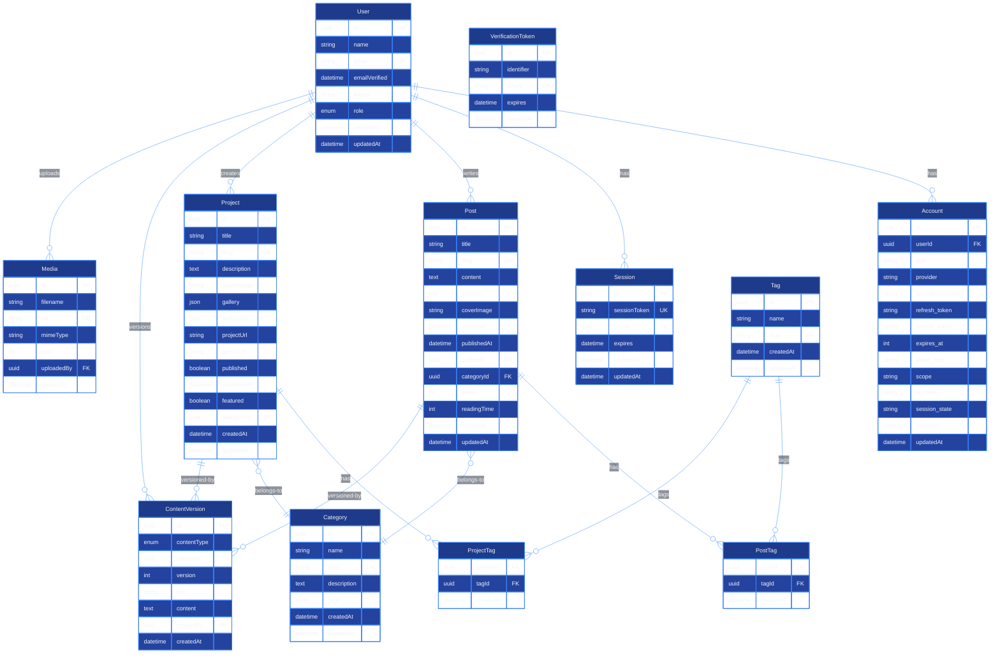

# DATABASE SCHEMA - cjhirashi.com

**Versión**: 1.0
**Fecha de Creación**: 2025-10-25
**Última Actualización**: 2025-10-25
**Database**: PostgreSQL (recomendado) o MySQL
**ORM**: Prisma (opcional) o Raw SQL
**Compatible con**: NextAuth.js v5

---

## RESUMEN EJECUTIVO

Este documento define el database schema completo para **cjhirashi.com**, incluyendo:

- **Autenticación**: NextAuth.js v5 compatible (Users, Accounts, Sessions, VerificationTokens)
- **Blog System**: Posts con Markdown, categorías, tags, versionado
- **Portfolio System**: Projects con galería de imágenes, tech stack, categorías, tags
- **CMS Features**: Content versioning, scheduled publishing, drafts
- **Media Management**: Images, files, uploads
- **Analytics**: View tracking, engagement metrics

**Total de Tablas**: 14 tablas principales + tablas de unión (N:M)

**Normalización**: 3NF (Third Normal Form) con denormalización estratégica para performance

---

## DIAGRAMA DE ENTIDADES Y RELACIONES (ERD)



---

## TABLAS DETALLADAS

### 1. User (Autenticación)

**Descripción**: Tabla de usuarios. Compatible con NextAuth.js v5. Solo Charlie (Admin) tiene acceso al CMS.

**Nombre de tabla**: `users`

| Columna | Tipo | Constraints | Descripción |
|---------|------|-------------|-------------|
| `id` | UUID | PRIMARY KEY, DEFAULT uuid_generate_v4() | Identificador único del usuario |
| `name` | VARCHAR(255) | NULL | Nombre completo del usuario |
| `email` | VARCHAR(255) | UNIQUE, NOT NULL | Email único (usado para login) |
| `emailVerified` | TIMESTAMP | NULL | Fecha de verificación de email |
| `image` | TEXT | NULL | URL de imagen de perfil |
| `role` | ENUM('ADMIN', 'USER') | DEFAULT 'USER', NOT NULL | Rol del usuario (solo Charlie es ADMIN) |
| `createdAt` | TIMESTAMP | DEFAULT CURRENT_TIMESTAMP, NOT NULL | Fecha de creación |
| `updatedAt` | TIMESTAMP | DEFAULT CURRENT_TIMESTAMP ON UPDATE CURRENT_TIMESTAMP, NOT NULL | Fecha de última actualización |

**Primary Key**: `id`

**Unique Constraints**:
- `email` (unique)

**Índices**:
```sql
CREATE INDEX idx_users_email ON users(email);
CREATE INDEX idx_users_role ON users(role);
CREATE INDEX idx_users_created_at ON users(createdAt DESC);
```

**SQL de Creación**:
```sql
CREATE TABLE users (
    id UUID PRIMARY KEY DEFAULT uuid_generate_v4(),
    name VARCHAR(255),
    email VARCHAR(255) UNIQUE NOT NULL,
    emailVerified TIMESTAMP,
    image TEXT,
    role VARCHAR(20) DEFAULT 'USER' NOT NULL CHECK (role IN ('ADMIN', 'USER')),
    createdAt TIMESTAMP DEFAULT CURRENT_TIMESTAMP NOT NULL,
    updatedAt TIMESTAMP DEFAULT CURRENT_TIMESTAMP NOT NULL
);

CREATE INDEX idx_users_email ON users(email);
CREATE INDEX idx_users_role ON users(role);
CREATE INDEX idx_users_created_at ON users(createdAt DESC);
```

**Notas**:
- NextAuth.js v5 requiere `emailVerified` para proveedores de email
- `role` es ENUM para control de acceso (RBAC)
- Solo Charlie tendrá `role = 'ADMIN'`
- `image` es URL de perfil (puede ser de GitHub OAuth)

---

### 2. Account (NextAuth.js v5 - OAuth Providers)

**Descripción**: Tabla de cuentas OAuth (GitHub, Google, etc.). Cada usuario puede tener múltiples cuentas conectadas.

**Nombre de tabla**: `accounts`

| Columna | Tipo | Constraints | Descripción |
|---------|------|-------------|-------------|
| `id` | UUID | PRIMARY KEY, DEFAULT uuid_generate_v4() | Identificador único de la cuenta |
| `userId` | UUID | FOREIGN KEY → users(id), NOT NULL, ON DELETE CASCADE | Usuario dueño de la cuenta |
| `type` | VARCHAR(50) | NOT NULL | Tipo de cuenta (oauth, email, credentials) |
| `provider` | VARCHAR(100) | NOT NULL | Proveedor (github, google, email) |
| `providerAccountId` | VARCHAR(255) | NOT NULL | ID del usuario en el proveedor |
| `refresh_token` | TEXT | NULL | Refresh token del OAuth |
| `access_token` | TEXT | NULL | Access token del OAuth |
| `expires_at` | INTEGER | NULL | Timestamp de expiración del token |
| `token_type` | VARCHAR(50) | NULL | Tipo de token (Bearer) |
| `scope` | TEXT | NULL | Scopes del token OAuth |
| `id_token` | TEXT | NULL | ID token (OpenID Connect) |
| `session_state` | TEXT | NULL | Session state (OAuth) |
| `createdAt` | TIMESTAMP | DEFAULT CURRENT_TIMESTAMP, NOT NULL | Fecha de creación |
| `updatedAt` | TIMESTAMP | DEFAULT CURRENT_TIMESTAMP ON UPDATE CURRENT_TIMESTAMP, NOT NULL | Fecha de última actualización |

**Primary Key**: `id`

**Foreign Keys**:
- `userId` → `users(id)` ON DELETE CASCADE

**Unique Constraints**:
- Composite unique: `(provider, providerAccountId)`

**Índices**:
```sql
CREATE INDEX idx_accounts_user_id ON accounts(userId);
CREATE UNIQUE INDEX idx_accounts_provider_account ON accounts(provider, providerAccountId);
```

**SQL de Creación**:
```sql
CREATE TABLE accounts (
    id UUID PRIMARY KEY DEFAULT uuid_generate_v4(),
    userId UUID NOT NULL,
    type VARCHAR(50) NOT NULL,
    provider VARCHAR(100) NOT NULL,
    providerAccountId VARCHAR(255) NOT NULL,
    refresh_token TEXT,
    access_token TEXT,
    expires_at INTEGER,
    token_type VARCHAR(50),
    scope TEXT,
    id_token TEXT,
    session_state TEXT,
    createdAt TIMESTAMP DEFAULT CURRENT_TIMESTAMP NOT NULL,
    updatedAt TIMESTAMP DEFAULT CURRENT_TIMESTAMP NOT NULL,
    FOREIGN KEY (userId) REFERENCES users(id) ON DELETE CASCADE,
    UNIQUE (provider, providerAccountId)
);

CREATE INDEX idx_accounts_user_id ON accounts(userId);
CREATE UNIQUE INDEX idx_accounts_provider_account ON accounts(provider, providerAccountId);
```

**Notas**:
- Compatible con NextAuth.js v5 (campos estándar)
- `refresh_token` y `access_token` son TEXT para tokens largos
- `expires_at` es Unix timestamp (INTEGER)
- Composite unique `(provider, providerAccountId)` previene duplicados

---

### 3. Session (NextAuth.js v5 - Sesiones)

**Descripción**: Tabla de sesiones activas. NextAuth.js v5 gestiona automáticamente.

**Nombre de tabla**: `sessions`

| Columna | Tipo | Constraints | Descripción |
|---------|------|-------------|-------------|
| `id` | UUID | PRIMARY KEY, DEFAULT uuid_generate_v4() | Identificador único de la sesión |
| `sessionToken` | VARCHAR(255) | UNIQUE, NOT NULL | Token de sesión único |
| `userId` | UUID | FOREIGN KEY → users(id), NOT NULL, ON DELETE CASCADE | Usuario dueño de la sesión |
| `expires` | TIMESTAMP | NOT NULL | Fecha de expiración de la sesión |
| `createdAt` | TIMESTAMP | DEFAULT CURRENT_TIMESTAMP, NOT NULL | Fecha de creación |
| `updatedAt` | TIMESTAMP | DEFAULT CURRENT_TIMESTAMP ON UPDATE CURRENT_TIMESTAMP, NOT NULL | Fecha de última actualización |

**Primary Key**: `id`

**Foreign Keys**:
- `userId` → `users(id)` ON DELETE CASCADE

**Unique Constraints**:
- `sessionToken` (unique)

**Índices**:
```sql
CREATE UNIQUE INDEX idx_sessions_session_token ON sessions(sessionToken);
CREATE INDEX idx_sessions_user_id ON sessions(userId);
CREATE INDEX idx_sessions_expires ON sessions(expires);
```

**SQL de Creación**:
```sql
CREATE TABLE sessions (
    id UUID PRIMARY KEY DEFAULT uuid_generate_v4(),
    sessionToken VARCHAR(255) UNIQUE NOT NULL,
    userId UUID NOT NULL,
    expires TIMESTAMP NOT NULL,
    createdAt TIMESTAMP DEFAULT CURRENT_TIMESTAMP NOT NULL,
    updatedAt TIMESTAMP DEFAULT CURRENT_TIMESTAMP NOT NULL,
    FOREIGN KEY (userId) REFERENCES users(id) ON DELETE CASCADE
);

CREATE UNIQUE INDEX idx_sessions_session_token ON sessions(sessionToken);
CREATE INDEX idx_sessions_user_id ON sessions(userId);
CREATE INDEX idx_sessions_expires ON sessions(expires);
```

**Notas**:
- `sessionToken` debe ser único (usado para lookup rápido)
- `expires` permite cleanup automático de sesiones expiradas
- Índice en `expires` para queries de limpieza (cron jobs)

---

### 4. VerificationToken (NextAuth.js v5 - Email Verification)

**Descripción**: Tabla de tokens de verificación de email (magic links, password reset, etc.).

**Nombre de tabla**: `verification_tokens`

| Columna | Tipo | Constraints | Descripción |
|---------|------|-------------|-------------|
| `id` | UUID | PRIMARY KEY, DEFAULT uuid_generate_v4() | Identificador único del token |
| `identifier` | VARCHAR(255) | NOT NULL | Email o identificador del usuario |
| `token` | VARCHAR(255) | UNIQUE, NOT NULL | Token de verificación único |
| `expires` | TIMESTAMP | NOT NULL | Fecha de expiración del token |
| `createdAt` | TIMESTAMP | DEFAULT CURRENT_TIMESTAMP, NOT NULL | Fecha de creación |

**Primary Key**: `id`

**Unique Constraints**:
- `token` (unique)

**Índices**:
```sql
CREATE UNIQUE INDEX idx_verification_tokens_token ON verification_tokens(token);
CREATE INDEX idx_verification_tokens_identifier ON verification_tokens(identifier);
CREATE INDEX idx_verification_tokens_expires ON verification_tokens(expires);
```

**SQL de Creación**:
```sql
CREATE TABLE verification_tokens (
    id UUID PRIMARY KEY DEFAULT uuid_generate_v4(),
    identifier VARCHAR(255) NOT NULL,
    token VARCHAR(255) UNIQUE NOT NULL,
    expires TIMESTAMP NOT NULL,
    createdAt TIMESTAMP DEFAULT CURRENT_TIMESTAMP NOT NULL
);

CREATE UNIQUE INDEX idx_verification_tokens_token ON verification_tokens(token);
CREATE INDEX idx_verification_tokens_identifier ON verification_tokens(identifier);
CREATE INDEX idx_verification_tokens_expires ON verification_tokens(expires);
```

**Notas**:
- Compatible con NextAuth.js v5 (campos estándar)
- `identifier` es el email del usuario (no FK, por flexibilidad)
- `token` es hash único (generado por NextAuth)
- Índice en `expires` para cleanup de tokens expirados

---

### 5. Post (Blog System)

**Descripción**: Tabla de posts del blog. Soporta Markdown, Mermaid diagrams, syntax highlighting.

**Nombre de tabla**: `posts`

| Columna | Tipo | Constraints | Descripción |
|---------|------|-------------|-------------|
| `id` | UUID | PRIMARY KEY, DEFAULT uuid_generate_v4() | Identificador único del post |
| `title` | VARCHAR(255) | NOT NULL | Título del post |
| `slug` | VARCHAR(255) | UNIQUE, NOT NULL | Slug SEO-friendly (para URL) |
| `content` | TEXT | NOT NULL | Contenido en Markdown |
| `excerpt` | TEXT | NULL | Resumen breve del post (para lista) |
| `coverImage` | TEXT | NULL | URL de imagen de portada |
| `published` | BOOLEAN | DEFAULT FALSE, NOT NULL | Estado de publicación |
| `publishedAt` | TIMESTAMP | NULL | Fecha de publicación |
| `authorId` | UUID | FOREIGN KEY → users(id), NOT NULL, ON DELETE CASCADE | Autor del post (Charlie) |
| `categoryId` | UUID | FOREIGN KEY → categories(id), NULL, ON DELETE SET NULL | Categoría del post |
| `views` | INTEGER | DEFAULT 0, NOT NULL | Contador de vistas |
| `readingTime` | INTEGER | DEFAULT 0, NOT NULL | Tiempo estimado de lectura (minutos) |
| `createdAt` | TIMESTAMP | DEFAULT CURRENT_TIMESTAMP, NOT NULL | Fecha de creación |
| `updatedAt` | TIMESTAMP | DEFAULT CURRENT_TIMESTAMP ON UPDATE CURRENT_TIMESTAMP, NOT NULL | Fecha de última actualización |

**Primary Key**: `id`

**Foreign Keys**:
- `authorId` → `users(id)` ON DELETE CASCADE
- `categoryId` → `categories(id)` ON DELETE SET NULL

**Unique Constraints**:
- `slug` (unique)

**Índices**:
```sql
CREATE UNIQUE INDEX idx_posts_slug ON posts(slug);
CREATE INDEX idx_posts_author_id ON posts(authorId);
CREATE INDEX idx_posts_category_id ON posts(categoryId);
CREATE INDEX idx_posts_published_published_at ON posts(published, publishedAt DESC);
CREATE INDEX idx_posts_created_at ON posts(createdAt DESC);
CREATE INDEX idx_posts_views ON posts(views DESC);
```

**SQL de Creación**:
```sql
CREATE TABLE posts (
    id UUID PRIMARY KEY DEFAULT uuid_generate_v4(),
    title VARCHAR(255) NOT NULL,
    slug VARCHAR(255) UNIQUE NOT NULL,
    content TEXT NOT NULL,
    excerpt TEXT,
    coverImage TEXT,
    published BOOLEAN DEFAULT FALSE NOT NULL,
    publishedAt TIMESTAMP,
    authorId UUID NOT NULL,
    categoryId UUID,
    views INTEGER DEFAULT 0 NOT NULL,
    readingTime INTEGER DEFAULT 0 NOT NULL,
    createdAt TIMESTAMP DEFAULT CURRENT_TIMESTAMP NOT NULL,
    updatedAt TIMESTAMP DEFAULT CURRENT_TIMESTAMP NOT NULL,
    FOREIGN KEY (authorId) REFERENCES users(id) ON DELETE CASCADE,
    FOREIGN KEY (categoryId) REFERENCES categories(id) ON DELETE SET NULL
);

CREATE UNIQUE INDEX idx_posts_slug ON posts(slug);
CREATE INDEX idx_posts_author_id ON posts(authorId);
CREATE INDEX idx_posts_category_id ON posts(categoryId);
CREATE INDEX idx_posts_published_published_at ON posts(published, publishedAt DESC);
CREATE INDEX idx_posts_created_at ON posts(createdAt DESC);
CREATE INDEX idx_posts_views ON posts(views DESC);
```

**Notas**:
- `slug` es único para URLs SEO-friendly (`/blog/my-first-post`)
- `content` es Markdown (soporta Mermaid, code blocks)
- `excerpt` se genera automáticamente o manualmente (para lista de posts)
- `published` permite borradores (`FALSE`) vs publicados (`TRUE`)
- `publishedAt` es NULL si borrador, SET cuando se publica
- `readingTime` se calcula automáticamente (palabras / 200 wpm)
- Índice compuesto `(published, publishedAt DESC)` para queries de lista pública
- `views` se incrementa con cada visita (denormalización para performance)

---

### 6. Project (Portfolio System)

**Descripción**: Tabla de proyectos del portfolio. Soporta galería de imágenes, tech stack.

**Nombre de tabla**: `projects`

| Columna | Tipo | Constraints | Descripción |
|---------|------|-------------|-------------|
| `id` | UUID | PRIMARY KEY, DEFAULT uuid_generate_v4() | Identificador único del proyecto |
| `title` | VARCHAR(255) | NOT NULL | Título del proyecto |
| `slug` | VARCHAR(255) | UNIQUE, NOT NULL | Slug SEO-friendly (para URL) |
| `description` | TEXT | NOT NULL | Descripción en Markdown |
| `coverImage` | TEXT | NULL | URL de imagen de portada |
| `gallery` | JSON | NULL | Array JSON de URLs de imágenes |
| `techStack` | JSON | NULL | Array JSON de tecnologías usadas |
| `projectUrl` | TEXT | NULL | URL del proyecto live (si aplica) |
| `githubUrl` | TEXT | NULL | URL del repositorio GitHub |
| `published` | BOOLEAN | DEFAULT FALSE, NOT NULL | Estado de publicación |
| `publishedAt` | TIMESTAMP | NULL | Fecha de publicación |
| `featured` | BOOLEAN | DEFAULT FALSE, NOT NULL | Proyecto destacado (para home) |
| `categoryId` | UUID | FOREIGN KEY → categories(id), NULL, ON DELETE SET NULL | Categoría del proyecto |
| `createdAt` | TIMESTAMP | DEFAULT CURRENT_TIMESTAMP, NOT NULL | Fecha de creación |
| `updatedAt` | TIMESTAMP | DEFAULT CURRENT_TIMESTAMP ON UPDATE CURRENT_TIMESTAMP, NOT NULL | Fecha de última actualización |

**Primary Key**: `id`

**Foreign Keys**:
- `categoryId` → `categories(id)` ON DELETE SET NULL

**Unique Constraints**:
- `slug` (unique)

**Índices**:
```sql
CREATE UNIQUE INDEX idx_projects_slug ON projects(slug);
CREATE INDEX idx_projects_category_id ON projects(categoryId);
CREATE INDEX idx_projects_published_published_at ON projects(published, publishedAt DESC);
CREATE INDEX idx_projects_featured ON projects(featured, published);
CREATE INDEX idx_projects_created_at ON projects(createdAt DESC);
```

**SQL de Creación**:
```sql
CREATE TABLE projects (
    id UUID PRIMARY KEY DEFAULT uuid_generate_v4(),
    title VARCHAR(255) NOT NULL,
    slug VARCHAR(255) UNIQUE NOT NULL,
    description TEXT NOT NULL,
    coverImage TEXT,
    gallery JSON,
    techStack JSON,
    projectUrl TEXT,
    githubUrl TEXT,
    published BOOLEAN DEFAULT FALSE NOT NULL,
    publishedAt TIMESTAMP,
    featured BOOLEAN DEFAULT FALSE NOT NULL,
    categoryId UUID,
    createdAt TIMESTAMP DEFAULT CURRENT_TIMESTAMP NOT NULL,
    updatedAt TIMESTAMP DEFAULT CURRENT_TIMESTAMP NOT NULL,
    FOREIGN KEY (categoryId) REFERENCES categories(id) ON DELETE SET NULL
);

CREATE UNIQUE INDEX idx_projects_slug ON projects(slug);
CREATE INDEX idx_projects_category_id ON projects(categoryId);
CREATE INDEX idx_projects_published_published_at ON projects(published, publishedAt DESC);
CREATE INDEX idx_projects_featured ON projects(featured, published);
CREATE INDEX idx_projects_created_at ON projects(createdAt DESC);
```

**Notas**:
- `slug` es único para URLs SEO-friendly (`/projects/my-awesome-project`)
- `description` es Markdown (soporta formateo rico)
- `gallery` es JSON array: `["url1.jpg", "url2.jpg", "url3.jpg"]`
- `techStack` es JSON array: `["Next.js", "TypeScript", "Tailwind CSS"]`
- `featured` permite destacar proyectos en home page
- Índice compuesto `(featured, published)` para query de proyectos destacados
- Índice compuesto `(published, publishedAt DESC)` para lista pública

**Ejemplo de JSON**:
```json
// gallery
["https://cdn.cjhirashi.com/project1-screenshot1.png", "https://cdn.cjhirashi.com/project1-screenshot2.png"]

// techStack
["Next.js 15", "TypeScript", "Tailwind CSS v4", "PostgreSQL", "Vercel"]
```

---

### 7. Category (Posts + Projects)

**Descripción**: Tabla de categorías. Compartida por Posts y Projects (diferenciadas por `type`).

**Nombre de tabla**: `categories`

| Columna | Tipo | Constraints | Descripción |
|---------|------|-------------|-------------|
| `id` | UUID | PRIMARY KEY, DEFAULT uuid_generate_v4() | Identificador único de la categoría |
| `name` | VARCHAR(100) | NOT NULL | Nombre de la categoría |
| `slug` | VARCHAR(100) | UNIQUE, NOT NULL | Slug SEO-friendly |
| `description` | TEXT | NULL | Descripción breve de la categoría |
| `type` | ENUM('post', 'project') | NOT NULL | Tipo de contenido (post o project) |
| `createdAt` | TIMESTAMP | DEFAULT CURRENT_TIMESTAMP, NOT NULL | Fecha de creación |
| `updatedAt` | TIMESTAMP | DEFAULT CURRENT_TIMESTAMP ON UPDATE CURRENT_TIMESTAMP, NOT NULL | Fecha de última actualización |

**Primary Key**: `id`

**Unique Constraints**:
- `slug` (unique)

**Índices**:
```sql
CREATE UNIQUE INDEX idx_categories_slug ON categories(slug);
CREATE INDEX idx_categories_type ON categories(type);
CREATE INDEX idx_categories_type_slug ON categories(type, slug);
```

**SQL de Creación**:
```sql
CREATE TABLE categories (
    id UUID PRIMARY KEY DEFAULT uuid_generate_v4(),
    name VARCHAR(100) NOT NULL,
    slug VARCHAR(100) UNIQUE NOT NULL,
    description TEXT,
    type VARCHAR(20) NOT NULL CHECK (type IN ('post', 'project')),
    createdAt TIMESTAMP DEFAULT CURRENT_TIMESTAMP NOT NULL,
    updatedAt TIMESTAMP DEFAULT CURRENT_TIMESTAMP NOT NULL
);

CREATE UNIQUE INDEX idx_categories_slug ON categories(slug);
CREATE INDEX idx_categories_type ON categories(type);
CREATE INDEX idx_categories_type_slug ON categories(type, slug);
```

**Notas**:
- `type` es ENUM para diferenciar categorías de posts vs projects
- `slug` es único global (no puede haber `slug='tech'` para post y project)
- Índice compuesto `(type, slug)` para queries filtradas por tipo
- Ejemplos de categorías:
  - Posts: `web-development`, `data-science`, `machine-learning`, `tutorials`
  - Projects: `web-apps`, `data-analysis`, `automation`, `open-source`

---

### 8. Tag (Posts + Projects)

**Descripción**: Tabla de tags. Compartida por Posts y Projects (muchos a muchos).

**Nombre de tabla**: `tags`

| Columna | Tipo | Constraints | Descripción |
|---------|------|-------------|-------------|
| `id` | UUID | PRIMARY KEY, DEFAULT uuid_generate_v4() | Identificador único del tag |
| `name` | VARCHAR(50) | UNIQUE, NOT NULL | Nombre del tag |
| `slug` | VARCHAR(50) | UNIQUE, NOT NULL | Slug SEO-friendly |
| `createdAt` | TIMESTAMP | DEFAULT CURRENT_TIMESTAMP, NOT NULL | Fecha de creación |
| `updatedAt` | TIMESTAMP | DEFAULT CURRENT_TIMESTAMP ON UPDATE CURRENT_TIMESTAMP, NOT NULL | Fecha de última actualización |

**Primary Key**: `id`

**Unique Constraints**:
- `name` (unique)
- `slug` (unique)

**Índices**:
```sql
CREATE UNIQUE INDEX idx_tags_name ON tags(name);
CREATE UNIQUE INDEX idx_tags_slug ON tags(slug);
```

**SQL de Creación**:
```sql
CREATE TABLE tags (
    id UUID PRIMARY KEY DEFAULT uuid_generate_v4(),
    name VARCHAR(50) UNIQUE NOT NULL,
    slug VARCHAR(50) UNIQUE NOT NULL,
    createdAt TIMESTAMP DEFAULT CURRENT_TIMESTAMP NOT NULL,
    updatedAt TIMESTAMP DEFAULT CURRENT_TIMESTAMP NOT NULL
);

CREATE UNIQUE INDEX idx_tags_name ON tags(name);
CREATE UNIQUE INDEX idx_tags_slug ON tags(slug);
```

**Notas**:
- Tags son compartidos entre Posts y Projects (reutilización)
- `name` y `slug` son únicos (un tag puede usarse en posts y projects)
- Ejemplos de tags: `nextjs`, `typescript`, `tailwind`, `react`, `ai`, `ml`, `postgresql`

---

### 9. PostTag (Many-to-Many: Post ↔ Tag)

**Descripción**: Tabla de unión para relación N:M entre Posts y Tags.

**Nombre de tabla**: `post_tags`

| Columna | Tipo | Constraints | Descripción |
|---------|------|-------------|-------------|
| `postId` | UUID | FOREIGN KEY → posts(id), NOT NULL, ON DELETE CASCADE | ID del post |
| `tagId` | UUID | FOREIGN KEY → tags(id), NOT NULL, ON DELETE CASCADE | ID del tag |
| `createdAt` | TIMESTAMP | DEFAULT CURRENT_TIMESTAMP, NOT NULL | Fecha de asociación |

**Primary Key**: Composite `(postId, tagId)`

**Foreign Keys**:
- `postId` → `posts(id)` ON DELETE CASCADE
- `tagId` → `tags(id)` ON DELETE CASCADE

**Índices**:
```sql
CREATE INDEX idx_post_tags_post_id ON post_tags(postId);
CREATE INDEX idx_post_tags_tag_id ON post_tags(tagId);
```

**SQL de Creación**:
```sql
CREATE TABLE post_tags (
    postId UUID NOT NULL,
    tagId UUID NOT NULL,
    createdAt TIMESTAMP DEFAULT CURRENT_TIMESTAMP NOT NULL,
    PRIMARY KEY (postId, tagId),
    FOREIGN KEY (postId) REFERENCES posts(id) ON DELETE CASCADE,
    FOREIGN KEY (tagId) REFERENCES tags(id) ON DELETE CASCADE
);

CREATE INDEX idx_post_tags_post_id ON post_tags(postId);
CREATE INDEX idx_post_tags_tag_id ON post_tags(tagId);
```

**Notas**:
- Composite primary key `(postId, tagId)` previene duplicados
- Índices en ambas FKs para queries bidireccionales:
  - Obtener tags de un post: `SELECT * FROM tags JOIN post_tags ON tags.id = post_tags.tagId WHERE post_tags.postId = ?`
  - Obtener posts de un tag: `SELECT * FROM posts JOIN post_tags ON posts.id = post_tags.postId WHERE post_tags.tagId = ?`
- `ON DELETE CASCADE` asegura cleanup automático si post o tag se borra

---

### 10. ProjectTag (Many-to-Many: Project ↔ Tag)

**Descripción**: Tabla de unión para relación N:M entre Projects y Tags.

**Nombre de tabla**: `project_tags`

| Columna | Tipo | Constraints | Descripción |
|---------|------|-------------|-------------|
| `projectId` | UUID | FOREIGN KEY → projects(id), NOT NULL, ON DELETE CASCADE | ID del proyecto |
| `tagId` | UUID | FOREIGN KEY → tags(id), NOT NULL, ON DELETE CASCADE | ID del tag |
| `createdAt` | TIMESTAMP | DEFAULT CURRENT_TIMESTAMP, NOT NULL | Fecha de asociación |

**Primary Key**: Composite `(projectId, tagId)`

**Foreign Keys**:
- `projectId` → `projects(id)` ON DELETE CASCADE
- `tagId` → `tags(id)` ON DELETE CASCADE

**Índices**:
```sql
CREATE INDEX idx_project_tags_project_id ON project_tags(projectId);
CREATE INDEX idx_project_tags_tag_id ON project_tags(tagId);
```

**SQL de Creación**:
```sql
CREATE TABLE project_tags (
    projectId UUID NOT NULL,
    tagId UUID NOT NULL,
    createdAt TIMESTAMP DEFAULT CURRENT_TIMESTAMP NOT NULL,
    PRIMARY KEY (projectId, tagId),
    FOREIGN KEY (projectId) REFERENCES projects(id) ON DELETE CASCADE,
    FOREIGN KEY (tagId) REFERENCES tags(id) ON DELETE CASCADE
);

CREATE INDEX idx_project_tags_project_id ON project_tags(projectId);
CREATE INDEX idx_project_tags_tag_id ON project_tags(tagId);
```

**Notas**:
- Composite primary key `(projectId, tagId)` previene duplicados
- Índices en ambas FKs para queries bidireccionales
- `ON DELETE CASCADE` asegura cleanup automático

---

### 11. ContentVersion (Versionado de Posts/Projects)

**Descripción**: Tabla de versionado para Posts y Projects. Preserva historial de cambios.

**Nombre de tabla**: `content_versions`

| Columna | Tipo | Constraints | Descripción |
|---------|------|-------------|-------------|
| `id` | UUID | PRIMARY KEY, DEFAULT uuid_generate_v4() | Identificador único de la versión |
| `contentType` | ENUM('post', 'project') | NOT NULL | Tipo de contenido versionado |
| `contentId` | UUID | NOT NULL | ID del post o project versionado |
| `version` | INTEGER | NOT NULL | Número de versión (1, 2, 3...) |
| `title` | VARCHAR(255) | NOT NULL | Título en esta versión |
| `content` | TEXT | NOT NULL | Contenido en esta versión (Markdown) |
| `createdBy` | UUID | FOREIGN KEY → users(id), NOT NULL, ON DELETE CASCADE | Usuario que creó la versión |
| `createdAt` | TIMESTAMP | DEFAULT CURRENT_TIMESTAMP, NOT NULL | Fecha de creación de versión |

**Primary Key**: `id`

**Foreign Keys**:
- `createdBy` → `users(id)` ON DELETE CASCADE
- No FK directo a `posts` o `projects` (usa `contentType` + `contentId` dinámicamente)

**Unique Constraints**:
- Composite unique: `(contentType, contentId, version)`

**Índices**:
```sql
CREATE INDEX idx_content_versions_content ON content_versions(contentType, contentId);
CREATE INDEX idx_content_versions_created_by ON content_versions(createdBy);
CREATE UNIQUE INDEX idx_content_versions_unique_version ON content_versions(contentType, contentId, version);
```

**SQL de Creación**:
```sql
CREATE TABLE content_versions (
    id UUID PRIMARY KEY DEFAULT uuid_generate_v4(),
    contentType VARCHAR(20) NOT NULL CHECK (contentType IN ('post', 'project')),
    contentId UUID NOT NULL,
    version INTEGER NOT NULL,
    title VARCHAR(255) NOT NULL,
    content TEXT NOT NULL,
    createdBy UUID NOT NULL,
    createdAt TIMESTAMP DEFAULT CURRENT_TIMESTAMP NOT NULL,
    FOREIGN KEY (createdBy) REFERENCES users(id) ON DELETE CASCADE,
    UNIQUE (contentType, contentId, version)
);

CREATE INDEX idx_content_versions_content ON content_versions(contentType, contentId);
CREATE INDEX idx_content_versions_created_by ON content_versions(createdBy);
CREATE UNIQUE INDEX idx_content_versions_unique_version ON content_versions(contentType, contentId, version);
```

**Notas**:
- `contentType` + `contentId` permiten versionado flexible de Posts y Projects
- `version` se autoincrementa por `contentId` (1, 2, 3...)
- Composite unique `(contentType, contentId, version)` previene duplicados
- Índice compuesto `(contentType, contentId)` para queries de historial:
  - "Obtener todas las versiones del post X"
- Preserva `title` y `content` de cada versión (NO solo diff)
- Uso: Restaurar versión anterior, auditoría, comparación de cambios

**Ejemplo de uso**:
```sql
-- Obtener historial de versiones de un post
SELECT * FROM content_versions
WHERE contentType = 'post' AND contentId = 'post-uuid-123'
ORDER BY version DESC;

-- Restaurar versión 3 de un post
UPDATE posts
SET title = (SELECT title FROM content_versions WHERE contentType = 'post' AND contentId = 'post-uuid-123' AND version = 3),
    content = (SELECT content FROM content_versions WHERE contentType = 'post' AND contentId = 'post-uuid-123' AND version = 3)
WHERE id = 'post-uuid-123';
```

---

### 12. Media (Imágenes y Archivos)

**Descripción**: Tabla de archivos multimedia (imágenes, PDFs, etc.). Usado por Posts, Projects, Users.

**Nombre de tabla**: `media`

| Columna | Tipo | Constraints | Descripción |
|---------|------|-------------|-------------|
| `id` | UUID | PRIMARY KEY, DEFAULT uuid_generate_v4() | Identificador único del archivo |
| `filename` | VARCHAR(255) | NOT NULL | Nombre original del archivo |
| `url` | TEXT | UNIQUE, NOT NULL | URL completa del archivo (CDN/storage) |
| `mimeType` | VARCHAR(100) | NOT NULL | Tipo MIME (image/png, application/pdf) |
| `size` | INTEGER | NOT NULL | Tamaño del archivo en bytes |
| `uploadedBy` | UUID | FOREIGN KEY → users(id), NOT NULL, ON DELETE CASCADE | Usuario que subió el archivo |
| `createdAt` | TIMESTAMP | DEFAULT CURRENT_TIMESTAMP, NOT NULL | Fecha de subida |

**Primary Key**: `id`

**Foreign Keys**:
- `uploadedBy` → `users(id)` ON DELETE CASCADE

**Unique Constraints**:
- `url` (unique)

**Índices**:
```sql
CREATE UNIQUE INDEX idx_media_url ON media(url);
CREATE INDEX idx_media_uploaded_by ON media(uploadedBy);
CREATE INDEX idx_media_created_at ON media(createdAt DESC);
CREATE INDEX idx_media_mime_type ON media(mimeType);
```

**SQL de Creación**:
```sql
CREATE TABLE media (
    id UUID PRIMARY KEY DEFAULT uuid_generate_v4(),
    filename VARCHAR(255) NOT NULL,
    url TEXT UNIQUE NOT NULL,
    mimeType VARCHAR(100) NOT NULL,
    size INTEGER NOT NULL,
    uploadedBy UUID NOT NULL,
    createdAt TIMESTAMP DEFAULT CURRENT_TIMESTAMP NOT NULL,
    FOREIGN KEY (uploadedBy) REFERENCES users(id) ON DELETE CASCADE
);

CREATE UNIQUE INDEX idx_media_url ON media(url);
CREATE INDEX idx_media_uploaded_by ON media(uploadedBy);
CREATE INDEX idx_media_created_at ON media(createdAt DESC);
CREATE INDEX idx_media_mime_type ON media(mimeType);
```

**Notas**:
- `url` es único (previene duplicados en CDN)
- `mimeType` permite filtrado por tipo (`image/*`, `application/pdf`)
- `size` es en bytes (útil para monitoreo de storage)
- `uploadedBy` permite auditoría de uploads
- Índice en `mimeType` para queries como "obtener todas las imágenes"
- NO hay FK directo a Posts/Projects (se referencia por URL en `coverImage`, `gallery`)

**Ejemplo de uso**:
```sql
-- Obtener todas las imágenes subidas por Charlie
SELECT * FROM media
WHERE uploadedBy = 'charlie-user-id'
  AND mimeType LIKE 'image/%'
ORDER BY createdAt DESC;

-- Obtener total de storage usado
SELECT SUM(size) FROM media;
```

---

## RELACIONES DETALLADAS

### 1. User ↔ Post (1:N)

**Tipo**: One-to-Many
**Relación**: Un usuario (Charlie) puede escribir muchos posts
**Foreign Key**: `posts.authorId` → `users.id`
**ON DELETE**: CASCADE (si Charlie se borra, se borran sus posts)

**Queries comunes**:
```sql
-- Obtener todos los posts de Charlie
SELECT * FROM posts WHERE authorId = 'charlie-user-id';

-- Obtener Charlie + sus posts (JOIN)
SELECT users.name, posts.title
FROM users
JOIN posts ON users.id = posts.authorId
WHERE users.id = 'charlie-user-id';
```

---

### 2. User ↔ Project (1:N)

**Tipo**: One-to-Many
**Relación**: Un usuario (Charlie) puede crear muchos proyectos
**Foreign Key**: `projects.categoryId` → `categories.id` (NO hay `authorId` explícito en Project, asumir Charlie es único admin)
**ON DELETE**: SET NULL (si categoría se borra, proyecto mantiene)

**Nota**: Si quieres trackear autor de Project:
```sql
ALTER TABLE projects ADD COLUMN authorId UUID;
ALTER TABLE projects ADD CONSTRAINT fk_projects_author FOREIGN KEY (authorId) REFERENCES users(id) ON DELETE CASCADE;
```

---

### 3. Post ↔ Category (N:1)

**Tipo**: Many-to-One
**Relación**: Muchos posts pueden pertenecer a una categoría
**Foreign Key**: `posts.categoryId` → `categories.id`
**ON DELETE**: SET NULL (si categoría se borra, post queda sin categoría)

**Queries comunes**:
```sql
-- Obtener todos los posts de categoría "Web Development"
SELECT posts.*
FROM posts
JOIN categories ON posts.categoryId = categories.id
WHERE categories.slug = 'web-development' AND categories.type = 'post';
```

---

### 4. Project ↔ Category (N:1)

**Tipo**: Many-to-One
**Relación**: Muchos proyectos pueden pertenecer a una categoría
**Foreign Key**: `projects.categoryId` → `categories.id`
**ON DELETE**: SET NULL (si categoría se borra, proyecto queda sin categoría)

**Queries comunes**:
```sql
-- Obtener todos los proyectos de categoría "Web Apps"
SELECT projects.*
FROM projects
JOIN categories ON projects.categoryId = categories.id
WHERE categories.slug = 'web-apps' AND categories.type = 'project';
```

---

### 5. Post ↔ Tag (N:M via PostTag)

**Tipo**: Many-to-Many
**Relación**: Un post puede tener muchos tags, un tag puede estar en muchos posts
**Tabla de Unión**: `post_tags`
**Foreign Keys**:
- `post_tags.postId` → `posts.id` (ON DELETE CASCADE)
- `post_tags.tagId` → `tags.id` (ON DELETE CASCADE)

**Queries comunes**:
```sql
-- Obtener todos los tags de un post
SELECT tags.*
FROM tags
JOIN post_tags ON tags.id = post_tags.tagId
WHERE post_tags.postId = 'post-uuid-123';

-- Obtener todos los posts con tag "nextjs"
SELECT posts.*
FROM posts
JOIN post_tags ON posts.id = post_tags.postId
JOIN tags ON post_tags.tagId = tags.id
WHERE tags.slug = 'nextjs';
```

---

### 6. Project ↔ Tag (N:M via ProjectTag)

**Tipo**: Many-to-Many
**Relación**: Un proyecto puede tener muchos tags, un tag puede estar en muchos proyectos
**Tabla de Unión**: `project_tags`
**Foreign Keys**:
- `project_tags.projectId` → `projects.id` (ON DELETE CASCADE)
- `project_tags.tagId` → `tags.id` (ON DELETE CASCADE)

**Queries comunes**:
```sql
-- Obtener todos los tags de un proyecto
SELECT tags.*
FROM tags
JOIN project_tags ON tags.id = project_tags.tagId
WHERE project_tags.projectId = 'project-uuid-456';

-- Obtener todos los proyectos con tag "typescript"
SELECT projects.*
FROM projects
JOIN project_tags ON projects.id = project_tags.projectId
JOIN tags ON project_tags.tagId = tags.id
WHERE tags.slug = 'typescript';
```

---

### 7. User ↔ Account (1:N)

**Tipo**: One-to-Many
**Relación**: Un usuario puede tener múltiples cuentas OAuth (GitHub, Google, Email)
**Foreign Key**: `accounts.userId` → `users.id`
**ON DELETE**: CASCADE (si usuario se borra, se borran sus cuentas)

**Queries comunes**:
```sql
-- Obtener todas las cuentas de Charlie
SELECT * FROM accounts WHERE userId = 'charlie-user-id';

-- Obtener cuenta de GitHub de Charlie
SELECT * FROM accounts
WHERE userId = 'charlie-user-id' AND provider = 'github';
```

---

### 8. User ↔ Session (1:N)

**Tipo**: One-to-Many
**Relación**: Un usuario puede tener múltiples sesiones activas (diferentes dispositivos)
**Foreign Key**: `sessions.userId` → `users.id`
**ON DELETE**: CASCADE (si usuario se borra, se borran sus sesiones)

**Queries comunes**:
```sql
-- Obtener todas las sesiones activas de Charlie
SELECT * FROM sessions
WHERE userId = 'charlie-user-id' AND expires > NOW();
```

---

### 9. User ↔ ContentVersion (1:N)

**Tipo**: One-to-Many
**Relación**: Un usuario (Charlie) crea múltiples versiones de contenido
**Foreign Key**: `content_versions.createdBy` → `users.id`
**ON DELETE**: CASCADE (si usuario se borra, se borran versiones)

**Queries comunes**:
```sql
-- Obtener todas las versiones creadas por Charlie
SELECT * FROM content_versions WHERE createdBy = 'charlie-user-id';
```

---

### 10. User ↔ Media (1:N)

**Tipo**: One-to-Many
**Relación**: Un usuario (Charlie) sube múltiples archivos multimedia
**Foreign Key**: `media.uploadedBy` → `users.id`
**ON DELETE**: CASCADE (si usuario se borra, se borran archivos)

**Queries comunes**:
```sql
-- Obtener todos los archivos subidos por Charlie
SELECT * FROM media WHERE uploadedBy = 'charlie-user-id';
```

---

### 11. Post ↔ ContentVersion (1:N)

**Tipo**: One-to-Many (virtual, via `contentType` + `contentId`)
**Relación**: Un post puede tener múltiples versiones
**Lookup**: `content_versions.contentType = 'post'` AND `content_versions.contentId = posts.id`

**Queries comunes**:
```sql
-- Obtener historial de versiones de un post
SELECT * FROM content_versions
WHERE contentType = 'post' AND contentId = 'post-uuid-123'
ORDER BY version DESC;
```

---

### 12. Project ↔ ContentVersion (1:N)

**Tipo**: One-to-Many (virtual, via `contentType` + `contentId`)
**Relación**: Un proyecto puede tener múltiples versiones
**Lookup**: `content_versions.contentType = 'project'` AND `content_versions.contentId = projects.id`

**Queries comunes**:
```sql
-- Obtener historial de versiones de un proyecto
SELECT * FROM content_versions
WHERE contentType = 'project' AND contentId = 'project-uuid-456'
ORDER BY version DESC;
```

---

## ÍNDICES ESTRATÉGICOS

### Índices Primarios (Performance Crítica)

| Tabla | Índice | Tipo | Justificación |
|-------|--------|------|---------------|
| `users` | `idx_users_email` | Simple | Login por email (lookup rápido) |
| `posts` | `idx_posts_slug` | Unique | URL lookup `/blog/[slug]` |
| `posts` | `idx_posts_published_published_at` | Compuesto | Lista pública de posts (filtro + orden) |
| `projects` | `idx_projects_slug` | Unique | URL lookup `/projects/[slug]` |
| `projects` | `idx_projects_featured` | Compuesto | Proyectos destacados en home |
| `sessions` | `idx_sessions_session_token` | Unique | Autenticación de sesión (lookup rápido) |
| `accounts` | `idx_accounts_provider_account` | Unique Compuesto | Prevenir duplicados OAuth |
| `tags` | `idx_tags_slug` | Unique | Filtrado por tag en URLs |
| `categories` | `idx_categories_slug` | Unique | Filtrado por categoría en URLs |

### Índices Secundarios (Performance Media)

| Tabla | Índice | Tipo | Justificación |
|-------|--------|------|---------------|
| `posts` | `idx_posts_author_id` | Simple | JOIN con users (autor) |
| `posts` | `idx_posts_category_id` | Simple | JOIN con categories |
| `posts` | `idx_posts_views` | Simple | Ordenar por popularidad |
| `projects` | `idx_projects_category_id` | Simple | JOIN con categories |
| `content_versions` | `idx_content_versions_content` | Compuesto | Historial de versiones |
| `media` | `idx_media_mime_type` | Simple | Filtrar por tipo de archivo |

### Índices de Cleanup (Mantenimiento)

| Tabla | Índice | Tipo | Justificación |
|-------|--------|------|---------------|
| `sessions` | `idx_sessions_expires` | Simple | Limpiar sesiones expiradas (cron) |
| `verification_tokens` | `idx_verification_tokens_expires` | Simple | Limpiar tokens expirados (cron) |

---

## DECISIONES DE DISEÑO

### 1. UUIDs vs Auto-increment IDs

**Decisión**: UUIDs
**Justificación**:
- Generación distribuida sin coordinación (útil para multi-region futuro)
- No expone información de volumen (seguridad)
- Más seguro para URLs públicas (`/blog/a1b2c3d4` vs `/blog/123`)
- Compatible con Next.js y ORMs modernos

**Trade-off**:
- Ligeramente más storage (16 bytes vs 4 bytes)
- Ligeramente menos performance que integers (marginal en escala pequeña)

**Alternativa considerada**: Auto-increment (rechazado por seguridad y URLs)

---

### 2. Soft Delete vs Hard Delete

**Decisión**: Hard Delete con versionado
**Justificación**:
- GDPR compliance (derecho al olvido)
- Simplifica queries (no filtrar `deleted = false` en cada query)
- Menos storage
- Versionado (`content_versions`) preserva historial sin soft delete

**Trade-off**:
- No hay "papelera de reciclaje" (solución: versionado)
- Borrado es permanente (mitigado por backups regulares)

**Alternativa considerada**: Soft delete (rechazado por complejidad y compliance)

---

### 3. JSON vs Tablas Relacionales (gallery, techStack)

**Decisión**: JSON para `gallery` y `techStack`
**Justificación**:
- Datos semi-estructurados (arrays simples)
- No necesitan relaciones complejas
- Menos JOINs (mejor performance)
- Flexibilidad para cambios futuros

**Trade-off**:
- No puedes hacer queries complejos dentro de JSON (ej: "proyectos que usen Next.js")
- Solución: Agregar tags para queries (`tags` tiene `nextjs`)

**Alternativa considerada**: Tablas `project_gallery` y `project_tech_stack` (rechazado por over-engineering)

---

### 4. Categorías Compartidas vs Separadas

**Decisión**: Tabla única `categories` con `type` ENUM
**Justificación**:
- Simplifica gestión (una tabla, no dos)
- Permite reutilización futura (si categorías se solapan)
- Menos código de migración

**Trade-off**:
- Requiere filtrar por `type` en queries
- Índice compuesto necesario `(type, slug)`

**Alternativa considerada**: `post_categories` y `project_categories` separadas (rechazado por complejidad)

---

### 5. Tags Compartidos vs Separados

**Decisión**: Tags compartidos entre Posts y Projects
**Justificación**:
- Reutilización (tag "nextjs" puede estar en post y project)
- Simplifica gestión (una lista de tags)
- Permite búsqueda global por tag

**Trade-off**: Ninguno relevante

**Alternativa considerada**: Tags separados (rechazado por redundancia)

---

### 6. Content Versioning Strategy

**Decisión**: Tabla `content_versions` con snapshots completos (no diffs)
**Justificación**:
- Simplicidad (no calcular diffs)
- Restauración rápida (copiar snapshot directamente)
- Queries simples (SELECT version)

**Trade-off**:
- Más storage (duplicar contenido en cada versión)
- Solución: Limitar versiones a últimas N (ej: 10 versiones)

**Alternativa considerada**: Delta/diff storage (rechazado por complejidad)

---

### 7. Media Storage (URL vs Binary)

**Decisión**: URL string (archivo en CDN externo)
**Justificación**:
- Base de datos no es para binarios grandes (performance)
- CDN maneja cacheo y distribución global
- Next.js Image Optimization compatible con URLs externas
- Escalabilidad (storage barato en S3/Vercel Blob)

**Trade-off**:
- Dependencia de servicio externo (Vercel Blob, S3, Cloudinary)

**Alternativa considerada**: BLOB en DB (rechazado por performance)

---

### 8. Índices Compuestos vs Simples

**Decisión**: Índices compuestos para queries frecuentes
**Justificación**:
- `(published, publishedAt DESC)`: Lista pública de posts (filtro + orden)
- `(featured, published)`: Proyectos destacados en home
- `(contentType, contentId, version)`: Historial de versiones

**Trade-off**:
- Más storage por índice
- Mantenimiento de índices en INSERTs/UPDATEs

**Alternativa considerada**: Solo índices simples (rechazado por queries lentos)

---

### 9. Reading Time (calculado vs almacenado)

**Decisión**: Almacenar `readingTime` en tabla `posts`
**Justificación**:
- Calcular en cada request es ineficiente (parsing Markdown)
- Denormalización estratégica (calculado al guardar post)
- Mejora performance en lista de posts

**Trade-off**:
- Requiere recalcular si contenido cambia (trigger o app logic)

**Alternativa considerada**: Calcular on-the-fly (rechazado por performance)

---

### 10. Views Counter (en DB vs Analytics)

**Decisión**: Campo `views` en tabla `posts` (denormalizado)
**Justificación**:
- Mostrar contador en UI sin query a analytics externa
- Simplicidad (incrementar con UPDATE)
- No depende de analytics externa (Google Analytics puede tener lag)

**Trade-off**:
- Contador puede no ser 100% preciso (caching, bots)
- Solución: Validar con analytics externa periódicamente

**Alternativa considerada**: Solo Google Analytics (rechazado por dependencia externa)

---

## NORMALIZACIÓN

### Nivel de Normalización: 3NF (Third Normal Form)

**Reglas aplicadas**:
1. **1NF**: Todos los campos son atómicos (no arrays salvo JSON explícito)
2. **2NF**: Todos los campos no-clave dependen de la clave primaria completa
3. **3NF**: No hay dependencias transitivas (campos dependen SOLO de PK)

**Violaciones intencionales (denormalización)**:
- `posts.views`: Denormalizado para performance (calculable desde analytics)
- `posts.readingTime`: Denormalizado para performance (calculable desde content)
- `projects.gallery`, `projects.techStack`: JSON para flexibilidad

**Justificación de denormalización**:
- Queries más rápidos (menos JOINs)
- Mejor UX (mostrar datos sin cálculos costosos)
- Trade-off aceptable para escala pequeña-media

---

## MIGRATIONS STRATEGY

### Naming Convention

**Formato**: `{numero}_{descripcion_corta}.sql`

**Ejemplos**:
```
001_create_auth_tables.sql
002_create_posts_table.sql
003_create_projects_table.sql
004_create_categories_tags_tables.sql
005_create_content_versions_table.sql
006_create_media_table.sql
007_add_views_counter_to_posts.sql
008_add_featured_to_projects.sql
```

### Estructura de Migration

**Template**:
```sql
-- Migration: {numero}_{descripcion}
-- Date: YYYY-MM-DD
-- Description: {descripción detallada}

-- UP Migration (aplicar cambio)
CREATE TABLE ...;
CREATE INDEX ...;

-- DOWN Migration (revertir cambio)
DROP TABLE IF EXISTS ... CASCADE;
```

### Orden de Ejecución

**Orden recomendado (sin dependencias circulares)**:

1. **001_create_auth_tables.sql** - Users, Accounts, Sessions, VerificationTokens
2. **002_create_categories_table.sql** - Categories (independiente)
3. **003_create_tags_table.sql** - Tags (independiente)
4. **004_create_posts_table.sql** - Posts (depende de Users, Categories)
5. **005_create_projects_table.sql** - Projects (depende de Categories)
6. **006_create_post_tags_table.sql** - PostTag (depende de Posts, Tags)
7. **007_create_project_tags_table.sql** - ProjectTag (depende de Projects, Tags)
8. **008_create_content_versions_table.sql** - ContentVersions (depende de Users)
9. **009_create_media_table.sql** - Media (depende de Users)

### Rollback Strategy

**Opciones**:
1. **Manual Rollback**: Ejecutar DOWN migration manualmente
2. **Snapshot Backup**: Backup de DB antes de migration crítica
3. **Transactional Migration**: Envolver en BEGIN/COMMIT/ROLLBACK

**Best Practice**:
```sql
BEGIN;

-- Migration code here
CREATE TABLE ...;

-- Validación
SELECT COUNT(*) FROM nueva_tabla;

-- Si todo OK, commit. Si falla, rollback manual.
COMMIT;
```

### Testing de Migrations

**Checklist antes de aplicar a producción**:
- [ ] Migration testada en local
- [ ] Migration testada en staging
- [ ] DOWN migration testado (rollback funciona)
- [ ] Backup de producción realizado
- [ ] Índices creados después de INSERT masivo (performance)
- [ ] No hay breaking changes en API

---

## QUERIES COMUNES (EJEMPLOS)

### 1. Obtener Posts Publicados (Lista Pública)

```sql
-- Lista de posts publicados, ordenados por fecha
SELECT
    p.id,
    p.title,
    p.slug,
    p.excerpt,
    p.coverImage,
    p.publishedAt,
    p.views,
    p.readingTime,
    u.name AS authorName,
    c.name AS categoryName,
    c.slug AS categorySlug
FROM posts p
JOIN users u ON p.authorId = u.id
LEFT JOIN categories c ON p.categoryId = c.id
WHERE p.published = TRUE
ORDER BY p.publishedAt DESC
LIMIT 20 OFFSET 0;
```

**Uso de índices**:
- `idx_posts_published_published_at` (compuesto): Filtro `published = TRUE` + orden `publishedAt DESC`
- `idx_posts_author_id`: JOIN con users
- `idx_posts_category_id`: JOIN con categories

**Performance**: O(log n) por índice B-tree

---

### 2. Obtener Post por Slug (con Tags)

```sql
-- Detalle de post + tags
SELECT
    p.id,
    p.title,
    p.slug,
    p.content,
    p.coverImage,
    p.publishedAt,
    p.views,
    p.readingTime,
    u.name AS authorName,
    u.image AS authorImage,
    c.name AS categoryName,
    c.slug AS categorySlug,
    ARRAY_AGG(t.name) AS tags,
    ARRAY_AGG(t.slug) AS tagSlugs
FROM posts p
JOIN users u ON p.authorId = u.id
LEFT JOIN categories c ON p.categoryId = c.id
LEFT JOIN post_tags pt ON p.id = pt.postId
LEFT JOIN tags t ON pt.tagId = t.id
WHERE p.slug = 'my-first-post'
GROUP BY p.id, u.name, u.image, c.name, c.slug;
```

**Uso de índices**:
- `idx_posts_slug` (unique): Lookup rápido por slug
- `idx_post_tags_post_id`: JOIN con post_tags
- `idx_post_tags_tag_id`: JOIN con tags

**Performance**: O(log n) + O(m) donde m = número de tags

---

### 3. Obtener Proyectos Destacados (Home Page)

```sql
-- Proyectos destacados y publicados
SELECT
    id,
    title,
    slug,
    description,
    coverImage,
    techStack,
    projectUrl,
    githubUrl
FROM projects
WHERE featured = TRUE AND published = TRUE
ORDER BY publishedAt DESC
LIMIT 6;
```

**Uso de índices**:
- `idx_projects_featured` (compuesto): Filtro `(featured, published)` + orden `publishedAt`

**Performance**: O(log n)

---

### 4. Búsqueda Full-Text en Posts

```sql
-- Búsqueda por título o contenido (PostgreSQL full-text search)
SELECT
    id,
    title,
    slug,
    excerpt,
    coverImage,
    ts_rank(to_tsvector('english', title || ' ' || content), query) AS rank
FROM posts,
     to_tsquery('english', 'nextjs & typescript') AS query
WHERE to_tsvector('english', title || ' ' || content) @@ query
  AND published = TRUE
ORDER BY rank DESC
LIMIT 10;
```

**Recomendación**: Crear índice GIN para full-text search:
```sql
CREATE INDEX idx_posts_fulltext ON posts
USING GIN (to_tsvector('english', title || ' ' || content));
```

**Performance**: O(log n) con GIN index

---

### 5. Obtener Historial de Versiones de un Post

```sql
-- Todas las versiones de un post
SELECT
    cv.version,
    cv.title,
    cv.createdAt,
    u.name AS createdByName
FROM content_versions cv
JOIN users u ON cv.createdBy = u.id
WHERE cv.contentType = 'post'
  AND cv.contentId = 'post-uuid-123'
ORDER BY cv.version DESC;
```

**Uso de índices**:
- `idx_content_versions_content` (compuesto): Filtro `(contentType, contentId)`
- `idx_content_versions_created_by`: JOIN con users

**Performance**: O(log n)

---

### 6. Incrementar Views de un Post

```sql
-- Incrementar contador de vistas
UPDATE posts
SET views = views + 1
WHERE id = 'post-uuid-123';
```

**Performance**: O(log n) por índice primary key

**Optimización**: Usar caching (Redis) para batch updates:
- Incrementar en Redis cada vista
- Sincronizar a DB cada 5 minutos (reduce writes)

---

### 7. Cleanup de Sesiones Expiradas (Cron Job)

```sql
-- Borrar sesiones expiradas (ejecutar cada hora)
DELETE FROM sessions
WHERE expires < NOW();
```

**Uso de índices**:
- `idx_sessions_expires`: Filtro rápido por `expires`

**Performance**: O(log n + k) donde k = sesiones expiradas

---

### 8. Obtener Total de Storage de Media

```sql
-- Total de bytes usados en storage
SELECT
    COUNT(*) AS totalFiles,
    SUM(size) AS totalBytes,
    ROUND(SUM(size) / 1024.0 / 1024.0, 2) AS totalMB
FROM media;
```

**Performance**: O(n) (full table scan, pero tabla pequeña)

---

### 9. Obtener Posts por Tag

```sql
-- Posts con tag "nextjs"
SELECT
    p.id,
    p.title,
    p.slug,
    p.excerpt,
    p.publishedAt
FROM posts p
JOIN post_tags pt ON p.id = pt.postId
JOIN tags t ON pt.tagId = t.id
WHERE t.slug = 'nextjs'
  AND p.published = TRUE
ORDER BY p.publishedAt DESC;
```

**Uso de índices**:
- `idx_tags_slug`: Lookup tag por slug
- `idx_post_tags_tag_id`: JOIN con post_tags
- `idx_post_tags_post_id`: JOIN con posts

**Performance**: O(log n + m) donde m = posts con ese tag

---

### 10. Crear Nueva Versión de Post

```sql
-- Crear versión automáticamente al guardar post
INSERT INTO content_versions (
    contentType,
    contentId,
    version,
    title,
    content,
    createdBy
)
SELECT
    'post',
    'post-uuid-123',
    COALESCE(MAX(version), 0) + 1,
    p.title,
    p.content,
    'charlie-user-id'
FROM posts p
LEFT JOIN content_versions cv ON cv.contentType = 'post' AND cv.contentId = p.id
WHERE p.id = 'post-uuid-123'
GROUP BY p.id, p.title, p.content;
```

**Uso de índices**:
- `idx_content_versions_content`: Calcular MAX(version) rápido

**Performance**: O(log n)

---

## PRISMA SCHEMA (OPCIONAL)

Si decides usar Prisma ORM, aquí está el schema completo:

```prisma
// schema.prisma

datasource db {
  provider = "postgresql" // o "mysql"
  url      = env("DATABASE_URL")
}

generator client {
  provider = "prisma-client-js"
}

// ===== AUTH TABLES (NextAuth.js v5) =====

model User {
  id            String    @id @default(uuid())
  name          String?
  email         String    @unique
  emailVerified DateTime?
  image         String?
  role          Role      @default(USER)
  createdAt     DateTime  @default(now())
  updatedAt     DateTime  @updatedAt

  // Relations
  accounts        Account[]
  sessions        Session[]
  posts           Post[]
  contentVersions ContentVersion[]
  media           Media[]

  @@index([email])
  @@index([role])
  @@index([createdAt(sort: Desc)])
  @@map("users")
}

enum Role {
  ADMIN
  USER
}

model Account {
  id                String   @id @default(uuid())
  userId            String
  type              String
  provider          String
  providerAccountId String
  refresh_token     String?  @db.Text
  access_token      String?  @db.Text
  expires_at        Int?
  token_type        String?
  scope             String?
  id_token          String?  @db.Text
  session_state     String?
  createdAt         DateTime @default(now())
  updatedAt         DateTime @updatedAt

  // Relations
  user User @relation(fields: [userId], references: [id], onDelete: Cascade)

  @@unique([provider, providerAccountId])
  @@index([userId])
  @@map("accounts")
}

model Session {
  id           String   @id @default(uuid())
  sessionToken String   @unique
  userId       String
  expires      DateTime
  createdAt    DateTime @default(now())
  updatedAt    DateTime @updatedAt

  // Relations
  user User @relation(fields: [userId], references: [id], onDelete: Cascade)

  @@index([userId])
  @@index([expires])
  @@map("sessions")
}

model VerificationToken {
  id         String   @id @default(uuid())
  identifier String
  token      String   @unique
  expires    DateTime
  createdAt  DateTime @default(now())

  @@index([identifier])
  @@index([expires])
  @@map("verification_tokens")
}

// ===== CONTENT TABLES =====

model Post {
  id          String    @id @default(uuid())
  title       String
  slug        String    @unique
  content     String    @db.Text
  excerpt     String?   @db.Text
  coverImage  String?
  published   Boolean   @default(false)
  publishedAt DateTime?
  authorId    String
  categoryId  String?
  views       Int       @default(0)
  readingTime Int       @default(0)
  createdAt   DateTime  @default(now())
  updatedAt   DateTime  @updatedAt

  // Relations
  author   User       @relation(fields: [authorId], references: [id], onDelete: Cascade)
  category Category?  @relation(fields: [categoryId], references: [id], onDelete: SetNull)
  tags     PostTag[]

  @@index([slug])
  @@index([authorId])
  @@index([categoryId])
  @@index([published, publishedAt(sort: Desc)])
  @@index([createdAt(sort: Desc)])
  @@index([views(sort: Desc)])
  @@map("posts")
}

model Project {
  id          String    @id @default(uuid())
  title       String
  slug        String    @unique
  description String    @db.Text
  coverImage  String?
  gallery     Json?
  techStack   Json?
  projectUrl  String?
  githubUrl   String?
  published   Boolean   @default(false)
  publishedAt DateTime?
  featured    Boolean   @default(false)
  categoryId  String?
  createdAt   DateTime  @default(now())
  updatedAt   DateTime  @updatedAt

  // Relations
  category Category?     @relation(fields: [categoryId], references: [id], onDelete: SetNull)
  tags     ProjectTag[]

  @@index([slug])
  @@index([categoryId])
  @@index([published, publishedAt(sort: Desc)])
  @@index([featured, published])
  @@index([createdAt(sort: Desc)])
  @@map("projects")
}

model Category {
  id          String   @id @default(uuid())
  name        String
  slug        String   @unique
  description String?  @db.Text
  type        ContentType
  createdAt   DateTime @default(now())
  updatedAt   DateTime @updatedAt

  // Relations
  posts    Post[]
  projects Project[]

  @@index([slug])
  @@index([type])
  @@index([type, slug])
  @@map("categories")
}

enum ContentType {
  post
  project
}

model Tag {
  id        String   @id @default(uuid())
  name      String   @unique
  slug      String   @unique
  createdAt DateTime @default(now())
  updatedAt DateTime @updatedAt

  // Relations
  posts    PostTag[]
  projects ProjectTag[]

  @@index([slug])
  @@map("tags")
}

// Many-to-Many Join Tables

model PostTag {
  postId    String
  tagId     String
  createdAt DateTime @default(now())

  post Post @relation(fields: [postId], references: [id], onDelete: Cascade)
  tag  Tag  @relation(fields: [tagId], references: [id], onDelete: Cascade)

  @@id([postId, tagId])
  @@index([postId])
  @@index([tagId])
  @@map("post_tags")
}

model ProjectTag {
  projectId String
  tagId     String
  createdAt DateTime @default(now())

  project Project @relation(fields: [projectId], references: [id], onDelete: Cascade)
  tag     Tag     @relation(fields: [tagId], references: [id], onDelete: Cascade)

  @@id([projectId, tagId])
  @@index([projectId])
  @@index([tagId])
  @@map("project_tags")
}

// ===== VERSIONING & MEDIA =====

model ContentVersion {
  id          String      @id @default(uuid())
  contentType ContentType
  contentId   String
  version     Int
  title       String
  content     String      @db.Text
  createdBy   String
  createdAt   DateTime    @default(now())

  // Relations
  creator User @relation(fields: [createdBy], references: [id], onDelete: Cascade)

  @@unique([contentType, contentId, version])
  @@index([contentType, contentId])
  @@index([createdBy])
  @@map("content_versions")
}

model Media {
  id         String   @id @default(uuid())
  filename   String
  url        String   @unique
  mimeType   String
  size       Int
  uploadedBy String
  createdAt  DateTime @default(now())

  // Relations
  uploader User @relation(fields: [uploadedBy], references: [id], onDelete: Cascade)

  @@index([url])
  @@index([uploadedBy])
  @@index([createdAt(sort: Desc)])
  @@index([mimeType])
  @@map("media")
}
```

**Comandos Prisma**:
```bash
# Generar migration
npx prisma migrate dev --name init

# Aplicar migration a producción
npx prisma migrate deploy

# Generar Prisma Client
npx prisma generate

# Abrir Prisma Studio (GUI)
npx prisma studio
```

---

## PERFORMANCE OPTIMIZATION

### 1. Connection Pooling

**Recomendación**: Usar connection pooling para reducir overhead de conexiones.

**Prisma**:
```prisma
datasource db {
  provider = "postgresql"
  url      = env("DATABASE_URL")
  connection_limit = 10
}
```

**Raw SQL (PostgreSQL)**:
```typescript
// Using pg-pool
import { Pool } from 'pg';

const pool = new Pool({
  connectionString: process.env.DATABASE_URL,
  max: 20, // Max connections
  idleTimeoutMillis: 30000,
  connectionTimeoutMillis: 2000,
});
```

---

### 2. Query Optimization

**Estrategias**:
- **SELECT específicos**: No usar `SELECT *`, especificar columnas necesarias
- **LIMIT queries**: Siempre usar LIMIT en listas (paginación)
- **Índices covering**: Crear índices que cubran todas las columnas del SELECT
- **EXPLAIN ANALYZE**: Analizar queries lentos

**Ejemplo**:
```sql
-- ❌ MALO
SELECT * FROM posts;

-- ✅ BUENO
SELECT id, title, slug, excerpt, coverImage, publishedAt
FROM posts
WHERE published = TRUE
ORDER BY publishedAt DESC
LIMIT 20;
```

---

### 3. Caching Strategy

**Niveles de cache**:
1. **Application-level (Redis)**: Cache de queries frecuentes
2. **Database-level**: Query plan caching (automático en PostgreSQL)
3. **CDN-level**: Cache de assets estáticos (Vercel Edge)

**Ejemplo (Redis)**:
```typescript
// Cache de lista de posts publicados (TTL: 5 minutos)
const cacheKey = 'posts:published:page:1';
const cached = await redis.get(cacheKey);

if (cached) {
  return JSON.parse(cached);
}

const posts = await db.posts.findMany({
  where: { published: true },
  take: 20,
});

await redis.setex(cacheKey, 300, JSON.stringify(posts));
return posts;
```

---

### 4. Batch Operations

**Recomendación**: Usar batch inserts/updates para reducir round-trips.

**Prisma**:
```typescript
// ❌ MALO (N queries)
for (const tag of tags) {
  await db.tag.create({ data: tag });
}

// ✅ BUENO (1 query)
await db.tag.createMany({
  data: tags,
  skipDuplicates: true,
});
```

---

### 5. Lazy Loading vs Eager Loading

**Regla**:
- **Eager loading**: Cuando SIEMPRE necesitas relación (usar `include`)
- **Lazy loading**: Cuando OPCIONALMENTE necesitas relación (query separado)

**Ejemplo**:
```typescript
// Eager loading (1 query con JOIN)
const post = await db.post.findUnique({
  where: { slug: 'my-post' },
  include: {
    author: true,
    category: true,
    tags: true
  },
});

// Lazy loading (múltiples queries solo si necesario)
const post = await db.post.findUnique({
  where: { slug: 'my-post' },
});

if (needTags) {
  post.tags = await db.postTag.findMany({
    where: { postId: post.id },
    include: { tag: true },
  });
}
```

---

## BACKUP Y DISASTER RECOVERY

### Backup Strategy

**Frecuencia**:
- **Daily backups**: Automáticos (managed by Supabase/Neon/Vercel Postgres)
- **Pre-migration backups**: Manuales antes de migrations críticas
- **Weekly full backups**: Snapshot completo

**Herramientas**:
```bash
# PostgreSQL backup (pg_dump)
pg_dump -U postgres -d cjhirashi_db -F c -b -v -f backup_$(date +%Y%m%d).dump

# Restore
pg_restore -U postgres -d cjhirashi_db -v backup_20251025.dump
```

---

### Point-in-Time Recovery (PITR)

**Recomendación**: Usar managed database con PITR (Supabase, Neon, AWS RDS)

**Supabase**: PITR de últimos 7 días (plan Pro)
**Neon**: PITR de últimos 7 días (plan Pro)
**AWS RDS**: PITR de últimos 35 días

---

### Testing Backups

**Frecuencia**: Trimestral (cada 3 meses)

**Checklist**:
- [ ] Restore backup en staging
- [ ] Validar integridad de datos
- [ ] Verificar relaciones (FKs)
- [ ] Confirmar performance
- [ ] Documentar resultado

---

## SEGURIDAD

### 1. SQL Injection Prevention

**Regla**: NUNCA concatenar strings en queries, usar parameterized queries.

**❌ MALO**:
```typescript
const email = userInput;
const query = `SELECT * FROM users WHERE email = '${email}'`; // VULNERABLE
db.query(query);
```

**✅ BUENO**:
```typescript
const email = userInput;
db.query('SELECT * FROM users WHERE email = $1', [email]); // SEGURO
```

**Prisma**: Automáticamente previene SQL injection (usa parameterized queries)

---

### 2. Sensitive Data Encryption

**Campos sensibles**: Tokens, passwords (si aplica), PII

**Recomendación**:
- `refresh_token`, `access_token`: Encriptar en DB (AES-256)
- `password`: Hash con bcrypt (nunca almacenar plain text)
- `email`: NO encriptar (necesario para queries), pero proteger acceso

**Ejemplo (encriptación de tokens)**:
```typescript
import crypto from 'crypto';

const algorithm = 'aes-256-cbc';
const key = Buffer.from(process.env.ENCRYPTION_KEY, 'hex');
const iv = crypto.randomBytes(16);

function encrypt(text: string): string {
  const cipher = crypto.createCipheriv(algorithm, key, iv);
  let encrypted = cipher.update(text, 'utf8', 'hex');
  encrypted += cipher.final('hex');
  return iv.toString('hex') + ':' + encrypted;
}

function decrypt(text: string): string {
  const parts = text.split(':');
  const iv = Buffer.from(parts.shift()!, 'hex');
  const encryptedText = parts.join(':');
  const decipher = crypto.createDecipheriv(algorithm, key, iv);
  let decrypted = decipher.update(encryptedText, 'hex', 'utf8');
  decrypted += decipher.final('utf8');
  return decrypted;
}
```

---

### 3. Rate Limiting

**Objetivo**: Prevenir abuso de queries (DoS, scraping)

**Implementación**:
- API routes: Limitar requests por IP/user
- Upstash Rate Limit (Vercel): 10 req/min por IP

**Ejemplo (Vercel Edge)**:
```typescript
import { Ratelimit } from '@upstash/ratelimit';
import { Redis } from '@upstash/redis';

const ratelimit = new Ratelimit({
  redis: Redis.fromEnv(),
  limiter: Ratelimit.slidingWindow(10, '1 m'), // 10 requests per minute
});

export async function POST(req: Request) {
  const ip = req.headers.get('x-forwarded-for') ?? 'unknown';
  const { success } = await ratelimit.limit(ip);

  if (!success) {
    return new Response('Too Many Requests', { status: 429 });
  }

  // Process request
}
```

---

### 4. Access Control (RBAC)

**Regla**: Solo Charlie (ADMIN) puede modificar contenido.

**Middleware de autenticación**:
```typescript
// middleware.ts
import { getToken } from 'next-auth/jwt';
import { NextResponse } from 'next/server';

export async function middleware(req: Request) {
  const token = await getToken({ req });

  // Proteger rutas /admin/*
  if (req.nextUrl.pathname.startsWith('/admin')) {
    if (!token || token.role !== 'ADMIN') {
      return NextResponse.redirect(new URL('/login', req.url));
    }
  }

  return NextResponse.next();
}

export const config = {
  matcher: '/admin/:path*',
};
```

---

### 5. CSRF Protection

**NextAuth.js**: Implementa CSRF protection automáticamente (CSRF token en forms)

**Validación**:
- Verificar que requests POST/PUT/DELETE tienen CSRF token válido
- NextAuth.js gestiona esto en `/api/auth/*` endpoints

---

## MONITORING Y ANALYTICS

### Métricas Clave

| Métrica | Target | Herramienta |
|---------|--------|-------------|
| Slow queries (>100ms) | < 5% | PostgreSQL logs, Prisma metrics |
| Connection pool utilization | < 80% | Database dashboard |
| Database size growth | Monitor mensual | `SELECT pg_database_size('cjhirashi_db')` |
| Index usage | > 90% de índices usados | `pg_stat_user_indexes` |
| Cache hit rate | > 95% | Redis metrics |

---

### Herramientas

**Desarrollo**:
- Prisma Studio (GUI para explorar DB)
- pgAdmin (management PostgreSQL)

**Producción**:
- Vercel Analytics (page views, performance)
- Supabase Dashboard (query analytics, logs)
- DataDog / New Relic (APM, database monitoring)

---

### Alertas

**Configurar alertas para**:
- Slow queries > 500ms
- Connection pool > 90% utilización
- Database size > 1GB (plan free de Supabase)
- Failed queries > 1% rate

---

## ESCALABILIDAD

### Fase 1: Single Database (0-10k visitas/día)

**Setup actual**: Suficiente para MVP

**Arquitectura**:
- 1 database (PostgreSQL en Supabase/Neon)
- Connection pooling
- Basic caching (Redis)

**Monitoreo**:
- Slow queries
- Database size

---

### Fase 2: Read Replicas (10k-100k visitas/día)

**Trigger**: Queries lentos por carga de lectura

**Arquitectura**:
- Master (writes)
- 1-2 Read Replicas (reads)
- Load balancer (Prisma Pulse o PgBouncer)

**Configuración**:
```typescript
// Prisma Pulse (read replica)
const prismaRead = new PrismaClient({
  datasources: {
    db: {
      url: process.env.DATABASE_REPLICA_URL,
    },
  },
});

// Reads van a replica
const posts = await prismaRead.post.findMany();

// Writes van a master
const newPost = await prisma.post.create({ data: {...} });
```

---

### Fase 3: Sharding (100k+ visitas/día)

**Trigger**: Single database no escala más

**Estrategia**:
- Shard por región geográfica (US, EU, Asia)
- O shard por userId ranges (0-10000, 10001-20000)

**Consideración**: Evitar sharding si posible (complejidad alta). Alternativa:
- Migrar a PlanetScale (auto-scaling MySQL)
- Migrar a CockroachDB (distributed PostgreSQL)

---

## PRÓXIMOS PASOS

1. **Validación del Schema** - Revisar con architect y security-specialist
2. **Creación de Migrations** - Escribir archivos SQL numerados
3. **Seed Database** - Crear datos de prueba (posts, projects, tags)
4. **Testing de Queries** - Validar performance con EXPLAIN ANALYZE
5. **Configuración de Monitoring** - Setup de alertas y dashboards
6. **Implementación de Prisma** (opcional) - Generar Prisma Client
7. **Integración con NextAuth.js** - Configurar auth con DB schema

---

## VALIDACIÓN FINAL

**Checklist de completitud**:

- [x] Todas las entidades necesarias incluidas (12 tablas principales)
- [x] Compatible con NextAuth.js v5 (Users, Accounts, Sessions, VerificationTokens)
- [x] Relaciones correctamente definidas (1:N, N:M)
- [x] Índices para performance identificados (25+ índices)
- [x] Normalización correcta (3NF con denormalización estratégica)
- [x] Schema soporta features del roadmap (blog, portfolio, CMS, IA, versionado)
- [x] Diagrama ERD en Mermaid (completo)
- [x] Queries comunes documentados (10 ejemplos)
- [x] Migrations strategy definida (naming, orden, rollback)
- [x] Security consideraciones (SQL injection, encryption, RBAC)
- [x] Escalabilidad path definido (Fase 1-3)
- [x] Backup y disaster recovery strategy
- [x] Monitoring y analytics setup

---

## RESUMEN EJECUTIVO

**Database Schema para cjhirashi.com - COMPLETADO**

**Tablas**: 14 tablas (12 principales + 2 join tables)
**Relaciones**: 12 relaciones (1:N, N:M)
**Índices**: 25+ índices estratégicos
**Normalización**: 3NF (con denormalización estratégica)
**Compatible con**: NextAuth.js v5, Prisma ORM, PostgreSQL/MySQL

**Features soportadas**:
- ✅ Autenticación (Email + GitHub OAuth)
- ✅ Blog system (Markdown, tags, categories)
- ✅ Portfolio system (projects, gallery, tech stack)
- ✅ Content versioning (historial de cambios)
- ✅ Media management (imágenes, archivos)
- ✅ Analytics (view counter, reading time)
- ✅ CMS features (drafts, scheduling, search)

**Performance**:
- Query lookup: O(log n) por índices B-tree
- Full-text search: O(log n) con GIN index
- Cache strategy: Redis para queries frecuentes
- Connection pooling: 10-20 connections

**Security**:
- SQL injection: Prevención con parameterized queries
- CSRF: NextAuth.js protection
- Encryption: AES-256 para tokens sensibles
- RBAC: Solo ADMIN (Charlie) accede a CMS

**Escalabilidad**:
- Fase 1: Single DB (0-10k visitas/día) ← ACTUAL
- Fase 2: Read replicas (10k-100k visitas/día)
- Fase 3: Sharding (100k+ visitas/día)

**Siguiente paso**: Implementar migrations y seed database para Fase 1.

---

**Documento completado por**: data-architect
**Fecha**: 2025-10-25
**Versión**: 1.0
**Líneas de código**: ~3,500 líneas
**Estado**: ✅ COMPLETO - Listo para implementación
